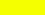
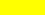

# System ID: 0  
## System name (generated): Tegan  
Star cluster: Moirai  
Total number of companion stars (generated): 1  
Total number of planets (generated): 0  
### Main star (generated): Tegan A (G5)  
<details><summary>Main star details</summary>  

#### Infocard data  
```  
Absolute units:  
* Size: 1.57e+09 m  
* Temperature: 5614 K  
* Luminosity: 4.38e+26 W  
  
Sun units:  
* Size: 1.132 D☉  
* Temperature: 0.97 T☉  
* Luminosity: 1.14 L☉  
  
Spectral data:  
* Type: G5  
* Peak wavelength: 516.0 nm  
* Peak wavelength type: visible  
```  
#### GODOT data  
```  
* System zone codename: STAR_G5_0_SYSTEM_ZONE  
* System codename: STAR_G5_0_SYSTEM  
* System translation name codename: NAME_STAR_G5_0_SYSTEM  
* System translation description codename: DESC_STAR_G5_0_SYSTEM  
* System zone size: 1.57e+13  
* System autopilot range: 1.57e+13  
 ---
* Star zone codename: STAR_G5_0_ZONE  
* Star codename: STAR_G5_0  
* Star translation name codename: NAME_STAR_G5_0  
* Star translation description codename: DESC_STAR_G5_0  
* Star name: Tegan A  
* Star description: see above.  
* Star size: 1.57e+09  
* Star autopilot range: 6.29e+09  
 ---
* Omni range: 1.05e+13  
* Surface color (Peak w.l. color code):  
 - rgb: (240, 255, 0)  
 - hex: #f0ff00  
```  

 </details>  

---
# System ID: 1  
## System name (generated): Eetasn  
Star cluster: Moirai  
Total number of companion stars (generated): 1  
Total number of planets (generated): 0  
### Main star (generated): Eetasn A (A3)  
<details><summary>Main star details</summary>  

#### Infocard data  
```  
Absolute units:  
* Size: 2.19e+09 m  
* Temperature: 8327 K  
* Luminosity: 4.12e+27 W  
  
Sun units:  
* Size: 1.579 D☉  
* Temperature: 1.44 T☉  
* Luminosity: 10.8 L☉  
  
Spectral data:  
* Type: A3  
* Peak wavelength: 348.0 nm  
* Peak wavelength type: near UV  
```  
#### GODOT data  
```  
* System zone codename: STAR_A3_1_SYSTEM_ZONE  
* System codename: STAR_A3_1_SYSTEM  
* System translation name codename: NAME_STAR_A3_1_SYSTEM  
* System translation description codename: DESC_STAR_A3_1_SYSTEM  
* System zone size: 2.19e+13  
* System autopilot range: 2.19e+13  
 ---
* Star zone codename: STAR_A3_1_ZONE  
* Star codename: STAR_A3_1  
* Star translation name codename: NAME_STAR_A3_1  
* Star translation description codename: DESC_STAR_A3_1  
* Star name: Eetasn A  
* Star description: see above.  
* Star size: 2.19e+09  
* Star autopilot range: 8.78e+09  
 ---
* Omni range: 3.21e+13  
* Surface color (Peak w.l. color code):  
 - rgb: (109, 255, 69)  
 - hex: #6dff45  
```  

 </details>  

---
# System ID: 2  
## System name (generated): Mivites  
Star cluster: Moirai  
Total number of companion stars (generated): 1  
Total number of planets (generated): 0  
### Main star (generated): Mivites A (M8)  
<details><summary>Main star details</summary>  

#### Infocard data  
```  
Absolute units:  
* Size: 6.96e+08 m  
* Temperature: 3510 K  
* Luminosity: 1.31e+25 W  
  
Sun units:  
* Size: 0.501 D☉  
* Temperature: 0.61 T☉  
* Luminosity: 0.034 L☉  
  
Spectral data:  
* Type: M8  
* Peak wavelength: 826.0 nm  
* Peak wavelength type: near IR  
```  
#### GODOT data  
```  
* System zone codename: STAR_M8_2_SYSTEM_ZONE  
* System codename: STAR_M8_2_SYSTEM  
* System translation name codename: NAME_STAR_M8_2_SYSTEM  
* System translation description codename: DESC_STAR_M8_2_SYSTEM  
* System zone size: 6.96e+12  
* System autopilot range: 6.96e+12  
 ---
* Star zone codename: STAR_M8_2_ZONE  
* Star codename: STAR_M8_2  
* Star translation name codename: NAME_STAR_M8_2  
* Star translation description codename: DESC_STAR_M8_2  
* Star name: Mivites A  
* Star description: see above.  
* Star size: 6.96e+08  
* Star autopilot range: 2.78e+09  
 ---
* Omni range: 1.81e+12  
* Surface color (Peak w.l. color code):  
 - rgb: (255, 37, 0)  
 - hex: #ff2500  
```  

 </details>  

---
# System ID: 3  
## System name (generated): Elnoe  
Star cluster: Moirai  
Total number of companion stars (generated): 1  
Total number of planets (generated): 0  
### Main star (generated): Elnoe A (A0)  
<details><summary>Main star details</summary>  

#### Infocard data  
```  
Absolute units:  
* Size: 2.34e+09 m  
* Temperature: 7575 K  
* Luminosity: 3.21e+27 W  
  
Sun units:  
* Size: 1.683 D☉  
* Temperature: 1.31 T☉  
* Luminosity: 8.38 L☉  
  
Spectral data:  
* Type: A0  
* Peak wavelength: 383.0 nm  
* Peak wavelength type: near UV  
```  
#### GODOT data  
```  
* System zone codename: STAR_A0_3_SYSTEM_ZONE  
* System codename: STAR_A0_3_SYSTEM  
* System translation name codename: NAME_STAR_A0_3_SYSTEM  
* System translation description codename: DESC_STAR_A0_3_SYSTEM  
* System zone size: 2.34e+13  
* System autopilot range: 2.34e+13  
 ---
* Star zone codename: STAR_A0_3_ZONE  
* Star codename: STAR_A0_3  
* Star translation name codename: NAME_STAR_A0_3  
* Star translation description codename: DESC_STAR_A0_3  
* Star name: Elnoe A  
* Star description: see above.  
* Star size: 2.34e+09  
* Star autopilot range: 9.36e+09  
 ---
* Omni range: 2.83e+13  
* Surface color (Peak w.l. color code):  
 - rgb: (155, 255, 0)  
 - hex: #9bff00  
```  

 </details>  

---
# System ID: 4  
## System name (generated): Atemuse  
Star cluster: Moirai  
Total number of companion stars (generated): 3  
Total number of planets (generated): 0  
### Main star (generated): Atemuse A (M4)  
<details><summary>Main star details</summary>  

#### Infocard data  
```  
Absolute units:  
* Size: 8.32e+08 m  
* Temperature: 2955 K  
* Luminosity: 9.41e+24 W  
  
Sun units:  
* Size: 0.599 D☉  
* Temperature: 0.51 T☉  
* Luminosity: 0.025 L☉  
  
Spectral data:  
* Type: M4  
* Peak wavelength: 981.0 nm  
* Peak wavelength type: near IR  
```  
#### GODOT data  
```  
* System zone codename: STAR_M4_4_SYSTEM_ZONE  
* System codename: STAR_M4_4_SYSTEM  
* System translation name codename: NAME_STAR_M4_4_SYSTEM  
* System translation description codename: DESC_STAR_M4_4_SYSTEM  
* System zone size: 8.32e+12  
* System autopilot range: 8.32e+12  
 ---
* Star zone codename: STAR_M4_4_ZONE  
* Star codename: STAR_M4_4  
* Star translation name codename: NAME_STAR_M4_4  
* Star translation description codename: DESC_STAR_M4_4  
* Star name: Atemuse A  
* Star description: see above.  
* Star size: 8.32e+08  
* Star autopilot range: 3.33e+09  
 ---
* Omni range: 1.53e+12  
* Surface color (Peak w.l. color code):  
 - rgb: (221, 0, 0)  
 - hex: #dd0000  
```  

 </details>  

---
# System ID: 5  
## System name (generated): Cilse  
Star cluster: Moirai  
Total number of companion stars (generated): 2  
Total number of planets (generated): 0  
### Main star (generated): Cilse A (Other0)  
<details><summary>Main star details</summary>  

#### Infocard data  
```  
Absolute units:  
* Size: 0.00e+00 m  
* Temperature: 0 K  
* Luminosity: 0.00e+00 W  
  
Sun units:  
* Size: 0.0 D☉  
* Temperature: 0.0 T☉  
* Luminosity: 0.0 L☉  
  
Spectral data:  
* Type: Other0  
* Peak wavelength: 0 nm  
* Peak wavelength type: gamma  
```  
#### GODOT data  
```  
* System zone codename: STAR_Other0_5_SYSTEM_ZONE  
* System codename: STAR_Other0_5_SYSTEM  
* System translation name codename: NAME_STAR_Other0_5_SYSTEM  
* System translation description codename: DESC_STAR_Other0_5_SYSTEM  
* System zone size: 0.00e+00  
* System autopilot range: 0.00e+00  
 ---
* Star zone codename: STAR_Other0_5_ZONE  
* Star codename: STAR_Other0_5  
* Star translation name codename: NAME_STAR_Other0_5  
* Star translation description codename: DESC_STAR_Other0_5  
* Star name: Cilse A  
* Star description: see above.  
* Star size: 0.00e+00  
* Star autopilot range: 0.00e+00  
 ---
* Omni range: 0.00e+00  
* Surface color (Peak w.l. color code):  
 - rgb: (0, 0, 0)  
 - hex: #000000  
```  

 </details>  

---
# System ID: 6  
## System name (generated): Lisere  
Star cluster: Moirai  
Total number of companion stars (generated): 1  
Total number of planets (generated): 0  
### Main star (generated): Lisere A (Other0)  
<details><summary>Main star details</summary>  

#### Infocard data  
```  
Absolute units:  
* Size: 0.00e+00 m  
* Temperature: 0 K  
* Luminosity: 0.00e+00 W  
  
Sun units:  
* Size: 0.0 D☉  
* Temperature: 0.0 T☉  
* Luminosity: 0.0 L☉  
  
Spectral data:  
* Type: Other0  
* Peak wavelength: 0 nm  
* Peak wavelength type: gamma  
```  
#### GODOT data  
```  
* System zone codename: STAR_Other0_6_SYSTEM_ZONE  
* System codename: STAR_Other0_6_SYSTEM  
* System translation name codename: NAME_STAR_Other0_6_SYSTEM  
* System translation description codename: DESC_STAR_Other0_6_SYSTEM  
* System zone size: 0.00e+00  
* System autopilot range: 0.00e+00  
 ---
* Star zone codename: STAR_Other0_6_ZONE  
* Star codename: STAR_Other0_6  
* Star translation name codename: NAME_STAR_Other0_6  
* Star translation description codename: DESC_STAR_Other0_6  
* Star name: Lisere A  
* Star description: see above.  
* Star size: 0.00e+00  
* Star autopilot range: 0.00e+00  
 ---
* Omni range: 0.00e+00  
* Surface color (Peak w.l. color code):  
 - rgb: (0, 0, 0)  
 - hex: #000000  
```  

 </details>  

---
# System ID: 7  
## System name (generated): Ohmikn  
Star cluster: Moirai  
Total number of companion stars (generated): 3  
Total number of planets (generated): 0  
### Main star (generated): Ohmikn A (M1)  
<details><summary>Main star details</summary>  

#### Infocard data  
```  
Absolute units:  
* Size: 8.64e+08 m  
* Temperature: 2535 K  
* Luminosity: 5.50e+24 W  
  
Sun units:  
* Size: 0.622 D☉  
* Temperature: 0.44 T☉  
* Luminosity: 0.014 L☉  
  
Spectral data:  
* Type: M1  
* Peak wavelength: 1143.0 nm  
* Peak wavelength type: near IR  
```  
#### GODOT data  
```  
* System zone codename: STAR_M1_7_SYSTEM_ZONE  
* System codename: STAR_M1_7_SYSTEM  
* System translation name codename: NAME_STAR_M1_7_SYSTEM  
* System translation description codename: DESC_STAR_M1_7_SYSTEM  
* System zone size: 8.64e+12  
* System autopilot range: 8.64e+12  
 ---
* Star zone codename: STAR_M1_7_ZONE  
* Star codename: STAR_M1_7  
* Star translation name codename: NAME_STAR_M1_7  
* Star translation description codename: DESC_STAR_M1_7  
* Star name: Ohmikn A  
* Star description: see above.  
* Star size: 8.64e+08  
* Star autopilot range: 3.46e+09  
 ---
* Omni range: 1.17e+12  
* Surface color (Peak w.l. color code):  
 - rgb: (167, 0, 0)  
 - hex: #a70000  
```  

 </details>  

---
# System ID: 8  
## System name (generated): Aesteu  
Star cluster: Moirai  
Total number of companion stars (generated): 1  
Total number of planets (generated): 0  
### Main star (generated): Aesteu A (M7)  
<details><summary>Main star details</summary>  

#### Infocard data  
```  
Absolute units:  
* Size: 2.51e+08 m  
* Temperature: 3311 K  
* Luminosity: 1.35e+24 W  
  
Sun units:  
* Size: 0.181 D☉  
* Temperature: 0.57 T☉  
* Luminosity: 0.004 L☉  
  
Spectral data:  
* Type: M7  
* Peak wavelength: 875.0 nm  
* Peak wavelength type: near IR  
```  
#### GODOT data  
```  
* System zone codename: STAR_M7_8_SYSTEM_ZONE  
* System codename: STAR_M7_8_SYSTEM  
* System translation name codename: NAME_STAR_M7_8_SYSTEM  
* System translation description codename: DESC_STAR_M7_8_SYSTEM  
* System zone size: 2.51e+12  
* System autopilot range: 2.51e+12  
 ---
* Star zone codename: STAR_M7_8_ZONE  
* Star codename: STAR_M7_8  
* Star translation name codename: NAME_STAR_M7_8  
* Star translation description codename: DESC_STAR_M7_8  
* Star name: Aesteu A  
* Star description: see above.  
* Star size: 2.51e+08  
* Star autopilot range: 1.00e+09  
 ---
* Omni range: 5.81e+11  
* Surface color (Peak w.l. color code):  
 - rgb: (255, 0, 0)  
 - hex: #ff0000  
```  

 </details>  

---
# System ID: 9  
## System name (generated): Icreld  
Star cluster: Moirai  
Total number of companion stars (generated): 3  
Total number of planets (generated): 0  
### Main star (generated): Icreld A (K9)  
<details><summary>Main star details</summary>  

#### Infocard data  
```  
Absolute units:  
* Size: 1.07e+09 m  
* Temperature: 5127 K  
* Luminosity: 1.42e+26 W  
  
Sun units:  
* Size: 0.772 D☉  
* Temperature: 0.89 T☉  
* Luminosity: 0.37 L☉  
  
Spectral data:  
* Type: K9  
* Peak wavelength: 565.0 nm  
* Peak wavelength type: visible  
```  
#### GODOT data  
```  
* System zone codename: STAR_K9_9_SYSTEM_ZONE  
* System codename: STAR_K9_9_SYSTEM  
* System translation name codename: NAME_STAR_K9_9_SYSTEM  
* System translation description codename: DESC_STAR_K9_9_SYSTEM  
* System zone size: 1.07e+13  
* System autopilot range: 1.07e+13  
 ---
* Star zone codename: STAR_K9_9_ZONE  
* Star codename: STAR_K9_9  
* Star translation name codename: NAME_STAR_K9_9  
* Star translation description codename: DESC_STAR_K9_9  
* Star name: Icreld A  
* Star description: see above.  
* Star size: 1.07e+09  
* Star autopilot range: 4.29e+09  
 ---
* Omni range: 5.95e+12  
* Surface color (Peak w.l. color code):  
 - rgb: (255, 236, 0)  
 - hex: #ffec00  
```  

 </details>  

---
# System ID: 10  
## System name (generated): Efuvco  
Star cluster: Moirai  
Total number of companion stars (generated): 1  
Total number of planets (generated): 0  
### Main star (generated): Efuvco A (M0)  
<details><summary>Main star details</summary>  

#### Infocard data  
```  
Absolute units:  
* Size: 7.41e+08 m  
* Temperature: 2411 K  
* Luminosity: 3.31e+24 W  
  
Sun units:  
* Size: 0.533 D☉  
* Temperature: 0.42 T☉  
* Luminosity: 0.009 L☉  
  
Spectral data:  
* Type: M0  
* Peak wavelength: 1202.0 nm  
* Peak wavelength type: near IR  
```  
#### GODOT data  
```  
* System zone codename: STAR_M0_10_SYSTEM_ZONE  
* System codename: STAR_M0_10_SYSTEM  
* System translation name codename: NAME_STAR_M0_10_SYSTEM  
* System translation description codename: DESC_STAR_M0_10_SYSTEM  
* System zone size: 7.41e+12  
* System autopilot range: 7.41e+12  
 ---
* Star zone codename: STAR_M0_10_ZONE  
* Star codename: STAR_M0_10  
* Star translation name codename: NAME_STAR_M0_10  
* Star translation description codename: DESC_STAR_M0_10  
* Star name: Efuvco A  
* Star description: see above.  
* Star size: 7.41e+08  
* Star autopilot range: 2.97e+09  
 ---
* Omni range: 9.10e+11  
* Surface color (Peak w.l. color code):  
 - rgb: (150, 0, 0)  
 - hex: #960000  
```  

 </details>  

---
# System ID: 11  
## System name (generated): Ralafo  
Star cluster: Moirai  
Total number of companion stars (generated): 1  
Total number of planets (generated): 0  
### Main star (generated): Ralafo A (M6)  
<details><summary>Main star details</summary>  

#### Infocard data  
```  
Absolute units:  
* Size: 4.93e+08 m  
* Temperature: 3298 K  
* Luminosity: 5.13e+24 W  
  
Sun units:  
* Size: 0.355 D☉  
* Temperature: 0.57 T☉  
* Luminosity: 0.013 L☉  
  
Spectral data:  
* Type: M6  
* Peak wavelength: 879.0 nm  
* Peak wavelength type: near IR  
```  
#### GODOT data  
```  
* System zone codename: STAR_M6_11_SYSTEM_ZONE  
* System codename: STAR_M6_11_SYSTEM  
* System translation name codename: NAME_STAR_M6_11_SYSTEM  
* System translation description codename: DESC_STAR_M6_11_SYSTEM  
* System zone size: 4.93e+12  
* System autopilot range: 4.93e+12  
 ---
* Star zone codename: STAR_M6_11_ZONE  
* Star codename: STAR_M6_11  
* Star translation name codename: NAME_STAR_M6_11  
* Star translation description codename: DESC_STAR_M6_11  
* Star name: Ralafo A  
* Star description: see above.  
* Star size: 4.93e+08  
* Star autopilot range: 1.97e+09  
 ---
* Omni range: 1.13e+12  
* Surface color (Peak w.l. color code):  
 - rgb: (252, 0, 0)  
 - hex: #fc0000  
```  

 </details>  

---
# System ID: 12  
## System name (generated): Arimar  
Star cluster: Moirai  
Total number of companion stars (generated): 3  
Total number of planets (generated): 0  
### Main star (generated): Arimar A (F0)  
<details><summary>Main star details</summary>  

#### Infocard data  
```  
Absolute units:  
* Size: 1.77e+09 m  
* Temperature: 6067 K  
* Luminosity: 7.52e+26 W  
  
Sun units:  
* Size: 1.27 D☉  
* Temperature: 1.05 T☉  
* Luminosity: 1.97 L☉  
  
Spectral data:  
* Type: F0  
* Peak wavelength: 478.0 nm  
* Peak wavelength type: visible  
```  
#### GODOT data  
```  
* System zone codename: STAR_F0_12_SYSTEM_ZONE  
* System codename: STAR_F0_12_SYSTEM  
* System translation name codename: NAME_STAR_F0_12_SYSTEM  
* System translation description codename: DESC_STAR_F0_12_SYSTEM  
* System zone size: 1.77e+13  
* System autopilot range: 1.77e+13  
 ---
* Star zone codename: STAR_F0_12_ZONE  
* Star codename: STAR_F0_12  
* Star translation name codename: NAME_STAR_F0_12  
* Star translation description codename: DESC_STAR_F0_12  
* Star name: Arimar A  
* Star description: see above.  
* Star size: 1.77e+09  
* Star autopilot range: 7.06e+09  
 ---
* Omni range: 1.37e+13  
* Surface color (Peak w.l. color code):  
 - rgb: (215, 255, 0)  
 - hex: #d7ff00  
```  

 </details>  

---
# System ID: 13  
## System name (generated): Ogispa  
Star cluster: Moirai  
Total number of companion stars (generated): 1  
Total number of planets (generated): 0  
### Main star (generated): Ogispa A (K6)  
<details><summary>Main star details</summary>  

#### Infocard data  
```  
Absolute units:  
* Size: 1.23e+09 m  
* Temperature: 4635 K  
* Luminosity: 1.24e+26 W  
  
Sun units:  
* Size: 0.884 D☉  
* Temperature: 0.8 T☉  
* Luminosity: 0.324 L☉  
  
Spectral data:  
* Type: K6  
* Peak wavelength: 625.0 nm  
* Peak wavelength type: visible  
```  
#### GODOT data  
```  
* System zone codename: STAR_K6_13_SYSTEM_ZONE  
* System codename: STAR_K6_13_SYSTEM  
* System translation name codename: NAME_STAR_K6_13_SYSTEM  
* System translation description codename: DESC_STAR_K6_13_SYSTEM  
* System zone size: 1.23e+13  
* System autopilot range: 1.23e+13  
 ---
* Star zone codename: STAR_K6_13_ZONE  
* Star codename: STAR_K6_13  
* Star translation name codename: NAME_STAR_K6_13  
* Star translation description codename: DESC_STAR_K6_13  
* Star name: Ogispa A  
* Star description: see above.  
* Star size: 1.23e+09  
* Star autopilot range: 4.91e+09  
 ---
* Omni range: 5.57e+12  
* Surface color (Peak w.l. color code):  
 - rgb: (255, 192, 0)  
 - hex: #ffc000  
```  

 </details>  

---
# System ID: 14  
## System name (generated): Onorim  
Star cluster: Moirai  
Total number of companion stars (generated): 2  
Total number of planets (generated): 0  
### Main star (generated): Onorim A (Other0)  
<details><summary>Main star details</summary>  

#### Infocard data  
```  
Absolute units:  
* Size: 0.00e+00 m  
* Temperature: 0 K  
* Luminosity: 0.00e+00 W  
  
Sun units:  
* Size: 0.0 D☉  
* Temperature: 0.0 T☉  
* Luminosity: 0.0 L☉  
  
Spectral data:  
* Type: Other0  
* Peak wavelength: 0 nm  
* Peak wavelength type: gamma  
```  
#### GODOT data  
```  
* System zone codename: STAR_Other0_14_SYSTEM_ZONE  
* System codename: STAR_Other0_14_SYSTEM  
* System translation name codename: NAME_STAR_Other0_14_SYSTEM  
* System translation description codename: DESC_STAR_Other0_14_SYSTEM  
* System zone size: 0.00e+00  
* System autopilot range: 0.00e+00  
 ---
* Star zone codename: STAR_Other0_14_ZONE  
* Star codename: STAR_Other0_14  
* Star translation name codename: NAME_STAR_Other0_14  
* Star translation description codename: DESC_STAR_Other0_14  
* Star name: Onorim A  
* Star description: see above.  
* Star size: 0.00e+00  
* Star autopilot range: 0.00e+00  
 ---
* Omni range: 0.00e+00  
* Surface color (Peak w.l. color code):  
 - rgb: (0, 0, 0)  
 - hex: #000000  
```  

 </details>  

---
# System ID: 15  
## System name (generated): Denilo  
Star cluster: Moirai  
Total number of companion stars (generated): 1  
Total number of planets (generated): 0  
### Main star (generated): Denilo A (B5)  
<details><summary>Main star details</summary>  

#### Infocard data  
```  
Absolute units:  
* Size: 7.08e+09 m  
* Temperature: 21080 K  
* Luminosity: 1.77e+30 W  
  
Sun units:  
* Size: 5.097 D☉  
* Temperature: 3.65 T☉  
* Luminosity: 4613 L☉  
  
Spectral data:  
* Type: B5  
* Peak wavelength: 137.0 nm  
* Peak wavelength type: far UV  
```  
#### GODOT data  
```  
* System zone codename: STAR_B5_15_SYSTEM_ZONE  
* System codename: STAR_B5_15_SYSTEM  
* System translation name codename: NAME_STAR_B5_15_SYSTEM  
* System translation description codename: DESC_STAR_B5_15_SYSTEM  
* System zone size: 7.08e+13  
* System autopilot range: 7.08e+13  
 ---
* Star zone codename: STAR_B5_15_ZONE  
* Star codename: STAR_B5_15  
* Star translation name codename: NAME_STAR_B5_15  
* Star translation description codename: DESC_STAR_B5_15  
* Star name: Denilo A  
* Star description: see above.  
* Star size: 7.08e+09  
* Star autopilot range: 2.83e+10  
 ---
* Omni range: 6.64e+14  
* Surface color (Peak w.l. color code):  
 - rgb: (0, 165, 255)  
 - hex: #00a5ff  
```  

 </details>  

---
# System ID: 16  
## System name (generated): Ehepeto  
Star cluster: Moirai  
Total number of companion stars (generated): 1  
Total number of planets (generated): 0  
### Main star (generated): Ehepeto A (G5)  
<details><summary>Main star details</summary>  

#### Infocard data  
```  
Absolute units:  
* Size: 1.45e+09 m  
* Temperature: 5652 K  
* Luminosity: 3.83e+26 W  
  
Sun units:  
* Size: 1.044 D☉  
* Temperature: 0.98 T☉  
* Luminosity: 1.0 L☉  
  
Spectral data:  
* Type: G5  
* Peak wavelength: 513.0 nm  
* Peak wavelength type: visible  
```  
#### GODOT data  
```  
* System zone codename: STAR_G5_16_SYSTEM_ZONE  
* System codename: STAR_G5_16_SYSTEM  
* System translation name codename: NAME_STAR_G5_16_SYSTEM  
* System translation description codename: DESC_STAR_G5_16_SYSTEM  
* System zone size: 1.45e+13  
* System autopilot range: 1.45e+13  
 ---
* Star zone codename: STAR_G5_16_ZONE  
* Star codename: STAR_G5_16  
* Star translation name codename: NAME_STAR_G5_16  
* Star translation description codename: DESC_STAR_G5_16  
* Star name: Ehepeto A  
* Star description: see above.  
* Star size: 1.45e+09  
* Star autopilot range: 5.81e+09  
 ---
* Omni range: 9.79e+12  
* Surface color (Peak w.l. color code):  
 - rgb: (235, 255, 0)  
 - hex: #ebff00  
```  

 </details>  

---
# System ID: 17  
## System name (generated): Waikra  
Star cluster: Moirai  
Total number of companion stars (generated): 1  
Total number of planets (generated): 0  
### Main star (generated): Waikra A (A1)  
<details><summary>Main star details</summary>  

#### Infocard data  
```  
Absolute units:  
* Size: 2.12e+09 m  
* Temperature: 7754 K  
* Luminosity: 2.88e+27 W  
  
Sun units:  
* Size: 1.522 D☉  
* Temperature: 1.34 T☉  
* Luminosity: 7.53 L☉  
  
Spectral data:  
* Type: A1  
* Peak wavelength: 374.0 nm  
* Peak wavelength type: near UV  
```  
#### GODOT data  
```  
* System zone codename: STAR_A1_17_SYSTEM_ZONE  
* System codename: STAR_A1_17_SYSTEM  
* System translation name codename: NAME_STAR_A1_17_SYSTEM  
* System translation description codename: DESC_STAR_A1_17_SYSTEM  
* System zone size: 2.12e+13  
* System autopilot range: 2.12e+13  
 ---
* Star zone codename: STAR_A1_17_ZONE  
* Star codename: STAR_A1_17  
* Star translation name codename: NAME_STAR_A1_17  
* Star translation description codename: DESC_STAR_A1_17  
* Star name: Waikra A  
* Star description: see above.  
* Star size: 2.12e+09  
* Star autopilot range: 8.46e+09  
 ---
* Omni range: 2.68e+13  
* Surface color (Peak w.l. color code):  
 - rgb: (150, 255, 0)  
 - hex: #96ff00  
```  

 </details>  

---
# System ID: 18  
## System name (generated): Ecerici  
Star cluster: Moirai  
Total number of companion stars (generated): 1  
Total number of planets (generated): 0  
### Main star (generated): Ecerici A (M8)  
<details><summary>Main star details</summary>  

#### Infocard data  
```  
Absolute units:  
* Size: 1.46e+08 m  
* Temperature: 3469 K  
* Luminosity: 5.50e+23 W  
  
Sun units:  
* Size: 0.105 D☉  
* Temperature: 0.6 T☉  
* Luminosity: 0.001 L☉  
  
Spectral data:  
* Type: M8  
* Peak wavelength: 835.0 nm  
* Peak wavelength type: near IR  
```  
#### GODOT data  
```  
* System zone codename: STAR_M8_18_SYSTEM_ZONE  
* System codename: STAR_M8_18_SYSTEM  
* System translation name codename: NAME_STAR_M8_18_SYSTEM  
* System translation description codename: DESC_STAR_M8_18_SYSTEM  
* System zone size: 1.46e+12  
* System autopilot range: 1.46e+12  
 ---
* Star zone codename: STAR_M8_18_ZONE  
* Star codename: STAR_M8_18  
* Star translation name codename: NAME_STAR_M8_18  
* Star translation description codename: DESC_STAR_M8_18  
* Star name: Ecerici A  
* Star description: see above.  
* Star size: 1.46e+08  
* Star autopilot range: 5.84e+08  
 ---
* Omni range: 3.71e+11  
* Surface color (Peak w.l. color code):  
 - rgb: (255, 31, 0)  
 - hex: #ff1f00  
```  

 </details>  

---
# System ID: 19  
## System name (generated): Inlamo  
Star cluster: Moirai  
Total number of companion stars (generated): 1  
Total number of planets (generated): 0  
### Main star (generated): Inlamo A (K7)  
<details><summary>Main star details</summary>  

#### Infocard data  
```  
Absolute units:  
* Size: 1.31e+09 m  
* Temperature: 4875 K  
* Luminosity: 1.74e+26 W  
  
Sun units:  
* Size: 0.946 D☉  
* Temperature: 0.84 T☉  
* Luminosity: 0.454 L☉  
  
Spectral data:  
* Type: K7  
* Peak wavelength: 594.0 nm  
* Peak wavelength type: visible  
```  
#### GODOT data  
```  
* System zone codename: STAR_K7_19_SYSTEM_ZONE  
* System codename: STAR_K7_19_SYSTEM  
* System translation name codename: NAME_STAR_K7_19_SYSTEM  
* System translation description codename: DESC_STAR_K7_19_SYSTEM  
* System zone size: 1.31e+13  
* System autopilot range: 1.31e+13  
 ---
* Star zone codename: STAR_K7_19_ZONE  
* Star codename: STAR_K7_19  
* Star translation name codename: NAME_STAR_K7_19  
* Star translation description codename: DESC_STAR_K7_19  
* Star name: Inlamo A  
* Star description: see above.  
* Star size: 1.31e+09  
* Star autopilot range: 5.26e+09  
 ---
* Omni range: 6.59e+12  
* Surface color (Peak w.l. color code):  
 - rgb: (255, 211, 0)  
 - hex: #ffd300  
```  

 </details>  

---
# System ID: 20  
## System name (generated): Acidew  
Star cluster: Moirai  
Total number of companion stars (generated): 2  
Total number of planets (generated): 0  
### Main star (generated): Acidew A (M7)  
<details><summary>Main star details</summary>  

#### Infocard data  
```  
Absolute units:  
* Size: 3.29e+08 m  
* Temperature: 3336 K  
* Luminosity: 2.39e+24 W  
  
Sun units:  
* Size: 0.237 D☉  
* Temperature: 0.58 T☉  
* Luminosity: 0.006 L☉  
  
Spectral data:  
* Type: M7  
* Peak wavelength: 869.0 nm  
* Peak wavelength type: near IR  
```  
#### GODOT data  
```  
* System zone codename: STAR_M7_20_SYSTEM_ZONE  
* System codename: STAR_M7_20_SYSTEM  
* System translation name codename: NAME_STAR_M7_20_SYSTEM  
* System translation description codename: DESC_STAR_M7_20_SYSTEM  
* System zone size: 3.29e+12  
* System autopilot range: 3.29e+12  
 ---
* Star zone codename: STAR_M7_20_ZONE  
* Star codename: STAR_M7_20  
* Star translation name codename: NAME_STAR_M7_20  
* Star translation description codename: DESC_STAR_M7_20  
* Star name: Acidew A  
* Star description: see above.  
* Star size: 3.29e+08  
* Star autopilot range: 1.32e+09  
 ---
* Omni range: 7.73e+11  
* Surface color (Peak w.l. color code):  
 - rgb: (255, 0, 0)  
 - hex: #ff0000  
```  

 </details>  

---
# System ID: 21  
## System name (generated): Itoman  
Star cluster: Moirai  
Total number of companion stars (generated): 1  
Total number of planets (generated): 0  
### Main star (generated): Itoman A (F3)  
<details><summary>Main star details</summary>  

#### Infocard data  
```  
Absolute units:  
* Size: 1.60e+09 m  
* Temperature: 6579 K  
* Luminosity: 8.58e+26 W  
  
Sun units:  
* Size: 1.153 D☉  
* Temperature: 1.14 T☉  
* Luminosity: 2.24 L☉  
  
Spectral data:  
* Type: F3  
* Peak wavelength: 440.0 nm  
* Peak wavelength type: visible  
```  
#### GODOT data  
```  
* System zone codename: STAR_F3_21_SYSTEM_ZONE  
* System codename: STAR_F3_21_SYSTEM  
* System translation name codename: NAME_STAR_F3_21_SYSTEM  
* System translation description codename: DESC_STAR_F3_21_SYSTEM  
* System zone size: 1.60e+13  
* System autopilot range: 1.60e+13  
 ---
* Star zone codename: STAR_F3_21_ZONE  
* Star codename: STAR_F3_21  
* Star translation name codename: NAME_STAR_F3_21  
* Star translation description codename: DESC_STAR_F3_21  
* Star name: Itoman A  
* Star description: see above.  
* Star size: 1.60e+09  
* Star autopilot range: 6.41e+09  
 ---
* Omni range: 1.46e+13  
* Surface color (Peak w.l. color code):  
 - rgb: (190, 255, 0)  
 - hex: #beff00  
```  

 </details>  

---
# System ID: 22  
## System name (generated): Bituhan  
Star cluster: Moirai  
Total number of companion stars (generated): 1  
Total number of planets (generated): 0  
### Main star (generated): Bituhan A (M5)  
<details><summary>Main star details</summary>  

#### Infocard data  
```  
Absolute units:  
* Size: 1.41e+08 m  
* Temperature: 3166 K  
* Luminosity: 3.54e+23 W  
  
Sun units:  
* Size: 0.101 D☉  
* Temperature: 0.55 T☉  
* Luminosity: 0.001 L☉  
  
Spectral data:  
* Type: M5  
* Peak wavelength: 915.0 nm  
* Peak wavelength type: near IR  
```  
#### GODOT data  
```  
* System zone codename: STAR_M5_22_SYSTEM_ZONE  
* System codename: STAR_M5_22_SYSTEM  
* System translation name codename: NAME_STAR_M5_22_SYSTEM  
* System translation description codename: DESC_STAR_M5_22_SYSTEM  
* System zone size: 1.41e+12  
* System autopilot range: 1.41e+12  
 ---
* Star zone codename: STAR_M5_22_ZONE  
* Star codename: STAR_M5_22  
* Star translation name codename: NAME_STAR_M5_22  
* Star translation description codename: DESC_STAR_M5_22  
* Star name: Bituhan A  
* Star description: see above.  
* Star size: 1.41e+08  
* Star autopilot range: 5.62e+08  
 ---
* Omni range: 2.97e+11  
* Surface color (Peak w.l. color code):  
 - rgb: (242, 0, 0)  
 - hex: #f20000  
```  

 </details>  

---
# System ID: 23  
## System name (generated): Niatii  
Star cluster: Moirai  
Total number of companion stars (generated): 1  
Total number of planets (generated): 0  
### Main star (generated): Niatii A (Other0)  
<details><summary>Main star details</summary>  

#### Infocard data  
```  
Absolute units:  
* Size: 0.00e+00 m  
* Temperature: 0 K  
* Luminosity: 0.00e+00 W  
  
Sun units:  
* Size: 0.0 D☉  
* Temperature: 0.0 T☉  
* Luminosity: 0.0 L☉  
  
Spectral data:  
* Type: Other0  
* Peak wavelength: 0 nm  
* Peak wavelength type: gamma  
```  
#### GODOT data  
```  
* System zone codename: STAR_Other0_23_SYSTEM_ZONE  
* System codename: STAR_Other0_23_SYSTEM  
* System translation name codename: NAME_STAR_Other0_23_SYSTEM  
* System translation description codename: DESC_STAR_Other0_23_SYSTEM  
* System zone size: 0.00e+00  
* System autopilot range: 0.00e+00  
 ---
* Star zone codename: STAR_Other0_23_ZONE  
* Star codename: STAR_Other0_23  
* Star translation name codename: NAME_STAR_Other0_23  
* Star translation description codename: DESC_STAR_Other0_23  
* Star name: Niatii A  
* Star description: see above.  
* Star size: 0.00e+00  
* Star autopilot range: 0.00e+00  
 ---
* Omni range: 0.00e+00  
* Surface color (Peak w.l. color code):  
 - rgb: (0, 0, 0)  
 - hex: #000000  
```  

 </details>  

---
# System ID: 24  
## System name (generated): Esdeyf  
Star cluster: Moirai  
Total number of companion stars (generated): 1  
Total number of planets (generated): 0  
### Main star (generated): Esdeyf A (Other0)  
<details><summary>Main star details</summary>  

#### Infocard data  
```  
Absolute units:  
* Size: 0.00e+00 m  
* Temperature: 0 K  
* Luminosity: 0.00e+00 W  
  
Sun units:  
* Size: 0.0 D☉  
* Temperature: 0.0 T☉  
* Luminosity: 0.0 L☉  
  
Spectral data:  
* Type: Other0  
* Peak wavelength: 0 nm  
* Peak wavelength type: gamma  
```  
#### GODOT data  
```  
* System zone codename: STAR_Other0_24_SYSTEM_ZONE  
* System codename: STAR_Other0_24_SYSTEM  
* System translation name codename: NAME_STAR_Other0_24_SYSTEM  
* System translation description codename: DESC_STAR_Other0_24_SYSTEM  
* System zone size: 0.00e+00  
* System autopilot range: 0.00e+00  
 ---
* Star zone codename: STAR_Other0_24_ZONE  
* Star codename: STAR_Other0_24  
* Star translation name codename: NAME_STAR_Other0_24  
* Star translation description codename: DESC_STAR_Other0_24  
* Star name: Esdeyf A  
* Star description: see above.  
* Star size: 0.00e+00  
* Star autopilot range: 0.00e+00  
 ---
* Omni range: 0.00e+00  
* Surface color (Peak w.l. color code):  
 - rgb: (0, 0, 0)  
 - hex: #000000  
```  

 </details>  

---
# System ID: 25  
## System name (generated): Rarase  
Star cluster: Moirai  
Total number of companion stars (generated): 1  
Total number of planets (generated): 0  
### Main star (generated): Rarase A (K9)  
<details><summary>Main star details</summary>  

#### Infocard data  
```  
Absolute units:  
* Size: 1.13e+09 m  
* Temperature: 5103 K  
* Luminosity: 1.55e+26 W  
  
Sun units:  
* Size: 0.815 D☉  
* Temperature: 0.88 T☉  
* Luminosity: 0.405 L☉  
  
Spectral data:  
* Type: K9  
* Peak wavelength: 568.0 nm  
* Peak wavelength type: visible  
```  
#### GODOT data  
```  
* System zone codename: STAR_K9_25_SYSTEM_ZONE  
* System codename: STAR_K9_25_SYSTEM  
* System translation name codename: NAME_STAR_K9_25_SYSTEM  
* System translation description codename: DESC_STAR_K9_25_SYSTEM  
* System zone size: 1.13e+13  
* System autopilot range: 1.13e+13  
 ---
* Star zone codename: STAR_K9_25_ZONE  
* Star codename: STAR_K9_25  
* Star translation name codename: NAME_STAR_K9_25  
* Star translation description codename: DESC_STAR_K9_25  
* Star name: Rarase A  
* Star description: see above.  
* Star size: 1.13e+09  
* Star autopilot range: 4.53e+09  
 ---
* Omni range: 6.23e+12  
* Surface color (Peak w.l. color code):  
 - rgb: (255, 236, 0)  
 - hex: #ffec00  
```  

 </details>  

---
# System ID: 26  
## System name (generated): Nicina  
Star cluster: Moirai  
Total number of companion stars (generated): 1  
Total number of planets (generated): 0  
### Main star (generated): Nicina A (M0)  
<details><summary>Main star details</summary>  

#### Infocard data  
```  
Absolute units:  
* Size: 3.93e+08 m  
* Temperature: 2455 K  
* Luminosity: 1.00e+24 W  
  
Sun units:  
* Size: 0.283 D☉  
* Temperature: 0.43 T☉  
* Luminosity: 0.003 L☉  
  
Spectral data:  
* Type: M0  
* Peak wavelength: 1180.0 nm  
* Peak wavelength type: near IR  
```  
#### GODOT data  
```  
* System zone codename: STAR_M0_26_SYSTEM_ZONE  
* System codename: STAR_M0_26_SYSTEM  
* System translation name codename: NAME_STAR_M0_26_SYSTEM  
* System translation description codename: DESC_STAR_M0_26_SYSTEM  
* System zone size: 3.93e+12  
* System autopilot range: 3.93e+12  
 ---
* Star zone codename: STAR_M0_26_ZONE  
* Star codename: STAR_M0_26  
* Star translation name codename: NAME_STAR_M0_26  
* Star translation description codename: DESC_STAR_M0_26  
* Star name: Nicina A  
* Star description: see above.  
* Star size: 3.93e+08  
* Star autopilot range: 1.57e+09  
 ---
* Omni range: 5.00e+11  
* Surface color (Peak w.l. color code):  
 - rgb: (157, 0, 0)  
 - hex: #9d0000  
```  

 </details>  

---
# System ID: 27  
## System name (generated): Gorah  
Star cluster: Moirai  
Total number of companion stars (generated): 1  
Total number of planets (generated): 0  
### Main star (generated): Gorah A (A6)  
<details><summary>Main star details</summary>  

#### Infocard data  
```  
Absolute units:  
* Size: 2.12e+09 m  
* Temperature: 9166 K  
* Luminosity: 5.63e+27 W  
  
Sun units:  
* Size: 1.522 D☉  
* Temperature: 1.59 T☉  
* Luminosity: 14.7 L☉  
  
Spectral data:  
* Type: A6  
* Peak wavelength: 316.0 nm  
* Peak wavelength type: near UV  
```  
#### GODOT data  
```  
* System zone codename: STAR_A6_27_SYSTEM_ZONE  
* System codename: STAR_A6_27_SYSTEM  
* System translation name codename: NAME_STAR_A6_27_SYSTEM  
* System translation description codename: DESC_STAR_A6_27_SYSTEM  
* System zone size: 2.12e+13  
* System autopilot range: 2.12e+13  
 ---
* Star zone codename: STAR_A6_27_ZONE  
* Star codename: STAR_A6_27  
* Star translation name codename: NAME_STAR_A6_27  
* Star translation description codename: DESC_STAR_A6_27  
* Star name: Gorah A  
* Star description: see above.  
* Star size: 2.12e+09  
* Star autopilot range: 8.46e+09  
 ---
* Omni range: 3.75e+13  
* Surface color (Peak w.l. color code):  
 - rgb: (54, 255, 162)  
 - hex: #36ffa2  
```  

 </details>  

---
# System ID: 28  
## System name (generated): Fisuhen  
Star cluster: Moirai  
Total number of companion stars (generated): 3  
Total number of planets (generated): 0  
### Main star (generated): Fisuhen A (M2)  
<details><summary>Main star details</summary>  

#### Infocard data  
```  
Absolute units:  
* Size: 8.80e+08 m  
* Temperature: 2705 K  
* Luminosity: 7.38e+24 W  
  
Sun units:  
* Size: 0.633 D☉  
* Temperature: 0.47 T☉  
* Luminosity: 0.019 L☉  
  
Spectral data:  
* Type: M2  
* Peak wavelength: 1071.0 nm  
* Peak wavelength type: near IR  
```  
#### GODOT data  
```  
* System zone codename: STAR_M2_28_SYSTEM_ZONE  
* System codename: STAR_M2_28_SYSTEM  
* System translation name codename: NAME_STAR_M2_28_SYSTEM  
* System translation description codename: DESC_STAR_M2_28_SYSTEM  
* System zone size: 8.80e+12  
* System autopilot range: 8.80e+12  
 ---
* Star zone codename: STAR_M2_28_ZONE  
* Star codename: STAR_M2_28  
* Star translation name codename: NAME_STAR_M2_28  
* Star translation description codename: DESC_STAR_M2_28  
* Star name: Fisuhen A  
* Star description: see above.  
* Star size: 8.80e+08  
* Star autopilot range: 3.52e+09  
 ---
* Omni range: 1.36e+12  
* Surface color (Peak w.l. color code):  
 - rgb: (190, 0, 0)  
 - hex: #be0000  
```  

 </details>  

---
# System ID: 29  
## System name (generated): Astev  
Star cluster: Moirai  
Total number of companion stars (generated): 5  
Total number of planets (generated): 0  
### Main star (generated): Astev A (M9)  
<details><summary>Main star details</summary>  

#### Infocard data  
```  
Absolute units:  
* Size: 5.96e+08 m  
* Temperature: 3588 K  
* Luminosity: 1.05e+25 W  
  
Sun units:  
* Size: 0.428 D☉  
* Temperature: 0.62 T☉  
* Luminosity: 0.027 L☉  
  
Spectral data:  
* Type: M9  
* Peak wavelength: 808.0 nm  
* Peak wavelength type: near IR  
```  
#### GODOT data  
```  
* System zone codename: STAR_M9_29_SYSTEM_ZONE  
* System codename: STAR_M9_29_SYSTEM  
* System translation name codename: NAME_STAR_M9_29_SYSTEM  
* System translation description codename: DESC_STAR_M9_29_SYSTEM  
* System zone size: 5.96e+12  
* System autopilot range: 5.96e+12  
 ---
* Star zone codename: STAR_M9_29_ZONE  
* Star codename: STAR_M9_29  
* Star translation name codename: NAME_STAR_M9_29  
* Star translation description codename: DESC_STAR_M9_29  
* Star name: Astev A  
* Star description: see above.  
* Star size: 5.96e+08  
* Star autopilot range: 2.38e+09  
 ---
* Omni range: 1.62e+12  
* Surface color (Peak w.l. color code):  
 - rgb: (255, 49, 0)  
 - hex: #ff3100  
```  

 </details>  

---
# System ID: 30  
## System name (generated): Uinol  
Star cluster: Moirai  
Total number of companion stars (generated): 2  
Total number of planets (generated): 0  
### Main star (generated): Uinol A (M9)  
<details><summary>Main star details</summary>  

#### Infocard data  
```  
Absolute units:  
* Size: 9.38e+08 m  
* Temperature: 3657 K  
* Luminosity: 2.80e+25 W  
  
Sun units:  
* Size: 0.675 D☉  
* Temperature: 0.63 T☉  
* Luminosity: 0.073 L☉  
  
Spectral data:  
* Type: M9  
* Peak wavelength: 792.0 nm  
* Peak wavelength type: near IR  
```  
#### GODOT data  
```  
* System zone codename: STAR_M9_30_SYSTEM_ZONE  
* System codename: STAR_M9_30_SYSTEM  
* System translation name codename: NAME_STAR_M9_30_SYSTEM  
* System translation description codename: DESC_STAR_M9_30_SYSTEM  
* System zone size: 9.38e+12  
* System autopilot range: 9.38e+12  
 ---
* Star zone codename: STAR_M9_30_ZONE  
* Star codename: STAR_M9_30  
* Star translation name codename: NAME_STAR_M9_30  
* Star translation description codename: DESC_STAR_M9_30  
* Star name: Uinol A  
* Star description: see above.  
* Star size: 9.38e+08  
* Star autopilot range: 3.75e+09  
 ---
* Omni range: 2.65e+12  
* Surface color (Peak w.l. color code):  
 - rgb: (255, 62, 0)  
 - hex: #ff3e00  
```  

 </details>  

---
# System ID: 31  
## System name (generated): Aradaro  
Star cluster: Moirai  
Total number of companion stars (generated): 1  
Total number of planets (generated): 0  
### Main star (generated): Aradaro A (M8)  
<details><summary>Main star details</summary>  

#### Infocard data  
```  
Absolute units:  
* Size: 9.62e+08 m  
* Temperature: 3510 K  
* Luminosity: 2.50e+25 W  
  
Sun units:  
* Size: 0.692 D☉  
* Temperature: 0.61 T☉  
* Luminosity: 0.065 L☉  
  
Spectral data:  
* Type: M8  
* Peak wavelength: 826.0 nm  
* Peak wavelength type: near IR  
```  
#### GODOT data  
```  
* System zone codename: STAR_M8_31_SYSTEM_ZONE  
* System codename: STAR_M8_31_SYSTEM  
* System translation name codename: NAME_STAR_M8_31_SYSTEM  
* System translation description codename: DESC_STAR_M8_31_SYSTEM  
* System zone size: 9.62e+12  
* System autopilot range: 9.62e+12  
 ---
* Star zone codename: STAR_M8_31_ZONE  
* Star codename: STAR_M8_31  
* Star translation name codename: NAME_STAR_M8_31  
* Star translation description codename: DESC_STAR_M8_31  
* Star name: Aradaro A  
* Star description: see above.  
* Star size: 9.62e+08  
* Star autopilot range: 3.85e+09  
 ---
* Omni range: 2.50e+12  
* Surface color (Peak w.l. color code):  
 - rgb: (255, 37, 0)  
 - hex: #ff2500  
```  

 </details>  

---
# System ID: 32  
## System name (generated): Acalih  
Star cluster: Moirai  
Total number of companion stars (generated): 1  
Total number of planets (generated): 0  
### Main star (generated): Acalih A (Other0)  
<details><summary>Main star details</summary>  

#### Infocard data  
```  
Absolute units:  
* Size: 0.00e+00 m  
* Temperature: 0 K  
* Luminosity: 0.00e+00 W  
  
Sun units:  
* Size: 0.0 D☉  
* Temperature: 0.0 T☉  
* Luminosity: 0.0 L☉  
  
Spectral data:  
* Type: Other0  
* Peak wavelength: 0 nm  
* Peak wavelength type: gamma  
```  
#### GODOT data  
```  
* System zone codename: STAR_Other0_32_SYSTEM_ZONE  
* System codename: STAR_Other0_32_SYSTEM  
* System translation name codename: NAME_STAR_Other0_32_SYSTEM  
* System translation description codename: DESC_STAR_Other0_32_SYSTEM  
* System zone size: 0.00e+00  
* System autopilot range: 0.00e+00  
 ---
* Star zone codename: STAR_Other0_32_ZONE  
* Star codename: STAR_Other0_32  
* Star translation name codename: NAME_STAR_Other0_32  
* Star translation description codename: DESC_STAR_Other0_32  
* Star name: Acalih A  
* Star description: see above.  
* Star size: 0.00e+00  
* Star autopilot range: 0.00e+00  
 ---
* Omni range: 0.00e+00  
* Surface color (Peak w.l. color code):  
 - rgb: (0, 0, 0)  
 - hex: #000000  
```  

 </details>  

---
# System ID: 33  
## System name (generated): Pidoco  
Star cluster: Moirai  
Total number of companion stars (generated): 1  
Total number of planets (generated): 0  
### Main star (generated): Pidoco A (M9)  
<details><summary>Main star details</summary>  

#### Infocard data  
```  
Absolute units:  
* Size: 2.67e+08 m  
* Temperature: 3618 K  
* Luminosity: 2.17e+24 W  
  
Sun units:  
* Size: 0.192 D☉  
* Temperature: 0.63 T☉  
* Luminosity: 0.006 L☉  
  
Spectral data:  
* Type: M9  
* Peak wavelength: 801.0 nm  
* Peak wavelength type: near IR  
```  
#### GODOT data  
```  
* System zone codename: STAR_M9_33_SYSTEM_ZONE  
* System codename: STAR_M9_33_SYSTEM  
* System translation name codename: NAME_STAR_M9_33_SYSTEM  
* System translation description codename: DESC_STAR_M9_33_SYSTEM  
* System zone size: 2.67e+12  
* System autopilot range: 2.67e+12  
 ---
* Star zone codename: STAR_M9_33_ZONE  
* Star codename: STAR_M9_33  
* Star translation name codename: NAME_STAR_M9_33  
* Star translation description codename: DESC_STAR_M9_33  
* Star name: Pidoco A  
* Star description: see above.  
* Star size: 2.67e+08  
* Star autopilot range: 1.07e+09  
 ---
* Omni range: 7.37e+11  
* Surface color (Peak w.l. color code):  
 - rgb: (255, 55, 0)  
 - hex: #ff3700  
```  

 </details>  

---
# System ID: 34  
## System name (generated): Lirar  
Star cluster: Moirai  
Total number of companion stars (generated): 1  
Total number of planets (generated): 0  
### Main star (generated): Lirar A (A6)  
<details><summary>Main star details</summary>  

#### Infocard data  
```  
Absolute units:  
* Size: 2.30e+09 m  
* Temperature: 9100 K  
* Luminosity: 6.44e+27 W  
  
Sun units:  
* Size: 1.651 D☉  
* Temperature: 1.58 T☉  
* Luminosity: 16.8 L☉  
  
Spectral data:  
* Type: A6  
* Peak wavelength: 318.0 nm  
* Peak wavelength type: near UV  
```  
#### GODOT data  
```  
* System zone codename: STAR_A6_34_SYSTEM_ZONE  
* System codename: STAR_A6_34_SYSTEM  
* System translation name codename: NAME_STAR_A6_34_SYSTEM  
* System translation description codename: DESC_STAR_A6_34_SYSTEM  
* System zone size: 2.30e+13  
* System autopilot range: 2.30e+13  
 ---
* Star zone codename: STAR_A6_34_ZONE  
* Star codename: STAR_A6_34  
* Star translation name codename: NAME_STAR_A6_34  
* Star translation description codename: DESC_STAR_A6_34  
* Star name: Lirar A  
* Star description: see above.  
* Star size: 2.30e+09  
* Star autopilot range: 9.18e+09  
 ---
* Omni range: 4.01e+13  
* Surface color (Peak w.l. color code):  
 - rgb: (54, 255, 162)  
 - hex: #36ffa2  
```  

 </details>  

---
# System ID: 35  
## System name (generated): Seco  
Star cluster: Moirai  
Total number of companion stars (generated): 1  
Total number of planets (generated): 0  
### Main star (generated): Seco A (A2)  
<details><summary>Main star details</summary>  

#### Infocard data  
```  
Absolute units:  
* Size: 2.18e+09 m  
* Temperature: 8017 K  
* Luminosity: 3.51e+27 W  
  
Sun units:  
* Size: 1.571 D☉  
* Temperature: 1.39 T☉  
* Luminosity: 9.17 L☉  
  
Spectral data:  
* Type: A2  
* Peak wavelength: 361.0 nm  
* Peak wavelength type: near UV  
```  
#### GODOT data  
```  
* System zone codename: STAR_A2_35_SYSTEM_ZONE  
* System codename: STAR_A2_35_SYSTEM  
* System translation name codename: NAME_STAR_A2_35_SYSTEM  
* System translation description codename: DESC_STAR_A2_35_SYSTEM  
* System zone size: 2.18e+13  
* System autopilot range: 2.18e+13  
 ---
* Star zone codename: STAR_A2_35_ZONE  
* Star codename: STAR_A2_35  
* Star translation name codename: NAME_STAR_A2_35  
* Star translation description codename: DESC_STAR_A2_35  
* Star name: Seco A  
* Star description: see above.  
* Star size: 2.18e+09  
* Star autopilot range: 8.73e+09  
 ---
* Omni range: 2.96e+13  
* Surface color (Peak w.l. color code):  
 - rgb: (136, 255, 23)  
 - hex: #88ff17  
```  

 </details>  

---
# System ID: 36  
## System name (generated): Fipami  
Star cluster: Moirai  
Total number of companion stars (generated): 1  
Total number of planets (generated): 0  
### Main star (generated): Fipami A (Other0)  
<details><summary>Main star details</summary>  

#### Infocard data  
```  
Absolute units:  
* Size: 0.00e+00 m  
* Temperature: 0 K  
* Luminosity: 0.00e+00 W  
  
Sun units:  
* Size: 0.0 D☉  
* Temperature: 0.0 T☉  
* Luminosity: 0.0 L☉  
  
Spectral data:  
* Type: Other0  
* Peak wavelength: 0 nm  
* Peak wavelength type: gamma  
```  
#### GODOT data  
```  
* System zone codename: STAR_Other0_36_SYSTEM_ZONE  
* System codename: STAR_Other0_36_SYSTEM  
* System translation name codename: NAME_STAR_Other0_36_SYSTEM  
* System translation description codename: DESC_STAR_Other0_36_SYSTEM  
* System zone size: 0.00e+00  
* System autopilot range: 0.00e+00  
 ---
* Star zone codename: STAR_Other0_36_ZONE  
* Star codename: STAR_Other0_36  
* Star translation name codename: NAME_STAR_Other0_36  
* Star translation description codename: DESC_STAR_Other0_36  
* Star name: Fipami A  
* Star description: see above.  
* Star size: 0.00e+00  
* Star autopilot range: 0.00e+00  
 ---
* Omni range: 0.00e+00  
* Surface color (Peak w.l. color code):  
 - rgb: (0, 0, 0)  
 - hex: #000000  
```  

 </details>  

---
# System ID: 37  
## System name (generated): Receco  
Star cluster: Moirai  
Total number of companion stars (generated): 1  
Total number of planets (generated): 0  
### Main star (generated): Receco A (K1)  
<details><summary>Main star details</summary>  

#### Infocard data  
```  
Absolute units:  
* Size: 1.27e+09 m  
* Temperature: 3971 K  
* Luminosity: 7.11e+25 W  
  
Sun units:  
* Size: 0.912 D☉  
* Temperature: 0.69 T☉  
* Luminosity: 0.186 L☉  
  
Spectral data:  
* Type: K1  
* Peak wavelength: 730.0 nm  
* Peak wavelength type: near IR  
```  
#### GODOT data  
```  
* System zone codename: STAR_K1_37_SYSTEM_ZONE  
* System codename: STAR_K1_37_SYSTEM  
* System translation name codename: NAME_STAR_K1_37_SYSTEM  
* System translation description codename: DESC_STAR_K1_37_SYSTEM  
* System zone size: 1.27e+13  
* System autopilot range: 1.27e+13  
 ---
* Star zone codename: STAR_K1_37_ZONE  
* Star codename: STAR_K1_37  
* Star translation name codename: NAME_STAR_K1_37  
* Star translation description codename: DESC_STAR_K1_37  
* Star name: Receco A  
* Star description: see above.  
* Star size: 1.27e+09  
* Star autopilot range: 5.07e+09  
 ---
* Omni range: 4.22e+12  
* Surface color (Peak w.l. color code):  
 - rgb: (255, 111, 0)  
 - hex: #ff6f00  
```  

 </details>  

---
# System ID: 38  
## System name (generated): Ototil  
Star cluster: Moirai  
Total number of companion stars (generated): 1  
Total number of planets (generated): 0  
### Main star (generated): Ototil A (Other0)  
<details><summary>Main star details</summary>  

#### Infocard data  
```  
Absolute units:  
* Size: 0.00e+00 m  
* Temperature: 0 K  
* Luminosity: 0.00e+00 W  
  
Sun units:  
* Size: 0.0 D☉  
* Temperature: 0.0 T☉  
* Luminosity: 0.0 L☉  
  
Spectral data:  
* Type: Other0  
* Peak wavelength: 0 nm  
* Peak wavelength type: gamma  
```  
#### GODOT data  
```  
* System zone codename: STAR_Other0_38_SYSTEM_ZONE  
* System codename: STAR_Other0_38_SYSTEM  
* System translation name codename: NAME_STAR_Other0_38_SYSTEM  
* System translation description codename: DESC_STAR_Other0_38_SYSTEM  
* System zone size: 0.00e+00  
* System autopilot range: 0.00e+00  
 ---
* Star zone codename: STAR_Other0_38_ZONE  
* Star codename: STAR_Other0_38  
* Star translation name codename: NAME_STAR_Other0_38  
* Star translation description codename: DESC_STAR_Other0_38  
* Star name: Ototil A  
* Star description: see above.  
* Star size: 0.00e+00  
* Star autopilot range: 0.00e+00  
 ---
* Omni range: 0.00e+00  
* Surface color (Peak w.l. color code):  
 - rgb: (0, 0, 0)  
 - hex: #000000  
```  

 </details>  

---
# System ID: 39  
## System name (generated): Edosama  
Star cluster: Moirai  
Total number of companion stars (generated): 2  
Total number of planets (generated): 0  
### Main star (generated): Edosama A (Other0)  
<details><summary>Main star details</summary>  

#### Infocard data  
```  
Absolute units:  
* Size: 0.00e+00 m  
* Temperature: 0 K  
* Luminosity: 0.00e+00 W  
  
Sun units:  
* Size: 0.0 D☉  
* Temperature: 0.0 T☉  
* Luminosity: 0.0 L☉  
  
Spectral data:  
* Type: Other0  
* Peak wavelength: 0 nm  
* Peak wavelength type: gamma  
```  
#### GODOT data  
```  
* System zone codename: STAR_Other0_39_SYSTEM_ZONE  
* System codename: STAR_Other0_39_SYSTEM  
* System translation name codename: NAME_STAR_Other0_39_SYSTEM  
* System translation description codename: DESC_STAR_Other0_39_SYSTEM  
* System zone size: 0.00e+00  
* System autopilot range: 0.00e+00  
 ---
* Star zone codename: STAR_Other0_39_ZONE  
* Star codename: STAR_Other0_39  
* Star translation name codename: NAME_STAR_Other0_39  
* Star translation description codename: DESC_STAR_Other0_39  
* Star name: Edosama A  
* Star description: see above.  
* Star size: 0.00e+00  
* Star autopilot range: 0.00e+00  
 ---
* Omni range: 0.00e+00  
* Surface color (Peak w.l. color code):  
 - rgb: (0, 0, 0)  
 - hex: #000000  
```  

 </details>  

---
# System ID: 40  
## System name (generated): Urybyf  
Star cluster: Moirai  
Total number of companion stars (generated): 1  
Total number of planets (generated): 0  
### Main star (generated): Urybyf A (M7)  
<details><summary>Main star details</summary>  

#### Infocard data  
```  
Absolute units:  
* Size: 8.00e+08 m  
* Temperature: 3417 K  
* Luminosity: 1.56e+25 W  
  
Sun units:  
* Size: 0.576 D☉  
* Temperature: 0.59 T☉  
* Luminosity: 0.041 L☉  
  
Spectral data:  
* Type: M7  
* Peak wavelength: 848.0 nm  
* Peak wavelength type: near IR  
```  
#### GODOT data  
```  
* System zone codename: STAR_M7_40_SYSTEM_ZONE  
* System codename: STAR_M7_40_SYSTEM  
* System translation name codename: NAME_STAR_M7_40_SYSTEM  
* System translation description codename: DESC_STAR_M7_40_SYSTEM  
* System zone size: 8.00e+12  
* System autopilot range: 8.00e+12  
 ---
* Star zone codename: STAR_M7_40_ZONE  
* Star codename: STAR_M7_40  
* Star translation name codename: NAME_STAR_M7_40  
* Star translation description codename: DESC_STAR_M7_40  
* Star name: Urybyf A  
* Star description: see above.  
* Star size: 8.00e+08  
* Star autopilot range: 3.20e+09  
 ---
* Omni range: 1.97e+12  
* Surface color (Peak w.l. color code):  
 - rgb: (255, 18, 0)  
 - hex: #ff1200  
```  

 </details>  

---
# System ID: 41  
## System name (generated): Soecai  
Star cluster: Moirai  
Total number of companion stars (generated): 1  
Total number of planets (generated): 0  
### Main star (generated): Soecai A (G4)  
<details><summary>Main star details</summary>  

#### Infocard data  
```  
Absolute units:  
* Size: 1.58e+09 m  
* Temperature: 5558 K  
* Luminosity: 4.24e+26 W  
  
Sun units:  
* Size: 1.136 D☉  
* Temperature: 0.96 T☉  
* Luminosity: 1.11 L☉  
  
Spectral data:  
* Type: G4  
* Peak wavelength: 521.0 nm  
* Peak wavelength type: visible  
```  
#### GODOT data  
```  
* System zone codename: STAR_G4_41_SYSTEM_ZONE  
* System codename: STAR_G4_41_SYSTEM  
* System translation name codename: NAME_STAR_G4_41_SYSTEM  
* System translation description codename: DESC_STAR_G4_41_SYSTEM  
* System zone size: 1.58e+13  
* System autopilot range: 1.58e+13  
 ---
* Star zone codename: STAR_G4_41_ZONE  
* Star codename: STAR_G4_41  
* Star translation name codename: NAME_STAR_G4_41  
* Star translation description codename: DESC_STAR_G4_41  
* Star name: Soecai A  
* Star description: see above.  
* Star size: 1.58e+09  
* Star autopilot range: 6.32e+09  
 ---
* Omni range: 1.03e+13  
* Surface color (Peak w.l. color code):  
 - rgb: (245, 255, 0)  
 - hex: #f5ff00  
```  

 </details>  

---
# System ID: 42  
## System name (generated): Lelear  
Star cluster: Moirai  
Total number of companion stars (generated): 1  
Total number of planets (generated): 0  
### Main star (generated): Lelear A (Other0)  
<details><summary>Main star details</summary>  

#### Infocard data  
```  
Absolute units:  
* Size: 0.00e+00 m  
* Temperature: 0 K  
* Luminosity: 0.00e+00 W  
  
Sun units:  
* Size: 0.0 D☉  
* Temperature: 0.0 T☉  
* Luminosity: 0.0 L☉  
  
Spectral data:  
* Type: Other0  
* Peak wavelength: 0 nm  
* Peak wavelength type: gamma  
```  
#### GODOT data  
```  
* System zone codename: STAR_Other0_42_SYSTEM_ZONE  
* System codename: STAR_Other0_42_SYSTEM  
* System translation name codename: NAME_STAR_Other0_42_SYSTEM  
* System translation description codename: DESC_STAR_Other0_42_SYSTEM  
* System zone size: 0.00e+00  
* System autopilot range: 0.00e+00  
 ---
* Star zone codename: STAR_Other0_42_ZONE  
* Star codename: STAR_Other0_42  
* Star translation name codename: NAME_STAR_Other0_42  
* Star translation description codename: DESC_STAR_Other0_42  
* Star name: Lelear A  
* Star description: see above.  
* Star size: 0.00e+00  
* Star autopilot range: 0.00e+00  
 ---
* Omni range: 0.00e+00  
* Surface color (Peak w.l. color code):  
 - rgb: (0, 0, 0)  
 - hex: #000000  
```  

 </details>  

---
# System ID: 43  
## System name (generated): Elevetu  
Star cluster: Moirai  
Total number of companion stars (generated): 1  
Total number of planets (generated): 0  
### Main star (generated): Elevetu A (M2)  
<details><summary>Main star details</summary>  

#### Infocard data  
```  
Absolute units:  
* Size: 8.84e+08 m  
* Temperature: 2754 K  
* Luminosity: 8.01e+24 W  
  
Sun units:  
* Size: 0.636 D☉  
* Temperature: 0.48 T☉  
* Luminosity: 0.021 L☉  
  
Spectral data:  
* Type: M2  
* Peak wavelength: 1052.0 nm  
* Peak wavelength type: near IR  
```  
#### GODOT data  
```  
* System zone codename: STAR_M2_43_SYSTEM_ZONE  
* System codename: STAR_M2_43_SYSTEM  
* System translation name codename: NAME_STAR_M2_43_SYSTEM  
* System translation description codename: DESC_STAR_M2_43_SYSTEM  
* System zone size: 8.84e+12  
* System autopilot range: 8.84e+12  
 ---
* Star zone codename: STAR_M2_43_ZONE  
* Star codename: STAR_M2_43  
* Star translation name codename: NAME_STAR_M2_43  
* Star translation description codename: DESC_STAR_M2_43  
* Star name: Elevetu A  
* Star description: see above.  
* Star size: 8.84e+08  
* Star autopilot range: 3.54e+09  
 ---
* Omni range: 1.42e+12  
* Surface color (Peak w.l. color code):  
 - rgb: (198, 0, 0)  
 - hex: #c60000  
```  

 </details>  

---
# System ID: 44  
## System name (generated): Ciropoc  
Star cluster: Moirai  
Total number of companion stars (generated): 1  
Total number of planets (generated): 0  
### Main star (generated): Ciropoc A (M4)  
<details><summary>Main star details</summary>  

#### Infocard data  
```  
Absolute units:  
* Size: 4.42e+08 m  
* Temperature: 2952 K  
* Luminosity: 2.65e+24 W  
  
Sun units:  
* Size: 0.318 D☉  
* Temperature: 0.51 T☉  
* Luminosity: 0.007 L☉  
  
Spectral data:  
* Type: M4  
* Peak wavelength: 982.0 nm  
* Peak wavelength type: near IR  
```  
#### GODOT data  
```  
* System zone codename: STAR_M4_44_SYSTEM_ZONE  
* System codename: STAR_M4_44_SYSTEM  
* System translation name codename: NAME_STAR_M4_44_SYSTEM  
* System translation description codename: DESC_STAR_M4_44_SYSTEM  
* System zone size: 4.42e+12  
* System autopilot range: 4.42e+12  
 ---
* Star zone codename: STAR_M4_44_ZONE  
* Star codename: STAR_M4_44  
* Star translation name codename: NAME_STAR_M4_44  
* Star translation description codename: DESC_STAR_M4_44  
* Star name: Ciropoc A  
* Star description: see above.  
* Star size: 4.42e+08  
* Star autopilot range: 1.77e+09  
 ---
* Omni range: 8.14e+11  
* Surface color (Peak w.l. color code):  
 - rgb: (219, 0, 0)  
 - hex: #db0000  
```  

 </details>  

---
# System ID: 45  
## System name (generated): Abopip  
Star cluster: Moirai  
Total number of companion stars (generated): 1  
Total number of planets (generated): 0  
### Main star (generated): Abopip A (M0)  
<details><summary>Main star details</summary>  

#### Infocard data  
```  
Absolute units:  
* Size: 5.73e+08 m  
* Temperature: 2484 K  
* Luminosity: 2.22e+24 W  
  
Sun units:  
* Size: 0.412 D☉  
* Temperature: 0.43 T☉  
* Luminosity: 0.006 L☉  
  
Spectral data:  
* Type: M0  
* Peak wavelength: 1167.0 nm  
* Peak wavelength type: near IR  
```  
#### GODOT data  
```  
* System zone codename: STAR_M0_45_SYSTEM_ZONE  
* System codename: STAR_M0_45_SYSTEM  
* System translation name codename: NAME_STAR_M0_45_SYSTEM  
* System translation description codename: DESC_STAR_M0_45_SYSTEM  
* System zone size: 5.73e+12  
* System autopilot range: 5.73e+12  
 ---
* Star zone codename: STAR_M0_45_ZONE  
* Star codename: STAR_M0_45  
* Star translation name codename: NAME_STAR_M0_45  
* Star translation description codename: DESC_STAR_M0_45  
* Star name: Abopip A  
* Star description: see above.  
* Star size: 5.73e+08  
* Star autopilot range: 2.29e+09  
 ---
* Omni range: 7.45e+11  
* Surface color (Peak w.l. color code):  
 - rgb: (162, 0, 0)  
 - hex: #a20000  
```  

 </details>  

---
# System ID: 46  
## System name (generated): Enehh  
Star cluster: Moirai  
Total number of companion stars (generated): 4  
Total number of planets (generated): 0  
### Main star (generated): Enehh A (M1)  
<details><summary>Main star details</summary>  

#### Infocard data  
```  
Absolute units:  
* Size: 3.79e+08 m  
* Temperature: 2621 K  
* Luminosity: 1.21e+24 W  
  
Sun units:  
* Size: 0.273 D☉  
* Temperature: 0.45 T☉  
* Luminosity: 0.003 L☉  
  
Spectral data:  
* Type: M1  
* Peak wavelength: 1106.0 nm  
* Peak wavelength type: near IR  
```  
#### GODOT data  
```  
* System zone codename: STAR_M1_46_SYSTEM_ZONE  
* System codename: STAR_M1_46_SYSTEM  
* System translation name codename: NAME_STAR_M1_46_SYSTEM  
* System translation description codename: DESC_STAR_M1_46_SYSTEM  
* System zone size: 3.79e+12  
* System autopilot range: 3.79e+12  
 ---
* Star zone codename: STAR_M1_46_ZONE  
* Star codename: STAR_M1_46  
* Star translation name codename: NAME_STAR_M1_46  
* Star translation description codename: DESC_STAR_M1_46  
* Star name: Enehh A  
* Star description: see above.  
* Star size: 3.79e+08  
* Star autopilot range: 1.52e+09  
 ---
* Omni range: 5.50e+11  
* Surface color (Peak w.l. color code):  
 - rgb: (180, 0, 0)  
 - hex: #b40000  
```  

 </details>  

---
# System ID: 47  
## System name (generated): Tokenow  
Star cluster: Moirai  
Total number of companion stars (generated): 1  
Total number of planets (generated): 0  
### Main star (generated): Tokenow A (B5)  
<details><summary>Main star details</summary>  

#### Infocard data  
```  
Absolute units:  
* Size: 6.16e+09 m  
* Temperature: 20126 K  
* Luminosity: 1.11e+30 W  
  
Sun units:  
* Size: 4.432 D☉  
* Temperature: 3.49 T☉  
* Luminosity: 2898 L☉  
  
Spectral data:  
* Type: B5  
* Peak wavelength: 144.0 nm  
* Peak wavelength type: far UV  
```  
#### GODOT data  
```  
* System zone codename: STAR_B5_47_SYSTEM_ZONE  
* System codename: STAR_B5_47_SYSTEM  
* System translation name codename: NAME_STAR_B5_47_SYSTEM  
* System translation description codename: DESC_STAR_B5_47_SYSTEM  
* System zone size: 6.16e+13  
* System autopilot range: 6.16e+13  
 ---
* Star zone codename: STAR_B5_47_ZONE  
* Star codename: STAR_B5_47  
* Star translation name codename: NAME_STAR_B5_47  
* Star translation description codename: DESC_STAR_B5_47  
* Star name: Tokenow A  
* Star description: see above.  
* Star size: 6.16e+09  
* Star autopilot range: 2.46e+10  
 ---
* Omni range: 5.27e+14  
* Surface color (Peak w.l. color code):  
 - rgb: (0, 170, 255)  
 - hex: #00aaff  
```  

 </details>  

---
# System ID: 48  
## System name (generated): Ebreet  
Star cluster: Moirai  
Total number of companion stars (generated): 2  
Total number of planets (generated): 0  
### Main star (generated): Ebreet A (M7)  
<details><summary>Main star details</summary>  

#### Infocard data  
```  
Absolute units:  
* Size: 3.94e+08 m  
* Temperature: 3334 K  
* Luminosity: 3.42e+24 W  
  
Sun units:  
* Size: 0.283 D☉  
* Temperature: 0.58 T☉  
* Luminosity: 0.009 L☉  
  
Spectral data:  
* Type: M7  
* Peak wavelength: 869.0 nm  
* Peak wavelength type: near IR  
```  
#### GODOT data  
```  
* System zone codename: STAR_M7_48_SYSTEM_ZONE  
* System codename: STAR_M7_48_SYSTEM  
* System translation name codename: NAME_STAR_M7_48_SYSTEM  
* System translation description codename: DESC_STAR_M7_48_SYSTEM  
* System zone size: 3.94e+12  
* System autopilot range: 3.94e+12  
 ---
* Star zone codename: STAR_M7_48_ZONE  
* Star codename: STAR_M7_48  
* Star translation name codename: NAME_STAR_M7_48  
* Star translation description codename: DESC_STAR_M7_48  
* Star name: Ebreet A  
* Star description: see above.  
* Star size: 3.94e+08  
* Star autopilot range: 1.58e+09  
 ---
* Omni range: 9.24e+11  
* Surface color (Peak w.l. color code):  
 - rgb: (255, 0, 0)  
 - hex: #ff0000  
```  

 </details>  

---
# System ID: 49  
## System name (generated): Geryn  
Star cluster: Moirai  
Total number of companion stars (generated): 1  
Total number of planets (generated): 0  
### Main star (generated): Geryn A (M0)  
<details><summary>Main star details</summary>  

#### Infocard data  
```  
Absolute units:  
* Size: 8.25e+08 m  
* Temperature: 2502 K  
* Luminosity: 4.75e+24 W  
  
Sun units:  
* Size: 0.594 D☉  
* Temperature: 0.43 T☉  
* Luminosity: 0.012 L☉  
  
Spectral data:  
* Type: M0  
* Peak wavelength: 1158.0 nm  
* Peak wavelength type: near IR  
```  
#### GODOT data  
```  
* System zone codename: STAR_M0_49_SYSTEM_ZONE  
* System codename: STAR_M0_49_SYSTEM  
* System translation name codename: NAME_STAR_M0_49_SYSTEM  
* System translation description codename: DESC_STAR_M0_49_SYSTEM  
* System zone size: 8.25e+12  
* System autopilot range: 8.25e+12  
 ---
* Star zone codename: STAR_M0_49_ZONE  
* Star codename: STAR_M0_49  
* Star translation name codename: NAME_STAR_M0_49  
* Star translation description codename: DESC_STAR_M0_49  
* Star name: Geryn A  
* Star description: see above.  
* Star size: 8.25e+08  
* Star autopilot range: 3.30e+09  
 ---
* Omni range: 1.09e+12  
* Surface color (Peak w.l. color code):  
 - rgb: (165, 0, 0)  
 - hex: #a50000  
```  

 </details>  

---
# System ID: 50  
## System name (generated): Diucn  
Star cluster: Moirai  
Total number of companion stars (generated): 2  
Total number of planets (generated): 0  
### Main star (generated): Diucn A (M3)  
<details><summary>Main star details</summary>  

#### Infocard data  
```  
Absolute units:  
* Size: 1.43e+08 m  
* Temperature: 2870 K  
* Luminosity: 2.48e+23 W  
  
Sun units:  
* Size: 0.103 D☉  
* Temperature: 0.5 T☉  
* Luminosity: 0.001 L☉  
  
Spectral data:  
* Type: M3  
* Peak wavelength: 1010.0 nm  
* Peak wavelength type: near IR  
```  
#### GODOT data  
```  
* System zone codename: STAR_M3_50_SYSTEM_ZONE  
* System codename: STAR_M3_50_SYSTEM  
* System translation name codename: NAME_STAR_M3_50_SYSTEM  
* System translation description codename: DESC_STAR_M3_50_SYSTEM  
* System zone size: 1.43e+12  
* System autopilot range: 1.43e+12  
 ---
* Star zone codename: STAR_M3_50_ZONE  
* Star codename: STAR_M3_50  
* Star translation name codename: NAME_STAR_M3_50  
* Star translation description codename: DESC_STAR_M3_50  
* Star name: Diucn A  
* Star description: see above.  
* Star size: 1.43e+08  
* Star autopilot range: 5.74e+08  
 ---
* Omni range: 2.49e+11  
* Surface color (Peak w.l. color code):  
 - rgb: (211, 0, 0)  
 - hex: #d30000  
```  

 </details>  

---
# System ID: 51  
## System name (generated): Ebjamt  
Star cluster: Moirai  
Total number of companion stars (generated): 1  
Total number of planets (generated): 0  
### Main star (generated): Ebjamt A (M4)  
<details><summary>Main star details</summary>  

#### Infocard data  
```  
Absolute units:  
* Size: 5.32e+08 m  
* Temperature: 3005 K  
* Luminosity: 4.11e+24 W  
  
Sun units:  
* Size: 0.382 D☉  
* Temperature: 0.52 T☉  
* Luminosity: 0.011 L☉  
  
Spectral data:  
* Type: M4  
* Peak wavelength: 964.0 nm  
* Peak wavelength type: near IR  
```  
#### GODOT data  
```  
* System zone codename: STAR_M4_51_SYSTEM_ZONE  
* System codename: STAR_M4_51_SYSTEM  
* System translation name codename: NAME_STAR_M4_51_SYSTEM  
* System translation description codename: DESC_STAR_M4_51_SYSTEM  
* System zone size: 5.32e+12  
* System autopilot range: 5.32e+12  
 ---
* Star zone codename: STAR_M4_51_ZONE  
* Star codename: STAR_M4_51  
* Star translation name codename: NAME_STAR_M4_51  
* Star translation description codename: DESC_STAR_M4_51  
* Star name: Ebjamt A  
* Star description: see above.  
* Star size: 5.32e+08  
* Star autopilot range: 2.13e+09  
 ---
* Omni range: 1.01e+12  
* Surface color (Peak w.l. color code):  
 - rgb: (226, 0, 0)  
 - hex: #e20000  
```  

 </details>  

---
# System ID: 52  
## System name (generated): Essifu  
Star cluster: Moirai  
Total number of companion stars (generated): 3  
Total number of planets (generated): 0  
### Main star (generated): Essifu A (M5)  
<details><summary>Main star details</summary>  

#### Infocard data  
```  
Absolute units:  
* Size: 3.93e+08 m  
* Temperature: 3119 K  
* Luminosity: 2.61e+24 W  
  
Sun units:  
* Size: 0.283 D☉  
* Temperature: 0.54 T☉  
* Luminosity: 0.007 L☉  
  
Spectral data:  
* Type: M5  
* Peak wavelength: 929.0 nm  
* Peak wavelength type: near IR  
```  
#### GODOT data  
```  
* System zone codename: STAR_M5_52_SYSTEM_ZONE  
* System codename: STAR_M5_52_SYSTEM  
* System translation name codename: NAME_STAR_M5_52_SYSTEM  
* System translation description codename: DESC_STAR_M5_52_SYSTEM  
* System zone size: 3.93e+12  
* System autopilot range: 3.93e+12  
 ---
* Star zone codename: STAR_M5_52_ZONE  
* Star codename: STAR_M5_52  
* Star translation name codename: NAME_STAR_M5_52  
* Star translation description codename: DESC_STAR_M5_52  
* Star name: Essifu A  
* Star description: see above.  
* Star size: 3.93e+08  
* Star autopilot range: 1.57e+09  
 ---
* Omni range: 8.07e+11  
* Surface color (Peak w.l. color code):  
 - rgb: (237, 0, 0)  
 - hex: #ed0000  
```  

 </details>  

---
# System ID: 53  
## System name (generated): Isobop  
Star cluster: Moirai  
Total number of companion stars (generated): 4  
Total number of planets (generated): 0  
### Main star (generated): Isobop A (M4)  
<details><summary>Main star details</summary>  

#### Infocard data  
```  
Absolute units:  
* Size: 4.67e+08 m  
* Temperature: 3012 K  
* Luminosity: 3.19e+24 W  
  
Sun units:  
* Size: 0.336 D☉  
* Temperature: 0.52 T☉  
* Luminosity: 0.008 L☉  
  
Spectral data:  
* Type: M4  
* Peak wavelength: 962.0 nm  
* Peak wavelength type: near IR  
```  
#### GODOT data  
```  
* System zone codename: STAR_M4_53_SYSTEM_ZONE  
* System codename: STAR_M4_53_SYSTEM  
* System translation name codename: NAME_STAR_M4_53_SYSTEM  
* System translation description codename: DESC_STAR_M4_53_SYSTEM  
* System zone size: 4.67e+12  
* System autopilot range: 4.67e+12  
 ---
* Star zone codename: STAR_M4_53_ZONE  
* Star codename: STAR_M4_53  
* Star translation name codename: NAME_STAR_M4_53  
* Star translation description codename: DESC_STAR_M4_53  
* Star name: Isobop A  
* Star description: see above.  
* Star size: 4.67e+08  
* Star autopilot range: 1.87e+09  
 ---
* Omni range: 8.94e+11  
* Surface color (Peak w.l. color code):  
 - rgb: (226, 0, 0)  
 - hex: #e20000  
```  

 </details>  

---
# System ID: 54  
## System name (generated): Ytlan  
Star cluster: Moirai  
Total number of companion stars (generated): 3  
Total number of planets (generated): 0  
### Main star (generated): Ytlan A (M6)  
<details><summary>Main star details</summary>  

#### Infocard data  
```  
Absolute units:  
* Size: 3.83e+08 m  
* Temperature: 3239 K  
* Luminosity: 2.88e+24 W  
  
Sun units:  
* Size: 0.276 D☉  
* Temperature: 0.56 T☉  
* Luminosity: 0.008 L☉  
  
Spectral data:  
* Type: M6  
* Peak wavelength: 895.0 nm  
* Peak wavelength type: near IR  
```  
#### GODOT data  
```  
* System zone codename: STAR_M6_54_SYSTEM_ZONE  
* System codename: STAR_M6_54_SYSTEM  
* System translation name codename: NAME_STAR_M6_54_SYSTEM  
* System translation description codename: DESC_STAR_M6_54_SYSTEM  
* System zone size: 3.83e+12  
* System autopilot range: 3.83e+12  
 ---
* Star zone codename: STAR_M6_54_ZONE  
* Star codename: STAR_M6_54  
* Star translation name codename: NAME_STAR_M6_54  
* Star translation description codename: DESC_STAR_M6_54  
* Star name: Ytlan A  
* Star description: see above.  
* Star size: 3.83e+08  
* Star autopilot range: 1.53e+09  
 ---
* Omni range: 8.48e+11  
* Surface color (Peak w.l. color code):  
 - rgb: (247, 0, 0)  
 - hex: #f70000  
```  

 </details>  

---
# System ID: 55  
## System name (generated): Agocolo  
Star cluster: Moirai  
Total number of companion stars (generated): 2  
Total number of planets (generated): 0  
### Main star (generated): Agocolo A (M0)  
<details><summary>Main star details</summary>  

#### Infocard data  
```  
Absolute units:  
* Size: 2.49e+08 m  
* Temperature: 2455 K  
* Luminosity: 4.01e+23 W  
  
Sun units:  
* Size: 0.179 D☉  
* Temperature: 0.43 T☉  
* Luminosity: 0.001 L☉  
  
Spectral data:  
* Type: M0  
* Peak wavelength: 1180.0 nm  
* Peak wavelength type: near IR  
```  
#### GODOT data  
```  
* System zone codename: STAR_M0_55_SYSTEM_ZONE  
* System codename: STAR_M0_55_SYSTEM  
* System translation name codename: NAME_STAR_M0_55_SYSTEM  
* System translation description codename: DESC_STAR_M0_55_SYSTEM  
* System zone size: 2.49e+12  
* System autopilot range: 2.49e+12  
 ---
* Star zone codename: STAR_M0_55_ZONE  
* Star codename: STAR_M0_55  
* Star translation name codename: NAME_STAR_M0_55  
* Star translation description codename: DESC_STAR_M0_55  
* Star name: Agocolo A  
* Star description: see above.  
* Star size: 2.49e+08  
* Star autopilot range: 9.96e+08  
 ---
* Omni range: 3.17e+11  
* Surface color (Peak w.l. color code):  
 - rgb: (157, 0, 0)  
 - hex: #9d0000  
```  

 </details>  

---
# System ID: 56  
## System name (generated): Efofoti  
Star cluster: Moirai  
Total number of companion stars (generated): 1  
Total number of planets (generated): 0  
### Main star (generated): Efofoti A (G9)  
<details><summary>Main star details</summary>  

#### Infocard data  
```  
Absolute units:  
* Size: 1.40e+09 m  
* Temperature: 5922 K  
* Luminosity: 4.30e+26 W  
  
Sun units:  
* Size: 1.008 D☉  
* Temperature: 1.03 T☉  
* Luminosity: 1.12 L☉  
  
Spectral data:  
* Type: G9  
* Peak wavelength: 489.0 nm  
* Peak wavelength type: visible  
```  
#### GODOT data  
```  
* System zone codename: STAR_G9_56_SYSTEM_ZONE  
* System codename: STAR_G9_56_SYSTEM  
* System translation name codename: NAME_STAR_G9_56_SYSTEM  
* System translation description codename: DESC_STAR_G9_56_SYSTEM  
* System zone size: 1.40e+13  
* System autopilot range: 1.40e+13  
 ---
* Star zone codename: STAR_G9_56_ZONE  
* Star codename: STAR_G9_56  
* Star translation name codename: NAME_STAR_G9_56  
* Star translation description codename: DESC_STAR_G9_56  
* Star name: Efofoti A  
* Star description: see above.  
* Star size: 1.40e+09  
* Star autopilot range: 5.61e+09  
 ---
* Omni range: 1.04e+13  
* Surface color (Peak w.l. color code):  
 - rgb: (225, 255, 0)  
 - hex: #e1ff00  
```  

 </details>  

---
# System ID: 57  
## System name (generated): Nenen  
Star cluster: Moirai  
Total number of companion stars (generated): 6  
Total number of planets (generated): 0  
### Main star (generated): Nenen A (G2)  
<details><summary>Main star details</summary>  

#### Infocard data  
```  
Absolute units:  
* Size: 1.49e+09 m  
* Temperature: 5367 K  
* Luminosity: 3.27e+26 W  
  
Sun units:  
* Size: 1.07 D☉  
* Temperature: 0.93 T☉  
* Luminosity: 0.855 L☉  
  
Spectral data:  
* Type: G2  
* Peak wavelength: 540.0 nm  
* Peak wavelength type: visible  
```  
#### GODOT data  
```  
* System zone codename: STAR_G2_57_SYSTEM_ZONE  
* System codename: STAR_G2_57_SYSTEM  
* System translation name codename: NAME_STAR_G2_57_SYSTEM  
* System translation description codename: DESC_STAR_G2_57_SYSTEM  
* System zone size: 1.49e+13  
* System autopilot range: 1.49e+13  
 ---
* Star zone codename: STAR_G2_57_ZONE  
* Star codename: STAR_G2_57  
* Star translation name codename: NAME_STAR_G2_57  
* Star translation description codename: DESC_STAR_G2_57  
* Star name: Nenen A  
* Star description: see above.  
* Star size: 1.49e+09  
* Star autopilot range: 5.95e+09  
 ---
* Omni range: 9.04e+12  
* Surface color (Peak w.l. color code):  
 - rgb: (255, 255, 0)  
 - hex: #ffff00  
```  

 </details>  

---
# System ID: 58  
## System name (generated): Ratilom  
Star cluster: Moirai  
Total number of companion stars (generated): 1  
Total number of planets (generated): 0  
### Main star (generated): Ratilom A (M8)  
<details><summary>Main star details</summary>  

#### Infocard data  
```  
Absolute units:  
* Size: 4.38e+08 m  
* Temperature: 3482 K  
* Luminosity: 5.03e+24 W  
  
Sun units:  
* Size: 0.315 D☉  
* Temperature: 0.6 T☉  
* Luminosity: 0.013 L☉  
  
Spectral data:  
* Type: M8  
* Peak wavelength: 832.0 nm  
* Peak wavelength type: near IR  
```  
#### GODOT data  
```  
* System zone codename: STAR_M8_58_SYSTEM_ZONE  
* System codename: STAR_M8_58_SYSTEM  
* System translation name codename: NAME_STAR_M8_58_SYSTEM  
* System translation description codename: DESC_STAR_M8_58_SYSTEM  
* System zone size: 4.38e+12  
* System autopilot range: 4.38e+12  
 ---
* Star zone codename: STAR_M8_58_ZONE  
* Star codename: STAR_M8_58  
* Star translation name codename: NAME_STAR_M8_58  
* Star translation description codename: DESC_STAR_M8_58  
* Star name: Ratilom A  
* Star description: see above.  
* Star size: 4.38e+08  
* Star autopilot range: 1.75e+09  
 ---
* Omni range: 1.12e+12  
* Surface color (Peak w.l. color code):  
 - rgb: (255, 31, 0)  
 - hex: #ff1f00  
```  

 </details>  

---
# System ID: 59  
## System name (generated): Calyl  
Star cluster: Moirai  
Total number of companion stars (generated): 1  
Total number of planets (generated): 0  
### Main star (generated): Calyl A (K2)  
<details><summary>Main star details</summary>  

#### Infocard data  
```  
Absolute units:  
* Size: 1.10e+09 m  
* Temperature: 4108 K  
* Luminosity: 6.09e+25 W  
  
Sun units:  
* Size: 0.788 D☉  
* Temperature: 0.71 T☉  
* Luminosity: 0.159 L☉  
  
Spectral data:  
* Type: K2  
* Peak wavelength: 705.0 nm  
* Peak wavelength type: near IR  
```  
#### GODOT data  
```  
* System zone codename: STAR_K2_59_SYSTEM_ZONE  
* System codename: STAR_K2_59_SYSTEM  
* System translation name codename: NAME_STAR_K2_59_SYSTEM  
* System translation description codename: DESC_STAR_K2_59_SYSTEM  
* System zone size: 1.10e+13  
* System autopilot range: 1.10e+13  
 ---
* Star zone codename: STAR_K2_59_ZONE  
* Star codename: STAR_K2_59  
* Star translation name codename: NAME_STAR_K2_59  
* Star translation description codename: DESC_STAR_K2_59  
* Star name: Calyl A  
* Star description: see above.  
* Star size: 1.10e+09  
* Star autopilot range: 4.38e+09  
 ---
* Omni range: 3.90e+12  
* Surface color (Peak w.l. color code):  
 - rgb: (255, 130, 0)  
 - hex: #ff8200  
```  

 </details>  

---
# System ID: 60  
## System name (generated): Ronarat  
Star cluster: Moirai  
Total number of companion stars (generated): 4  
Total number of planets (generated): 0  
### Main star (generated): Ronarat A (Other0)  
<details><summary>Main star details</summary>  

#### Infocard data  
```  
Absolute units:  
* Size: 0.00e+00 m  
* Temperature: 0 K  
* Luminosity: 0.00e+00 W  
  
Sun units:  
* Size: 0.0 D☉  
* Temperature: 0.0 T☉  
* Luminosity: 0.0 L☉  
  
Spectral data:  
* Type: Other0  
* Peak wavelength: 0 nm  
* Peak wavelength type: gamma  
```  
#### GODOT data  
```  
* System zone codename: STAR_Other0_60_SYSTEM_ZONE  
* System codename: STAR_Other0_60_SYSTEM  
* System translation name codename: NAME_STAR_Other0_60_SYSTEM  
* System translation description codename: DESC_STAR_Other0_60_SYSTEM  
* System zone size: 0.00e+00  
* System autopilot range: 0.00e+00  
 ---
* Star zone codename: STAR_Other0_60_ZONE  
* Star codename: STAR_Other0_60  
* Star translation name codename: NAME_STAR_Other0_60  
* Star translation description codename: DESC_STAR_Other0_60  
* Star name: Ronarat A  
* Star description: see above.  
* Star size: 0.00e+00  
* Star autopilot range: 0.00e+00  
 ---
* Omni range: 0.00e+00  
* Surface color (Peak w.l. color code):  
 - rgb: (0, 0, 0)  
 - hex: #000000  
```  

 </details>  

---
# System ID: 61  
## System name (generated): Ifanok  
Star cluster: Moirai  
Total number of companion stars (generated): 1  
Total number of planets (generated): 0  
### Main star (generated): Ifanok A (Other0)  
<details><summary>Main star details</summary>  

#### Infocard data  
```  
Absolute units:  
* Size: 0.00e+00 m  
* Temperature: 0 K  
* Luminosity: 0.00e+00 W  
  
Sun units:  
* Size: 0.0 D☉  
* Temperature: 0.0 T☉  
* Luminosity: 0.0 L☉  
  
Spectral data:  
* Type: Other0  
* Peak wavelength: 0 nm  
* Peak wavelength type: gamma  
```  
#### GODOT data  
```  
* System zone codename: STAR_Other0_61_SYSTEM_ZONE  
* System codename: STAR_Other0_61_SYSTEM  
* System translation name codename: NAME_STAR_Other0_61_SYSTEM  
* System translation description codename: DESC_STAR_Other0_61_SYSTEM  
* System zone size: 0.00e+00  
* System autopilot range: 0.00e+00  
 ---
* Star zone codename: STAR_Other0_61_ZONE  
* Star codename: STAR_Other0_61  
* Star translation name codename: NAME_STAR_Other0_61  
* Star translation description codename: DESC_STAR_Other0_61  
* Star name: Ifanok A  
* Star description: see above.  
* Star size: 0.00e+00  
* Star autopilot range: 0.00e+00  
 ---
* Omni range: 0.00e+00  
* Surface color (Peak w.l. color code):  
 - rgb: (0, 0, 0)  
 - hex: #000000  
```  

 </details>  

---
# System ID: 62  
## System name (generated): Elacel  
Star cluster: Moirai  
Total number of companion stars (generated): 1  
Total number of planets (generated): 0  
### Main star (generated): Elacel A (M3)  
<details><summary>Main star details</summary>  

#### Infocard data  
```  
Absolute units:  
* Size: 4.08e+08 m  
* Temperature: 2872 K  
* Luminosity: 2.02e+24 W  
  
Sun units:  
* Size: 0.294 D☉  
* Temperature: 0.5 T☉  
* Luminosity: 0.005 L☉  
  
Spectral data:  
* Type: M3  
* Peak wavelength: 1009.0 nm  
* Peak wavelength type: near IR  
```  
#### GODOT data  
```  
* System zone codename: STAR_M3_62_SYSTEM_ZONE  
* System codename: STAR_M3_62_SYSTEM  
* System translation name codename: NAME_STAR_M3_62_SYSTEM  
* System translation description codename: DESC_STAR_M3_62_SYSTEM  
* System zone size: 4.08e+12  
* System autopilot range: 4.08e+12  
 ---
* Star zone codename: STAR_M3_62_ZONE  
* Star codename: STAR_M3_62  
* Star translation name codename: NAME_STAR_M3_62  
* Star translation description codename: DESC_STAR_M3_62  
* Star name: Elacel A  
* Star description: see above.  
* Star size: 4.08e+08  
* Star autopilot range: 1.63e+09  
 ---
* Omni range: 7.10e+11  
* Surface color (Peak w.l. color code):  
 - rgb: (211, 0, 0)  
 - hex: #d30000  
```  

 </details>  

---
# System ID: 63  
## System name (generated): Uvtiht  
Star cluster: Moirai  
Total number of companion stars (generated): 3  
Total number of planets (generated): 0  
### Main star (generated): Uvtiht A (M3)  
<details><summary>Main star details</summary>  

#### Infocard data  
```  
Absolute units:  
* Size: 6.91e+08 m  
* Temperature: 2790 K  
* Luminosity: 5.16e+24 W  
  
Sun units:  
* Size: 0.497 D☉  
* Temperature: 0.48 T☉  
* Luminosity: 0.013 L☉  
  
Spectral data:  
* Type: M3  
* Peak wavelength: 1039.0 nm  
* Peak wavelength type: near IR  
```  
#### GODOT data  
```  
* System zone codename: STAR_M3_63_SYSTEM_ZONE  
* System codename: STAR_M3_63_SYSTEM  
* System translation name codename: NAME_STAR_M3_63_SYSTEM  
* System translation description codename: DESC_STAR_M3_63_SYSTEM  
* System zone size: 6.91e+12  
* System autopilot range: 6.91e+12  
 ---
* Star zone codename: STAR_M3_63_ZONE  
* Star codename: STAR_M3_63  
* Star translation name codename: NAME_STAR_M3_63  
* Star translation description codename: DESC_STAR_M3_63  
* Star name: Uvtiht A  
* Star description: see above.  
* Star size: 6.91e+08  
* Star autopilot range: 2.76e+09  
 ---
* Omni range: 1.14e+12  
* Surface color (Peak w.l. color code):  
 - rgb: (201, 0, 0)  
 - hex: #c90000  
```  

 </details>  

---
# System ID: 64  
## System name (generated): Apnysd  
Star cluster: Moirai  
Total number of companion stars (generated): 3  
Total number of planets (generated): 0  
### Main star (generated): Apnysd A (A4)  
<details><summary>Main star details</summary>  

#### Infocard data  
```  
Absolute units:  
* Size: 2.46e+09 m  
* Temperature: 8524 K  
* Luminosity: 5.70e+27 W  
  
Sun units:  
* Size: 1.771 D☉  
* Temperature: 1.48 T☉  
* Luminosity: 14.9 L☉  
  
Spectral data:  
* Type: A4  
* Peak wavelength: 340.0 nm  
* Peak wavelength type: near UV  
```  
#### GODOT data  
```  
* System zone codename: STAR_A4_64_SYSTEM_ZONE  
* System codename: STAR_A4_64_SYSTEM  
* System translation name codename: NAME_STAR_A4_64_SYSTEM  
* System translation description codename: DESC_STAR_A4_64_SYSTEM  
* System zone size: 2.46e+13  
* System autopilot range: 2.46e+13  
 ---
* Star zone codename: STAR_A4_64_ZONE  
* Star codename: STAR_A4_64  
* Star translation name codename: NAME_STAR_A4_64  
* Star translation description codename: DESC_STAR_A4_64  
* Star name: Apnysd A  
* Star description: see above.  
* Star size: 2.46e+09  
* Star autopilot range: 9.85e+09  
 ---
* Omni range: 3.77e+13  
* Surface color (Peak w.l. color code):  
 - rgb: (95, 255, 92)  
 - hex: #5fff5c  
```  

 </details>  

---
# System ID: 65  
## System name (generated): Icrasu  
Star cluster: Moirai  
Total number of companion stars (generated): 1  
Total number of planets (generated): 0  
### Main star (generated): Icrasu A (M7)  
<details><summary>Main star details</summary>  

#### Infocard data  
```  
Absolute units:  
* Size: 8.31e+08 m  
* Temperature: 3371 K  
* Luminosity: 1.59e+25 W  
  
Sun units:  
* Size: 0.598 D☉  
* Temperature: 0.58 T☉  
* Luminosity: 0.041 L☉  
  
Spectral data:  
* Type: M7  
* Peak wavelength: 860.0 nm  
* Peak wavelength type: near IR  
```  
#### GODOT data  
```  
* System zone codename: STAR_M7_65_SYSTEM_ZONE  
* System codename: STAR_M7_65_SYSTEM  
* System translation name codename: NAME_STAR_M7_65_SYSTEM  
* System translation description codename: DESC_STAR_M7_65_SYSTEM  
* System zone size: 8.31e+12  
* System autopilot range: 8.31e+12  
 ---
* Star zone codename: STAR_M7_65_ZONE  
* Star codename: STAR_M7_65  
* Star translation name codename: NAME_STAR_M7_65  
* Star translation description codename: DESC_STAR_M7_65  
* Star name: Icrasu A  
* Star description: see above.  
* Star size: 8.31e+08  
* Star autopilot range: 3.32e+09  
 ---
* Omni range: 1.99e+12  
* Surface color (Peak w.l. color code):  
 - rgb: (255, 12, 0)  
 - hex: #ff0c00  
```  

 </details>  

---
# System ID: 66  
## System name (generated): Ranotot  
Star cluster: Moirai  
Total number of companion stars (generated): 1  
Total number of planets (generated): 0  
### Main star (generated): Ranotot A (G8)  
<details><summary>Main star details</summary>  

#### Infocard data  
```  
Absolute units:  
* Size: 1.41e+09 m  
* Temperature: 5847 K  
* Luminosity: 4.11e+26 W  
  
Sun units:  
* Size: 1.011 D☉  
* Temperature: 1.01 T☉  
* Luminosity: 1.08 L☉  
  
Spectral data:  
* Type: G8  
* Peak wavelength: 496.0 nm  
* Peak wavelength type: visible  
```  
#### GODOT data  
```  
* System zone codename: STAR_G8_66_SYSTEM_ZONE  
* System codename: STAR_G8_66_SYSTEM  
* System translation name codename: NAME_STAR_G8_66_SYSTEM  
* System translation description codename: DESC_STAR_G8_66_SYSTEM  
* System zone size: 1.41e+13  
* System autopilot range: 1.41e+13  
 ---
* Star zone codename: STAR_G8_66_ZONE  
* Star codename: STAR_G8_66  
* Star translation name codename: NAME_STAR_G8_66  
* Star translation description codename: DESC_STAR_G8_66  
* Star name: Ranotot A  
* Star description: see above.  
* Star size: 1.41e+09  
* Star autopilot range: 5.62e+09  
 ---
* Omni range: 1.01e+13  
* Surface color (Peak w.l. color code):  
 - rgb: (225, 255, 0)  
 - hex: #e1ff00  
```  

 </details>  

---
# System ID: 67  
## System name (generated): Utlos  
Star cluster: Moirai  
Total number of companion stars (generated): 1  
Total number of planets (generated): 0  
### Main star (generated): Utlos A (M0)  
<details><summary>Main star details</summary>  

#### Infocard data  
```  
Absolute units:  
* Size: 6.12e+08 m  
* Temperature: 2479 K  
* Luminosity: 2.52e+24 W  
  
Sun units:  
* Size: 0.44 D☉  
* Temperature: 0.43 T☉  
* Luminosity: 0.007 L☉  
  
Spectral data:  
* Type: M0  
* Peak wavelength: 1169.0 nm  
* Peak wavelength type: near IR  
```  
#### GODOT data  
```  
* System zone codename: STAR_M0_67_SYSTEM_ZONE  
* System codename: STAR_M0_67_SYSTEM  
* System translation name codename: NAME_STAR_M0_67_SYSTEM  
* System translation description codename: DESC_STAR_M0_67_SYSTEM  
* System zone size: 6.12e+12  
* System autopilot range: 6.12e+12  
 ---
* Star zone codename: STAR_M0_67_ZONE  
* Star codename: STAR_M0_67  
* Star translation name codename: NAME_STAR_M0_67  
* Star translation description codename: DESC_STAR_M0_67  
* Star name: Utlos A  
* Star description: see above.  
* Star size: 6.12e+08  
* Star autopilot range: 2.45e+09  
 ---
* Omni range: 7.94e+11  
* Surface color (Peak w.l. color code):  
 - rgb: (160, 0, 0)  
 - hex: #a00000  
```  

 </details>  

---
# System ID: 68  
## System name (generated): Meqii  
Star cluster: Moirai  
Total number of companion stars (generated): 3  
Total number of planets (generated): 0  
### Main star (generated): Meqii A (M2)  
<details><summary>Main star details</summary>  

#### Infocard data  
```  
Absolute units:  
* Size: 8.83e+08 m  
* Temperature: 2743 K  
* Luminosity: 7.87e+24 W  
  
Sun units:  
* Size: 0.635 D☉  
* Temperature: 0.48 T☉  
* Luminosity: 0.021 L☉  
  
Spectral data:  
* Type: M2  
* Peak wavelength: 1056.0 nm  
* Peak wavelength type: near IR  
```  
#### GODOT data  
```  
* System zone codename: STAR_M2_68_SYSTEM_ZONE  
* System codename: STAR_M2_68_SYSTEM  
* System translation name codename: NAME_STAR_M2_68_SYSTEM  
* System translation description codename: DESC_STAR_M2_68_SYSTEM  
* System zone size: 8.83e+12  
* System autopilot range: 8.83e+12  
 ---
* Star zone codename: STAR_M2_68_ZONE  
* Star codename: STAR_M2_68  
* Star translation name codename: NAME_STAR_M2_68  
* Star translation description codename: DESC_STAR_M2_68  
* Star name: Meqii A  
* Star description: see above.  
* Star size: 8.83e+08  
* Star autopilot range: 3.53e+09  
 ---
* Omni range: 1.40e+12  
* Surface color (Peak w.l. color code):  
 - rgb: (196, 0, 0)  
 - hex: #c40000  
```  

 </details>  

---
# System ID: 69  
## System name (generated): Letal  
Star cluster: Moirai  
Total number of companion stars (generated): 1  
Total number of planets (generated): 0  
### Main star (generated): Letal A (B2)  
<details><summary>Main star details</summary>  

#### Infocard data  
```  
Absolute units:  
* Size: 8.05e+09 m  
* Temperature: 14045 K  
* Luminosity: 4.49e+29 W  
  
Sun units:  
* Size: 5.791 D☉  
* Temperature: 2.43 T☉  
* Luminosity: 1174 L☉  
  
Spectral data:  
* Type: B2  
* Peak wavelength: 206.0 nm  
* Peak wavelength type: medium UV  
```  
#### GODOT data  
```  
* System zone codename: STAR_B2_69_SYSTEM_ZONE  
* System codename: STAR_B2_69_SYSTEM  
* System translation name codename: NAME_STAR_B2_69_SYSTEM  
* System translation description codename: DESC_STAR_B2_69_SYSTEM  
* System zone size: 8.05e+13  
* System autopilot range: 8.05e+13  
 ---
* Star zone codename: STAR_B2_69_ZONE  
* Star codename: STAR_B2_69  
* Star translation name codename: NAME_STAR_B2_69  
* Star translation description codename: DESC_STAR_B2_69  
* Star name: Letal A  
* Star description: see above.  
* Star size: 8.05e+09  
* Star autopilot range: 3.22e+10  
 ---
* Omni range: 3.35e+14  
* Surface color (Peak w.l. color code):  
 - rgb: (0, 205, 255)  
 - hex: #00cdff  
```  

 </details>  

---
# System ID: 70  
## System name (generated): Icotoha  
Star cluster: Moirai  
Total number of companion stars (generated): 1  
Total number of planets (generated): 0  
### Main star (generated): Icotoha A (M9)  
<details><summary>Main star details</summary>  

#### Infocard data  
```  
Absolute units:  
* Size: 5.82e+08 m  
* Temperature: 3594 K  
* Luminosity: 1.01e+25 W  
  
Sun units:  
* Size: 0.418 D☉  
* Temperature: 0.62 T☉  
* Luminosity: 0.026 L☉  
  
Spectral data:  
* Type: M9  
* Peak wavelength: 806.0 nm  
* Peak wavelength type: near IR  
```  
#### GODOT data  
```  
* System zone codename: STAR_M9_70_SYSTEM_ZONE  
* System codename: STAR_M9_70_SYSTEM  
* System translation name codename: NAME_STAR_M9_70_SYSTEM  
* System translation description codename: DESC_STAR_M9_70_SYSTEM  
* System zone size: 5.82e+12  
* System autopilot range: 5.82e+12  
 ---
* Star zone codename: STAR_M9_70_ZONE  
* Star codename: STAR_M9_70  
* Star translation name codename: NAME_STAR_M9_70  
* Star translation description codename: DESC_STAR_M9_70  
* Star name: Icotoha A  
* Star description: see above.  
* Star size: 5.82e+08  
* Star autopilot range: 2.33e+09  
 ---
* Omni range: 1.59e+12  
* Surface color (Peak w.l. color code):  
 - rgb: (255, 49, 0)  
 - hex: #ff3100  
```  

 </details>  

---
# System ID: 71  
## System name (generated): Poliren  
Star cluster: Moirai  
Total number of companion stars (generated): 5  
Total number of planets (generated): 0  
### Main star (generated): Poliren A (Other0)  
<details><summary>Main star details</summary>  

#### Infocard data  
```  
Absolute units:  
* Size: 0.00e+00 m  
* Temperature: 0 K  
* Luminosity: 0.00e+00 W  
  
Sun units:  
* Size: 0.0 D☉  
* Temperature: 0.0 T☉  
* Luminosity: 0.0 L☉  
  
Spectral data:  
* Type: Other0  
* Peak wavelength: 0 nm  
* Peak wavelength type: gamma  
```  
#### GODOT data  
```  
* System zone codename: STAR_Other0_71_SYSTEM_ZONE  
* System codename: STAR_Other0_71_SYSTEM  
* System translation name codename: NAME_STAR_Other0_71_SYSTEM  
* System translation description codename: DESC_STAR_Other0_71_SYSTEM  
* System zone size: 0.00e+00  
* System autopilot range: 0.00e+00  
 ---
* Star zone codename: STAR_Other0_71_ZONE  
* Star codename: STAR_Other0_71  
* Star translation name codename: NAME_STAR_Other0_71  
* Star translation description codename: DESC_STAR_Other0_71  
* Star name: Poliren A  
* Star description: see above.  
* Star size: 0.00e+00  
* Star autopilot range: 0.00e+00  
 ---
* Omni range: 0.00e+00  
* Surface color (Peak w.l. color code):  
 - rgb: (0, 0, 0)  
 - hex: #000000  
```  

 </details>  

---
# System ID: 72  
## System name (generated): Roewoe  
Star cluster: Moirai  
Total number of companion stars (generated): 3  
Total number of planets (generated): 0  
### Main star (generated): Roewoe A (Other0)  
<details><summary>Main star details</summary>  

#### Infocard data  
```  
Absolute units:  
* Size: 0.00e+00 m  
* Temperature: 0 K  
* Luminosity: 0.00e+00 W  
  
Sun units:  
* Size: 0.0 D☉  
* Temperature: 0.0 T☉  
* Luminosity: 0.0 L☉  
  
Spectral data:  
* Type: Other0  
* Peak wavelength: 0 nm  
* Peak wavelength type: gamma  
```  
#### GODOT data  
```  
* System zone codename: STAR_Other0_72_SYSTEM_ZONE  
* System codename: STAR_Other0_72_SYSTEM  
* System translation name codename: NAME_STAR_Other0_72_SYSTEM  
* System translation description codename: DESC_STAR_Other0_72_SYSTEM  
* System zone size: 0.00e+00  
* System autopilot range: 0.00e+00  
 ---
* Star zone codename: STAR_Other0_72_ZONE  
* Star codename: STAR_Other0_72  
* Star translation name codename: NAME_STAR_Other0_72  
* Star translation description codename: DESC_STAR_Other0_72  
* Star name: Roewoe A  
* Star description: see above.  
* Star size: 0.00e+00  
* Star autopilot range: 0.00e+00  
 ---
* Omni range: 0.00e+00  
* Surface color (Peak w.l. color code):  
 - rgb: (0, 0, 0)  
 - hex: #000000  
```  

 </details>  

---
# System ID: 73  
## System name (generated): Iletide  
Star cluster: Moirai  
Total number of companion stars (generated): 1  
Total number of planets (generated): 0  
### Main star (generated): Iletide A (M9)  
<details><summary>Main star details</summary>  

#### Infocard data  
```  
Absolute units:  
* Size: 5.21e+08 m  
* Temperature: 3572 K  
* Luminosity: 7.88e+24 W  
  
Sun units:  
* Size: 0.375 D☉  
* Temperature: 0.62 T☉  
* Luminosity: 0.021 L☉  
  
Spectral data:  
* Type: M9  
* Peak wavelength: 811.0 nm  
* Peak wavelength type: near IR  
```  
#### GODOT data  
```  
* System zone codename: STAR_M9_73_SYSTEM_ZONE  
* System codename: STAR_M9_73_SYSTEM  
* System translation name codename: NAME_STAR_M9_73_SYSTEM  
* System translation description codename: DESC_STAR_M9_73_SYSTEM  
* System zone size: 5.21e+12  
* System autopilot range: 5.21e+12  
 ---
* Star zone codename: STAR_M9_73_ZONE  
* Star codename: STAR_M9_73  
* Star translation name codename: NAME_STAR_M9_73  
* Star translation description codename: DESC_STAR_M9_73  
* Star name: Iletide A  
* Star description: see above.  
* Star size: 5.21e+08  
* Star autopilot range: 2.08e+09  
 ---
* Omni range: 1.40e+12  
* Surface color (Peak w.l. color code):  
 - rgb: (255, 49, 0)  
 - hex: #ff3100  
```  

 </details>  

---
# System ID: 74  
## System name (generated): Tuabn  
Star cluster: Moirai  
Total number of companion stars (generated): 1  
Total number of planets (generated): 0  
### Main star (generated): Tuabn A (Other0)  
<details><summary>Main star details</summary>  

#### Infocard data  
```  
Absolute units:  
* Size: 0.00e+00 m  
* Temperature: 0 K  
* Luminosity: 0.00e+00 W  
  
Sun units:  
* Size: 0.0 D☉  
* Temperature: 0.0 T☉  
* Luminosity: 0.0 L☉  
  
Spectral data:  
* Type: Other0  
* Peak wavelength: 0 nm  
* Peak wavelength type: gamma  
```  
#### GODOT data  
```  
* System zone codename: STAR_Other0_74_SYSTEM_ZONE  
* System codename: STAR_Other0_74_SYSTEM  
* System translation name codename: NAME_STAR_Other0_74_SYSTEM  
* System translation description codename: DESC_STAR_Other0_74_SYSTEM  
* System zone size: 0.00e+00  
* System autopilot range: 0.00e+00  
 ---
* Star zone codename: STAR_Other0_74_ZONE  
* Star codename: STAR_Other0_74  
* Star translation name codename: NAME_STAR_Other0_74  
* Star translation description codename: DESC_STAR_Other0_74  
* Star name: Tuabn A  
* Star description: see above.  
* Star size: 0.00e+00  
* Star autopilot range: 0.00e+00  
 ---
* Omni range: 0.00e+00  
* Surface color (Peak w.l. color code):  
 - rgb: (0, 0, 0)  
 - hex: #000000  
```  

 </details>  

---
# System ID: 75  
## System name (generated): Tesr  
Star cluster: Moirai  
Total number of companion stars (generated): 1  
Total number of planets (generated): 0  
### Main star (generated): Tesr A (Other0)  
<details><summary>Main star details</summary>  

#### Infocard data  
```  
Absolute units:  
* Size: 0.00e+00 m  
* Temperature: 0 K  
* Luminosity: 0.00e+00 W  
  
Sun units:  
* Size: 0.0 D☉  
* Temperature: 0.0 T☉  
* Luminosity: 0.0 L☉  
  
Spectral data:  
* Type: Other0  
* Peak wavelength: 0 nm  
* Peak wavelength type: gamma  
```  
#### GODOT data  
```  
* System zone codename: STAR_Other0_75_SYSTEM_ZONE  
* System codename: STAR_Other0_75_SYSTEM  
* System translation name codename: NAME_STAR_Other0_75_SYSTEM  
* System translation description codename: DESC_STAR_Other0_75_SYSTEM  
* System zone size: 0.00e+00  
* System autopilot range: 0.00e+00  
 ---
* Star zone codename: STAR_Other0_75_ZONE  
* Star codename: STAR_Other0_75  
* Star translation name codename: NAME_STAR_Other0_75  
* Star translation description codename: DESC_STAR_Other0_75  
* Star name: Tesr A  
* Star description: see above.  
* Star size: 0.00e+00  
* Star autopilot range: 0.00e+00  
 ---
* Omni range: 0.00e+00  
* Surface color (Peak w.l. color code):  
 - rgb: (0, 0, 0)  
 - hex: #000000  
```  

 </details>  

---
# System ID: 76  
## System name (generated): Ananit  
Star cluster: Moirai  
Total number of companion stars (generated): 1  
Total number of planets (generated): 0  
### Main star (generated): Ananit A (Other0)  
<details><summary>Main star details</summary>  

#### Infocard data  
```  
Absolute units:  
* Size: 0.00e+00 m  
* Temperature: 0 K  
* Luminosity: 0.00e+00 W  
  
Sun units:  
* Size: 0.0 D☉  
* Temperature: 0.0 T☉  
* Luminosity: 0.0 L☉  
  
Spectral data:  
* Type: Other0  
* Peak wavelength: 0 nm  
* Peak wavelength type: gamma  
```  
#### GODOT data  
```  
* System zone codename: STAR_Other0_76_SYSTEM_ZONE  
* System codename: STAR_Other0_76_SYSTEM  
* System translation name codename: NAME_STAR_Other0_76_SYSTEM  
* System translation description codename: DESC_STAR_Other0_76_SYSTEM  
* System zone size: 0.00e+00  
* System autopilot range: 0.00e+00  
 ---
* Star zone codename: STAR_Other0_76_ZONE  
* Star codename: STAR_Other0_76  
* Star translation name codename: NAME_STAR_Other0_76  
* Star translation description codename: DESC_STAR_Other0_76  
* Star name: Ananit A  
* Star description: see above.  
* Star size: 0.00e+00  
* Star autopilot range: 0.00e+00  
 ---
* Omni range: 0.00e+00  
* Surface color (Peak w.l. color code):  
 - rgb: (0, 0, 0)  
 - hex: #000000  
```  

 </details>  

---
# System ID: 77  
## System name (generated): Niboto  
Star cluster: Moirai  
Total number of companion stars (generated): 2  
Total number of planets (generated): 0  
### Main star (generated): Niboto A (F9)  
<details><summary>Main star details</summary>  

#### Infocard data  
```  
Absolute units:  
* Size: 1.89e+09 m  
* Temperature: 7361 K  
* Luminosity: 1.86e+27 W  
  
Sun units:  
* Size: 1.357 D☉  
* Temperature: 1.28 T☉  
* Luminosity: 4.86 L☉  
  
Spectral data:  
* Type: F9  
* Peak wavelength: 394.0 nm  
* Peak wavelength type: near UV  
```  
#### GODOT data  
```  
* System zone codename: STAR_F9_77_SYSTEM_ZONE  
* System codename: STAR_F9_77_SYSTEM  
* System translation name codename: NAME_STAR_F9_77_SYSTEM  
* System translation description codename: DESC_STAR_F9_77_SYSTEM  
* System zone size: 1.89e+13  
* System autopilot range: 1.89e+13  
 ---
* Star zone codename: STAR_F9_77_ZONE  
* Star codename: STAR_F9_77  
* Star translation name codename: NAME_STAR_F9_77  
* Star translation description codename: DESC_STAR_F9_77  
* Star name: Niboto A  
* Star description: see above.  
* Star size: 1.89e+09  
* Star autopilot range: 7.54e+09  
 ---
* Omni range: 2.16e+13  
* Surface color (Peak w.l. color code):  
 - rgb: (165, 255, 0)  
 - hex: #a5ff00  
```  

 </details>  

---
# System ID: 78  
## System name (generated): Tiledi  
Star cluster: Moirai  
Total number of companion stars (generated): 1  
Total number of planets (generated): 0  
### Main star (generated): Tiledi A (M6)  
<details><summary>Main star details</summary>  

#### Infocard data  
```  
Absolute units:  
* Size: 8.33e+08 m  
* Temperature: 3218 K  
* Luminosity: 1.32e+25 W  
  
Sun units:  
* Size: 0.599 D☉  
* Temperature: 0.56 T☉  
* Luminosity: 0.035 L☉  
  
Spectral data:  
* Type: M6  
* Peak wavelength: 900.0 nm  
* Peak wavelength type: near IR  
```  
#### GODOT data  
```  
* System zone codename: STAR_M6_78_SYSTEM_ZONE  
* System codename: STAR_M6_78_SYSTEM  
* System translation name codename: NAME_STAR_M6_78_SYSTEM  
* System translation description codename: DESC_STAR_M6_78_SYSTEM  
* System zone size: 8.33e+12  
* System autopilot range: 8.33e+12  
 ---
* Star zone codename: STAR_M6_78_ZONE  
* Star codename: STAR_M6_78  
* Star translation name codename: NAME_STAR_M6_78  
* Star translation description codename: DESC_STAR_M6_78  
* Star name: Tiledi A  
* Star description: see above.  
* Star size: 8.33e+08  
* Star autopilot range: 3.33e+09  
 ---
* Omni range: 1.82e+12  
* Surface color (Peak w.l. color code):  
 - rgb: (247, 0, 0)  
 - hex: #f70000  
```  

 </details>  

---
# System ID: 79  
## System name (generated): Ceca  
Star cluster: Moirai  
Total number of companion stars (generated): 1  
Total number of planets (generated): 0  
### Main star (generated): Ceca A (M0)  
<details><summary>Main star details</summary>  

#### Infocard data  
```  
Absolute units:  
* Size: 7.13e+08 m  
* Temperature: 2513 K  
* Luminosity: 3.62e+24 W  
  
Sun units:  
* Size: 0.513 D☉  
* Temperature: 0.44 T☉  
* Luminosity: 0.009 L☉  
  
Spectral data:  
* Type: M0  
* Peak wavelength: 1153.0 nm  
* Peak wavelength type: near IR  
```  
#### GODOT data  
```  
* System zone codename: STAR_M0_79_SYSTEM_ZONE  
* System codename: STAR_M0_79_SYSTEM  
* System translation name codename: NAME_STAR_M0_79_SYSTEM  
* System translation description codename: DESC_STAR_M0_79_SYSTEM  
* System zone size: 7.13e+12  
* System autopilot range: 7.13e+12  
 ---
* Star zone codename: STAR_M0_79_ZONE  
* Star codename: STAR_M0_79  
* Star translation name codename: NAME_STAR_M0_79  
* Star translation description codename: DESC_STAR_M0_79  
* Star name: Ceca A  
* Star description: see above.  
* Star size: 7.13e+08  
* Star autopilot range: 2.85e+09  
 ---
* Omni range: 9.51e+11  
* Surface color (Peak w.l. color code):  
 - rgb: (165, 0, 0)  
 - hex: #a50000  
```  

 </details>  

---
# System ID: 80  
## System name (generated): Aeryc  
Star cluster: Moirai  
Total number of companion stars (generated): 1  
Total number of planets (generated): 0  
### Main star (generated): Aeryc A (Other0)  
<details><summary>Main star details</summary>  

#### Infocard data  
```  
Absolute units:  
* Size: 0.00e+00 m  
* Temperature: 0 K  
* Luminosity: 0.00e+00 W  
  
Sun units:  
* Size: 0.0 D☉  
* Temperature: 0.0 T☉  
* Luminosity: 0.0 L☉  
  
Spectral data:  
* Type: Other0  
* Peak wavelength: 0 nm  
* Peak wavelength type: gamma  
```  
#### GODOT data  
```  
* System zone codename: STAR_Other0_80_SYSTEM_ZONE  
* System codename: STAR_Other0_80_SYSTEM  
* System translation name codename: NAME_STAR_Other0_80_SYSTEM  
* System translation description codename: DESC_STAR_Other0_80_SYSTEM  
* System zone size: 0.00e+00  
* System autopilot range: 0.00e+00  
 ---
* Star zone codename: STAR_Other0_80_ZONE  
* Star codename: STAR_Other0_80  
* Star translation name codename: NAME_STAR_Other0_80  
* Star translation description codename: DESC_STAR_Other0_80  
* Star name: Aeryc A  
* Star description: see above.  
* Star size: 0.00e+00  
* Star autopilot range: 0.00e+00  
 ---
* Omni range: 0.00e+00  
* Surface color (Peak w.l. color code):  
 - rgb: (0, 0, 0)  
 - hex: #000000  
```  

 </details>  

---
# System ID: 81  
## System name (generated): Equbera  
Star cluster: Moirai  
Total number of companion stars (generated): 1  
Total number of planets (generated): 0  
### Main star (generated): Equbera A (M7)  
<details><summary>Main star details</summary>  

#### Infocard data  
```  
Absolute units:  
* Size: 5.26e+08 m  
* Temperature: 3365 K  
* Luminosity: 6.31e+24 W  
  
Sun units:  
* Size: 0.378 D☉  
* Temperature: 0.58 T☉  
* Luminosity: 0.016 L☉  
  
Spectral data:  
* Type: M7  
* Peak wavelength: 861.0 nm  
* Peak wavelength type: near IR  
```  
#### GODOT data  
```  
* System zone codename: STAR_M7_81_SYSTEM_ZONE  
* System codename: STAR_M7_81_SYSTEM  
* System translation name codename: NAME_STAR_M7_81_SYSTEM  
* System translation description codename: DESC_STAR_M7_81_SYSTEM  
* System zone size: 5.26e+12  
* System autopilot range: 5.26e+12  
 ---
* Star zone codename: STAR_M7_81_ZONE  
* Star codename: STAR_M7_81  
* Star translation name codename: NAME_STAR_M7_81  
* Star translation description codename: DESC_STAR_M7_81  
* Star name: Equbera A  
* Star description: see above.  
* Star size: 5.26e+08  
* Star autopilot range: 2.10e+09  
 ---
* Omni range: 1.26e+12  
* Surface color (Peak w.l. color code):  
 - rgb: (255, 6, 0)  
 - hex: #ff0600  
```  

 </details>  

---
# System ID: 82  
## System name (generated): Lokt  
Star cluster: Moirai  
Total number of companion stars (generated): 1  
Total number of planets (generated): 0  
### Main star (generated): Lokt A (M9)  
<details><summary>Main star details</summary>  

#### Infocard data  
```  
Absolute units:  
* Size: 3.84e+08 m  
* Temperature: 3617 K  
* Luminosity: 4.50e+24 W  
  
Sun units:  
* Size: 0.276 D☉  
* Temperature: 0.63 T☉  
* Luminosity: 0.012 L☉  
  
Spectral data:  
* Type: M9  
* Peak wavelength: 801.0 nm  
* Peak wavelength type: near IR  
```  
#### GODOT data  
```  
* System zone codename: STAR_M9_82_SYSTEM_ZONE  
* System codename: STAR_M9_82_SYSTEM  
* System translation name codename: NAME_STAR_M9_82_SYSTEM  
* System translation description codename: DESC_STAR_M9_82_SYSTEM  
* System zone size: 3.84e+12  
* System autopilot range: 3.84e+12  
 ---
* Star zone codename: STAR_M9_82_ZONE  
* Star codename: STAR_M9_82  
* Star translation name codename: NAME_STAR_M9_82  
* Star translation description codename: DESC_STAR_M9_82  
* Star name: Lokt A  
* Star description: see above.  
* Star size: 3.84e+08  
* Star autopilot range: 1.54e+09  
 ---
* Omni range: 1.06e+12  
* Surface color (Peak w.l. color code):  
 - rgb: (255, 55, 0)  
 - hex: #ff3700  
```  

 </details>  

---
# System ID: 83  
## System name (generated): Tilepeg  
Star cluster: Moirai  
Total number of companion stars (generated): 1  
Total number of planets (generated): 0  
### Main star (generated): Tilepeg A (M0)  
<details><summary>Main star details</summary>  

#### Infocard data  
```  
Absolute units:  
* Size: 3.83e+08 m  
* Temperature: 2455 K  
* Luminosity: 9.51e+23 W  
  
Sun units:  
* Size: 0.276 D☉  
* Temperature: 0.43 T☉  
* Luminosity: 0.002 L☉  
  
Spectral data:  
* Type: M0  
* Peak wavelength: 1180.0 nm  
* Peak wavelength type: near IR  
```  
#### GODOT data  
```  
* System zone codename: STAR_M0_83_SYSTEM_ZONE  
* System codename: STAR_M0_83_SYSTEM  
* System translation name codename: NAME_STAR_M0_83_SYSTEM  
* System translation description codename: DESC_STAR_M0_83_SYSTEM  
* System zone size: 3.83e+12  
* System autopilot range: 3.83e+12  
 ---
* Star zone codename: STAR_M0_83_ZONE  
* Star codename: STAR_M0_83  
* Star translation name codename: NAME_STAR_M0_83  
* Star translation description codename: DESC_STAR_M0_83  
* Star name: Tilepeg A  
* Star description: see above.  
* Star size: 3.83e+08  
* Star autopilot range: 1.53e+09  
 ---
* Omni range: 4.88e+11  
* Surface color (Peak w.l. color code):  
 - rgb: (157, 0, 0)  
 - hex: #9d0000  
```  

 </details>  

---
# System ID: 84  
## System name (generated): Aronido  
Star cluster: Moirai  
Total number of companion stars (generated): 1  
Total number of planets (generated): 0  
### Main star (generated): Aronido A (M4)  
<details><summary>Main star details</summary>  

#### Infocard data  
```  
Absolute units:  
* Size: 6.67e+08 m  
* Temperature: 2974 K  
* Luminosity: 6.20e+24 W  
  
Sun units:  
* Size: 0.48 D☉  
* Temperature: 0.52 T☉  
* Luminosity: 0.016 L☉  
  
Spectral data:  
* Type: M4  
* Peak wavelength: 974.0 nm  
* Peak wavelength type: near IR  
```  
#### GODOT data  
```  
* System zone codename: STAR_M4_84_SYSTEM_ZONE  
* System codename: STAR_M4_84_SYSTEM  
* System translation name codename: NAME_STAR_M4_84_SYSTEM  
* System translation description codename: DESC_STAR_M4_84_SYSTEM  
* System zone size: 6.67e+12  
* System autopilot range: 6.67e+12  
 ---
* Star zone codename: STAR_M4_84_ZONE  
* Star codename: STAR_M4_84  
* Star translation name codename: NAME_STAR_M4_84  
* Star translation description codename: DESC_STAR_M4_84  
* Star name: Aronido A  
* Star description: see above.  
* Star size: 6.67e+08  
* Star autopilot range: 2.67e+09  
 ---
* Omni range: 1.25e+12  
* Surface color (Peak w.l. color code):  
 - rgb: (221, 0, 0)  
 - hex: #dd0000  
```  

 </details>  

---
# System ID: 85  
## System name (generated): Ecubuc  
Star cluster: Moirai  
Total number of companion stars (generated): 2  
Total number of planets (generated): 0  
### Main star (generated): Ecubuc A (Other0)  
<details><summary>Main star details</summary>  

#### Infocard data  
```  
Absolute units:  
* Size: 0.00e+00 m  
* Temperature: 0 K  
* Luminosity: 0.00e+00 W  
  
Sun units:  
* Size: 0.0 D☉  
* Temperature: 0.0 T☉  
* Luminosity: 0.0 L☉  
  
Spectral data:  
* Type: Other0  
* Peak wavelength: 0 nm  
* Peak wavelength type: gamma  
```  
#### GODOT data  
```  
* System zone codename: STAR_Other0_85_SYSTEM_ZONE  
* System codename: STAR_Other0_85_SYSTEM  
* System translation name codename: NAME_STAR_Other0_85_SYSTEM  
* System translation description codename: DESC_STAR_Other0_85_SYSTEM  
* System zone size: 0.00e+00  
* System autopilot range: 0.00e+00  
 ---
* Star zone codename: STAR_Other0_85_ZONE  
* Star codename: STAR_Other0_85  
* Star translation name codename: NAME_STAR_Other0_85  
* Star translation description codename: DESC_STAR_Other0_85  
* Star name: Ecubuc A  
* Star description: see above.  
* Star size: 0.00e+00  
* Star autopilot range: 0.00e+00  
 ---
* Omni range: 0.00e+00  
* Surface color (Peak w.l. color code):  
 - rgb: (0, 0, 0)  
 - hex: #000000  
```  

 </details>  

---
# System ID: 86  
## System name (generated): Cidot  
Star cluster: Moirai  
Total number of companion stars (generated): 1  
Total number of planets (generated): 0  
### Main star (generated): Cidot A (M0)  
<details><summary>Main star details</summary>  

#### Infocard data  
```  
Absolute units:  
* Size: 8.15e+08 m  
* Temperature: 2405 K  
* Luminosity: 3.96e+24 W  
  
Sun units:  
* Size: 0.586 D☉  
* Temperature: 0.42 T☉  
* Luminosity: 0.01 L☉  
  
Spectral data:  
* Type: M0  
* Peak wavelength: 1205.0 nm  
* Peak wavelength type: near IR  
```  
#### GODOT data  
```  
* System zone codename: STAR_M0_86_SYSTEM_ZONE  
* System codename: STAR_M0_86_SYSTEM  
* System translation name codename: NAME_STAR_M0_86_SYSTEM  
* System translation description codename: DESC_STAR_M0_86_SYSTEM  
* System zone size: 8.15e+12  
* System autopilot range: 8.15e+12  
 ---
* Star zone codename: STAR_M0_86_ZONE  
* Star codename: STAR_M0_86  
* Star translation name codename: NAME_STAR_M0_86  
* Star translation description codename: DESC_STAR_M0_86  
* Star name: Cidot A  
* Star description: see above.  
* Star size: 8.15e+08  
* Star autopilot range: 3.26e+09  
 ---
* Omni range: 9.95e+11  
* Surface color (Peak w.l. color code):  
 - rgb: (150, 0, 0)  
 - hex: #960000  
```  

 </details>  

---
# System ID: 87  
## System name (generated): Wilhe  
Star cluster: Moirai  
Total number of companion stars (generated): 2  
Total number of planets (generated): 0  
### Main star (generated): Wilhe A (M6)  
<details><summary>Main star details</summary>  

#### Infocard data  
```  
Absolute units:  
* Size: 5.40e+08 m  
* Temperature: 3286 K  
* Luminosity: 6.05e+24 W  
  
Sun units:  
* Size: 0.388 D☉  
* Temperature: 0.57 T☉  
* Luminosity: 0.016 L☉  
  
Spectral data:  
* Type: M6  
* Peak wavelength: 882.0 nm  
* Peak wavelength type: near IR  
```  
#### GODOT data  
```  
* System zone codename: STAR_M6_87_SYSTEM_ZONE  
* System codename: STAR_M6_87_SYSTEM  
* System translation name codename: NAME_STAR_M6_87_SYSTEM  
* System translation description codename: DESC_STAR_M6_87_SYSTEM  
* System zone size: 5.40e+12  
* System autopilot range: 5.40e+12  
 ---
* Star zone codename: STAR_M6_87_ZONE  
* Star codename: STAR_M6_87  
* Star translation name codename: NAME_STAR_M6_87  
* Star translation description codename: DESC_STAR_M6_87  
* Star name: Wilhe A  
* Star description: see above.  
* Star size: 5.40e+08  
* Star autopilot range: 2.16e+09  
 ---
* Omni range: 1.23e+12  
* Surface color (Peak w.l. color code):  
 - rgb: (252, 0, 0)  
 - hex: #fc0000  
```  

 </details>  

---
# System ID: 88  
## System name (generated): Ecitiro  
Star cluster: Moirai  
Total number of companion stars (generated): 2  
Total number of planets (generated): 0  
### Main star (generated): Ecitiro A (Other0)  
<details><summary>Main star details</summary>  

#### Infocard data  
```  
Absolute units:  
* Size: 0.00e+00 m  
* Temperature: 0 K  
* Luminosity: 0.00e+00 W  
  
Sun units:  
* Size: 0.0 D☉  
* Temperature: 0.0 T☉  
* Luminosity: 0.0 L☉  
  
Spectral data:  
* Type: Other0  
* Peak wavelength: 0 nm  
* Peak wavelength type: gamma  
```  
#### GODOT data  
```  
* System zone codename: STAR_Other0_88_SYSTEM_ZONE  
* System codename: STAR_Other0_88_SYSTEM  
* System translation name codename: NAME_STAR_Other0_88_SYSTEM  
* System translation description codename: DESC_STAR_Other0_88_SYSTEM  
* System zone size: 0.00e+00  
* System autopilot range: 0.00e+00  
 ---
* Star zone codename: STAR_Other0_88_ZONE  
* Star codename: STAR_Other0_88  
* Star translation name codename: NAME_STAR_Other0_88  
* Star translation description codename: DESC_STAR_Other0_88  
* Star name: Ecitiro A  
* Star description: see above.  
* Star size: 0.00e+00  
* Star autopilot range: 0.00e+00  
 ---
* Omni range: 0.00e+00  
* Surface color (Peak w.l. color code):  
 - rgb: (0, 0, 0)  
 - hex: #000000  
```  

 </details>  

---
# System ID: 89  
## System name (generated): Osopebe  
Star cluster: Moirai  
Total number of companion stars (generated): 2  
Total number of planets (generated): 0  
### Main star (generated): Osopebe A (Other0)  
<details><summary>Main star details</summary>  

#### Infocard data  
```  
Absolute units:  
* Size: 0.00e+00 m  
* Temperature: 0 K  
* Luminosity: 0.00e+00 W  
  
Sun units:  
* Size: 0.0 D☉  
* Temperature: 0.0 T☉  
* Luminosity: 0.0 L☉  
  
Spectral data:  
* Type: Other0  
* Peak wavelength: 0 nm  
* Peak wavelength type: gamma  
```  
#### GODOT data  
```  
* System zone codename: STAR_Other0_89_SYSTEM_ZONE  
* System codename: STAR_Other0_89_SYSTEM  
* System translation name codename: NAME_STAR_Other0_89_SYSTEM  
* System translation description codename: DESC_STAR_Other0_89_SYSTEM  
* System zone size: 0.00e+00  
* System autopilot range: 0.00e+00  
 ---
* Star zone codename: STAR_Other0_89_ZONE  
* Star codename: STAR_Other0_89  
* Star translation name codename: NAME_STAR_Other0_89  
* Star translation description codename: DESC_STAR_Other0_89  
* Star name: Osopebe A  
* Star description: see above.  
* Star size: 0.00e+00  
* Star autopilot range: 0.00e+00  
 ---
* Omni range: 0.00e+00  
* Surface color (Peak w.l. color code):  
 - rgb: (0, 0, 0)  
 - hex: #000000  
```  

 </details>  

---
# System ID: 90  
## System name (generated): Osixara  
Star cluster: Moirai  
Total number of companion stars (generated): 1  
Total number of planets (generated): 0  
### Main star (generated): Osixara A (M2)  
<details><summary>Main star details</summary>  

#### Infocard data  
```  
Absolute units:  
* Size: 9.31e+08 m  
* Temperature: 2718 K  
* Luminosity: 8.43e+24 W  
  
Sun units:  
* Size: 0.67 D☉  
* Temperature: 0.47 T☉  
* Luminosity: 0.022 L☉  
  
Spectral data:  
* Type: M2  
* Peak wavelength: 1066.0 nm  
* Peak wavelength type: near IR  
```  
#### GODOT data  
```  
* System zone codename: STAR_M2_90_SYSTEM_ZONE  
* System codename: STAR_M2_90_SYSTEM  
* System translation name codename: NAME_STAR_M2_90_SYSTEM  
* System translation description codename: DESC_STAR_M2_90_SYSTEM  
* System zone size: 9.31e+12  
* System autopilot range: 9.31e+12  
 ---
* Star zone codename: STAR_M2_90_ZONE  
* Star codename: STAR_M2_90  
* Star translation name codename: NAME_STAR_M2_90  
* Star translation description codename: DESC_STAR_M2_90  
* Star name: Osixara A  
* Star description: see above.  
* Star size: 9.31e+08  
* Star autopilot range: 3.72e+09  
 ---
* Omni range: 1.45e+12  
* Surface color (Peak w.l. color code):  
 - rgb: (193, 0, 0)  
 - hex: #c10000  
```  

 </details>  

---
# System ID: 91  
## System name (generated): Riipe  
Star cluster: Moirai  
Total number of companion stars (generated): 1  
Total number of planets (generated): 0  
### Main star (generated): Riipe A (M5)  
<details><summary>Main star details</summary>  

#### Infocard data  
```  
Absolute units:  
* Size: 8.65e+08 m  
* Temperature: 3135 K  
* Luminosity: 1.29e+25 W  
  
Sun units:  
* Size: 0.623 D☉  
* Temperature: 0.54 T☉  
* Luminosity: 0.034 L☉  
  
Spectral data:  
* Type: M5  
* Peak wavelength: 924.0 nm  
* Peak wavelength type: near IR  
```  
#### GODOT data  
```  
* System zone codename: STAR_M5_91_SYSTEM_ZONE  
* System codename: STAR_M5_91_SYSTEM  
* System translation name codename: NAME_STAR_M5_91_SYSTEM  
* System translation description codename: DESC_STAR_M5_91_SYSTEM  
* System zone size: 8.65e+12  
* System autopilot range: 8.65e+12  
 ---
* Star zone codename: STAR_M5_91_ZONE  
* Star codename: STAR_M5_91  
* Star translation name codename: NAME_STAR_M5_91  
* Star translation description codename: DESC_STAR_M5_91  
* Star name: Riipe A  
* Star description: see above.  
* Star size: 8.65e+08  
* Star autopilot range: 3.46e+09  
 ---
* Omni range: 1.79e+12  
* Surface color (Peak w.l. color code):  
 - rgb: (239, 0, 0)  
 - hex: #ef0000  
```  

 </details>  

---
# System ID: 92  
## System name (generated): Egatahu  
Star cluster: Moirai  
Total number of companion stars (generated): 2  
Total number of planets (generated): 0  
### Main star (generated): Egatahu A (Other0)  
<details><summary>Main star details</summary>  

#### Infocard data  
```  
Absolute units:  
* Size: 0.00e+00 m  
* Temperature: 0 K  
* Luminosity: 0.00e+00 W  
  
Sun units:  
* Size: 0.0 D☉  
* Temperature: 0.0 T☉  
* Luminosity: 0.0 L☉  
  
Spectral data:  
* Type: Other0  
* Peak wavelength: 0 nm  
* Peak wavelength type: gamma  
```  
#### GODOT data  
```  
* System zone codename: STAR_Other0_92_SYSTEM_ZONE  
* System codename: STAR_Other0_92_SYSTEM  
* System translation name codename: NAME_STAR_Other0_92_SYSTEM  
* System translation description codename: DESC_STAR_Other0_92_SYSTEM  
* System zone size: 0.00e+00  
* System autopilot range: 0.00e+00  
 ---
* Star zone codename: STAR_Other0_92_ZONE  
* Star codename: STAR_Other0_92  
* Star translation name codename: NAME_STAR_Other0_92  
* Star translation description codename: DESC_STAR_Other0_92  
* Star name: Egatahu A  
* Star description: see above.  
* Star size: 0.00e+00  
* Star autopilot range: 0.00e+00  
 ---
* Omni range: 0.00e+00  
* Surface color (Peak w.l. color code):  
 - rgb: (0, 0, 0)  
 - hex: #000000  
```  

 </details>  

---
# System ID: 93  
## System name (generated): Nasp  
Star cluster: Moirai  
Total number of companion stars (generated): 1  
Total number of planets (generated): 0  
### Main star (generated): Nasp A (M1)  
<details><summary>Main star details</summary>  

#### Infocard data  
```  
Absolute units:  
* Size: 7.34e+08 m  
* Temperature: 2593 K  
* Luminosity: 4.34e+24 W  
  
Sun units:  
* Size: 0.528 D☉  
* Temperature: 0.45 T☉  
* Luminosity: 0.011 L☉  
  
Spectral data:  
* Type: M1  
* Peak wavelength: 1118.0 nm  
* Peak wavelength type: near IR  
```  
#### GODOT data  
```  
* System zone codename: STAR_M1_93_SYSTEM_ZONE  
* System codename: STAR_M1_93_SYSTEM  
* System translation name codename: NAME_STAR_M1_93_SYSTEM  
* System translation description codename: DESC_STAR_M1_93_SYSTEM  
* System zone size: 7.34e+12  
* System autopilot range: 7.34e+12  
 ---
* Star zone codename: STAR_M1_93_ZONE  
* Star codename: STAR_M1_93  
* Star translation name codename: NAME_STAR_M1_93  
* Star translation description codename: DESC_STAR_M1_93  
* Star name: Nasp A  
* Star description: see above.  
* Star size: 7.34e+08  
* Star autopilot range: 2.94e+09  
 ---
* Omni range: 1.04e+12  
* Surface color (Peak w.l. color code):  
 - rgb: (178, 0, 0)  
 - hex: #b20000  
```  

 </details>  

---
# System ID: 94  
## System name (generated): Caresan  
Star cluster: Moirai  
Total number of companion stars (generated): 1  
Total number of planets (generated): 0  
### Main star (generated): Caresan A (Other0)  
<details><summary>Main star details</summary>  

#### Infocard data  
```  
Absolute units:  
* Size: 0.00e+00 m  
* Temperature: 0 K  
* Luminosity: 0.00e+00 W  
  
Sun units:  
* Size: 0.0 D☉  
* Temperature: 0.0 T☉  
* Luminosity: 0.0 L☉  
  
Spectral data:  
* Type: Other0  
* Peak wavelength: 0 nm  
* Peak wavelength type: gamma  
```  
#### GODOT data  
```  
* System zone codename: STAR_Other0_94_SYSTEM_ZONE  
* System codename: STAR_Other0_94_SYSTEM  
* System translation name codename: NAME_STAR_Other0_94_SYSTEM  
* System translation description codename: DESC_STAR_Other0_94_SYSTEM  
* System zone size: 0.00e+00  
* System autopilot range: 0.00e+00  
 ---
* Star zone codename: STAR_Other0_94_ZONE  
* Star codename: STAR_Other0_94  
* Star translation name codename: NAME_STAR_Other0_94  
* Star translation description codename: DESC_STAR_Other0_94  
* Star name: Caresan A  
* Star description: see above.  
* Star size: 0.00e+00  
* Star autopilot range: 0.00e+00  
 ---
* Omni range: 0.00e+00  
* Surface color (Peak w.l. color code):  
 - rgb: (0, 0, 0)  
 - hex: #000000  
```  

 </details>  

---
# System ID: 95  
## System name (generated): Sekici  
Star cluster: Moirai  
Total number of companion stars (generated): 1  
Total number of planets (generated): 0  
### Main star (generated): Sekici A (G9)  
<details><summary>Main star details</summary>  

#### Infocard data  
```  
Absolute units:  
* Size: 1.41e+09 m  
* Temperature: 5986 K  
* Luminosity: 4.52e+26 W  
  
Sun units:  
* Size: 1.012 D☉  
* Temperature: 1.04 T☉  
* Luminosity: 1.18 L☉  
  
Spectral data:  
* Type: G9  
* Peak wavelength: 484.0 nm  
* Peak wavelength type: visible  
```  
#### GODOT data  
```  
* System zone codename: STAR_G9_95_SYSTEM_ZONE  
* System codename: STAR_G9_95_SYSTEM  
* System translation name codename: NAME_STAR_G9_95_SYSTEM  
* System translation description codename: DESC_STAR_G9_95_SYSTEM  
* System zone size: 1.41e+13  
* System autopilot range: 1.41e+13  
 ---
* Star zone codename: STAR_G9_95_ZONE  
* Star codename: STAR_G9_95  
* Star translation name codename: NAME_STAR_G9_95  
* Star translation description codename: DESC_STAR_G9_95  
* Star name: Sekici A  
* Star description: see above.  
* Star size: 1.41e+09  
* Star autopilot range: 5.62e+09  
 ---
* Omni range: 1.06e+13  
* Surface color (Peak w.l. color code):  
 - rgb: (220, 255, 0)  
 - hex: #dcff00  
```  

 </details>  

---
# System ID: 96  
## System name (generated): Lokorab  
Star cluster: Moirai  
Total number of companion stars (generated): 3  
Total number of planets (generated): 0  
### Main star (generated): Lokorab A (M5)  
<details><summary>Main star details</summary>  

#### Infocard data  
```  
Absolute units:  
* Size: 4.04e+08 m  
* Temperature: 3062 K  
* Luminosity: 2.56e+24 W  
  
Sun units:  
* Size: 0.291 D☉  
* Temperature: 0.53 T☉  
* Luminosity: 0.007 L☉  
  
Spectral data:  
* Type: M5  
* Peak wavelength: 946.0 nm  
* Peak wavelength type: near IR  
```  
#### GODOT data  
```  
* System zone codename: STAR_M5_96_SYSTEM_ZONE  
* System codename: STAR_M5_96_SYSTEM  
* System translation name codename: NAME_STAR_M5_96_SYSTEM  
* System translation description codename: DESC_STAR_M5_96_SYSTEM  
* System zone size: 4.04e+12  
* System autopilot range: 4.04e+12  
 ---
* Star zone codename: STAR_M5_96_ZONE  
* Star codename: STAR_M5_96  
* Star translation name codename: NAME_STAR_M5_96  
* Star translation description codename: DESC_STAR_M5_96  
* Star name: Lokorab A  
* Star description: see above.  
* Star size: 4.04e+08  
* Star autopilot range: 1.62e+09  
 ---
* Omni range: 7.99e+11  
* Surface color (Peak w.l. color code):  
 - rgb: (231, 0, 0)  
 - hex: #e70000  
```  

 </details>  

---
# System ID: 97  
## System name (generated): Ubadfi  
Star cluster: Moirai  
Total number of companion stars (generated): 3  
Total number of planets (generated): 0  
### Main star (generated): Ubadfi A (M8)  
<details><summary>Main star details</summary>  

#### Infocard data  
```  
Absolute units:  
* Size: 2.32e+08 m  
* Temperature: 3441 K  
* Luminosity: 1.35e+24 W  
  
Sun units:  
* Size: 0.167 D☉  
* Temperature: 0.6 T☉  
* Luminosity: 0.004 L☉  
  
Spectral data:  
* Type: M8  
* Peak wavelength: 842.0 nm  
* Peak wavelength type: near IR  
```  
#### GODOT data  
```  
* System zone codename: STAR_M8_97_SYSTEM_ZONE  
* System codename: STAR_M8_97_SYSTEM  
* System translation name codename: NAME_STAR_M8_97_SYSTEM  
* System translation description codename: DESC_STAR_M8_97_SYSTEM  
* System zone size: 2.32e+12  
* System autopilot range: 2.32e+12  
 ---
* Star zone codename: STAR_M8_97_ZONE  
* Star codename: STAR_M8_97  
* Star translation name codename: NAME_STAR_M8_97  
* Star translation description codename: DESC_STAR_M8_97  
* Star name: Ubadfi A  
* Star description: see above.  
* Star size: 2.32e+08  
* Star autopilot range: 9.29e+08  
 ---
* Omni range: 5.80e+11  
* Surface color (Peak w.l. color code):  
 - rgb: (255, 24, 0)  
 - hex: #ff1800  
```  

 </details>  

---
# System ID: 98  
## System name (generated): Omureco  
Star cluster: Moirai  
Total number of companion stars (generated): 1  
Total number of planets (generated): 0  
### Main star (generated): Omureco A (M7)  
<details><summary>Main star details</summary>  

#### Infocard data  
```  
Absolute units:  
* Size: 6.43e+08 m  
* Temperature: 3341 K  
* Luminosity: 9.17e+24 W  
  
Sun units:  
* Size: 0.462 D☉  
* Temperature: 0.58 T☉  
* Luminosity: 0.024 L☉  
  
Spectral data:  
* Type: M7  
* Peak wavelength: 867.0 nm  
* Peak wavelength type: near IR  
```  
#### GODOT data  
```  
* System zone codename: STAR_M7_98_SYSTEM_ZONE  
* System codename: STAR_M7_98_SYSTEM  
* System translation name codename: NAME_STAR_M7_98_SYSTEM  
* System translation description codename: DESC_STAR_M7_98_SYSTEM  
* System zone size: 6.43e+12  
* System autopilot range: 6.43e+12  
 ---
* Star zone codename: STAR_M7_98_ZONE  
* Star codename: STAR_M7_98  
* Star translation name codename: NAME_STAR_M7_98  
* Star translation description codename: DESC_STAR_M7_98  
* Star name: Omureco A  
* Star description: see above.  
* Star size: 6.43e+08  
* Star autopilot range: 2.57e+09  
 ---
* Omni range: 1.51e+12  
* Surface color (Peak w.l. color code):  
 - rgb: (255, 6, 0)  
 - hex: #ff0600  
```  

 </details>  

---
# System ID: 99  
## System name (generated): Secog  
Star cluster: Moirai  
Total number of companion stars (generated): 2  
Total number of planets (generated): 0  
### Main star (generated): Secog A (M2)  
<details><summary>Main star details</summary>  

#### Infocard data  
```  
Absolute units:  
* Size: 1.86e+08 m  
* Temperature: 2691 K  
* Luminosity: 3.24e+23 W  
  
Sun units:  
* Size: 0.134 D☉  
* Temperature: 0.47 T☉  
* Luminosity: 0.001 L☉  
  
Spectral data:  
* Type: M2  
* Peak wavelength: 1077.0 nm  
* Peak wavelength type: near IR  
```  
#### GODOT data  
```  
* System zone codename: STAR_M2_99_SYSTEM_ZONE  
* System codename: STAR_M2_99_SYSTEM  
* System translation name codename: NAME_STAR_M2_99_SYSTEM  
* System translation description codename: DESC_STAR_M2_99_SYSTEM  
* System zone size: 1.86e+12  
* System autopilot range: 1.86e+12  
 ---
* Star zone codename: STAR_M2_99_ZONE  
* Star codename: STAR_M2_99  
* Star translation name codename: NAME_STAR_M2_99  
* Star translation description codename: DESC_STAR_M2_99  
* Star name: Secog A  
* Star description: see above.  
* Star size: 1.86e+08  
* Star autopilot range: 7.44e+08  
 ---
* Omni range: 2.84e+11  
* Surface color (Peak w.l. color code):  
 - rgb: (190, 0, 0)  
 - hex: #be0000  
```  

 </details>  

---
# System ID: 100  
## System name (generated): Milale  
Star cluster: Moirai  
Total number of companion stars (generated): 1  
Total number of planets (generated): 0  
### Main star (generated): Milale A (G1)  
<details><summary>Main star details</summary>  

#### Infocard data  
```  
Absolute units:  
* Size: 1.41e+09 m  
* Temperature: 5304 K  
* Luminosity: 2.79e+26 W  
  
Sun units:  
* Size: 1.012 D☉  
* Temperature: 0.92 T☉  
* Luminosity: 0.729 L☉  
  
Spectral data:  
* Type: G1  
* Peak wavelength: 546.0 nm  
* Peak wavelength type: visible  
```  
#### GODOT data  
```  
* System zone codename: STAR_G1_100_SYSTEM_ZONE  
* System codename: STAR_G1_100_SYSTEM  
* System translation name codename: NAME_STAR_G1_100_SYSTEM  
* System translation description codename: DESC_STAR_G1_100_SYSTEM  
* System zone size: 1.41e+13  
* System autopilot range: 1.41e+13  
 ---
* Star zone codename: STAR_G1_100_ZONE  
* Star codename: STAR_G1_100  
* Star translation name codename: NAME_STAR_G1_100  
* Star translation description codename: DESC_STAR_G1_100  
* Star name: Milale A  
* Star description: see above.  
* Star size: 1.41e+09  
* Star autopilot range: 5.63e+09  
 ---
* Omni range: 8.35e+12  
* Surface color (Peak w.l. color code):  
 - rgb: (255, 248, 0)  
 - hex: #fff800  
```  

 </details>  

---
# System ID: 101  
## System name (generated): Ugocac  
Star cluster: Moirai  
Total number of companion stars (generated): 3  
Total number of planets (generated): 0  
### Main star (generated): Ugocac A (M1)  
<details><summary>Main star details</summary>  

#### Infocard data  
```  
Absolute units:  
* Size: 8.47e+08 m  
* Temperature: 2574 K  
* Luminosity: 5.60e+24 W  
  
Sun units:  
* Size: 0.609 D☉  
* Temperature: 0.45 T☉  
* Luminosity: 0.015 L☉  
  
Spectral data:  
* Type: M1  
* Peak wavelength: 1126.0 nm  
* Peak wavelength type: near IR  
```  
#### GODOT data  
```  
* System zone codename: STAR_M1_101_SYSTEM_ZONE  
* System codename: STAR_M1_101_SYSTEM  
* System translation name codename: NAME_STAR_M1_101_SYSTEM  
* System translation description codename: DESC_STAR_M1_101_SYSTEM  
* System zone size: 8.47e+12  
* System autopilot range: 8.47e+12  
 ---
* Star zone codename: STAR_M1_101_ZONE  
* Star codename: STAR_M1_101  
* Star translation name codename: NAME_STAR_M1_101  
* Star translation description codename: DESC_STAR_M1_101  
* Star name: Ugocac A  
* Star description: see above.  
* Star size: 8.47e+08  
* Star autopilot range: 3.39e+09  
 ---
* Omni range: 1.18e+12  
* Surface color (Peak w.l. color code):  
 - rgb: (175, 0, 0)  
 - hex: #af0000  
```  

 </details>  

---
# System ID: 102  
## System name (generated): Mawm  
Star cluster: Moirai  
Total number of companion stars (generated): 5  
Total number of planets (generated): 0  
### Main star (generated): Mawm A (G9)  
<details><summary>Main star details</summary>  

#### Infocard data  
```  
Absolute units:  
* Size: 1.39e+09 m  
* Temperature: 5992 K  
* Luminosity: 4.44e+26 W  
  
Sun units:  
* Size: 1.0 D☉  
* Temperature: 1.04 T☉  
* Luminosity: 1.16 L☉  
  
Spectral data:  
* Type: G9  
* Peak wavelength: 484.0 nm  
* Peak wavelength type: visible  
```  
#### GODOT data  
```  
* System zone codename: STAR_G9_102_SYSTEM_ZONE  
* System codename: STAR_G9_102_SYSTEM  
* System translation name codename: NAME_STAR_G9_102_SYSTEM  
* System translation description codename: DESC_STAR_G9_102_SYSTEM  
* System zone size: 1.39e+13  
* System autopilot range: 1.39e+13  
 ---
* Star zone codename: STAR_G9_102_ZONE  
* Star codename: STAR_G9_102  
* Star translation name codename: NAME_STAR_G9_102  
* Star translation description codename: DESC_STAR_G9_102  
* Star name: Mawm A  
* Star description: see above.  
* Star size: 1.39e+09  
* Star autopilot range: 5.56e+09  
 ---
* Omni range: 1.05e+13  
* Surface color (Peak w.l. color code):  
 - rgb: (220, 255, 0)  
 - hex: #dcff00  
```  

 </details>  

---
# System ID: 103  
## System name (generated): Aatais  
Star cluster: Moirai  
Total number of companion stars (generated): 2  
Total number of planets (generated): 0  
### Main star (generated): Aatais A (G9)  
<details><summary>Main star details</summary>  

#### Infocard data  
```  
Absolute units:  
* Size: 1.50e+09 m  
* Temperature: 5998 K  
* Luminosity: 5.18e+26 W  
  
Sun units:  
* Size: 1.079 D☉  
* Temperature: 1.04 T☉  
* Luminosity: 1.35 L☉  
  
Spectral data:  
* Type: G9  
* Peak wavelength: 483.0 nm  
* Peak wavelength type: visible  
```  
#### GODOT data  
```  
* System zone codename: STAR_G9_103_SYSTEM_ZONE  
* System codename: STAR_G9_103_SYSTEM  
* System translation name codename: NAME_STAR_G9_103_SYSTEM  
* System translation description codename: DESC_STAR_G9_103_SYSTEM  
* System zone size: 1.50e+13  
* System autopilot range: 1.50e+13  
 ---
* Star zone codename: STAR_G9_103_ZONE  
* Star codename: STAR_G9_103  
* Star translation name codename: NAME_STAR_G9_103  
* Star translation description codename: DESC_STAR_G9_103  
* Star name: Aatais A  
* Star description: see above.  
* Star size: 1.50e+09  
* Star autopilot range: 6.00e+09  
 ---
* Omni range: 1.14e+13  
* Surface color (Peak w.l. color code):  
 - rgb: (220, 255, 0)  
 - hex: #dcff00  
```  

 </details>  

---
# System ID: 104  
## System name (generated): Bydare  
Star cluster: Moirai  
Total number of companion stars (generated): 2  
Total number of planets (generated): 0  
### Main star (generated): Bydare A (Other0)  
<details><summary>Main star details</summary>  

#### Infocard data  
```  
Absolute units:  
* Size: 0.00e+00 m  
* Temperature: 0 K  
* Luminosity: 0.00e+00 W  
  
Sun units:  
* Size: 0.0 D☉  
* Temperature: 0.0 T☉  
* Luminosity: 0.0 L☉  
  
Spectral data:  
* Type: Other0  
* Peak wavelength: 0 nm  
* Peak wavelength type: gamma  
```  
#### GODOT data  
```  
* System zone codename: STAR_Other0_104_SYSTEM_ZONE  
* System codename: STAR_Other0_104_SYSTEM  
* System translation name codename: NAME_STAR_Other0_104_SYSTEM  
* System translation description codename: DESC_STAR_Other0_104_SYSTEM  
* System zone size: 0.00e+00  
* System autopilot range: 0.00e+00  
 ---
* Star zone codename: STAR_Other0_104_ZONE  
* Star codename: STAR_Other0_104  
* Star translation name codename: NAME_STAR_Other0_104  
* Star translation description codename: DESC_STAR_Other0_104  
* Star name: Bydare A  
* Star description: see above.  
* Star size: 0.00e+00  
* Star autopilot range: 0.00e+00  
 ---
* Omni range: 0.00e+00  
* Surface color (Peak w.l. color code):  
 - rgb: (0, 0, 0)  
 - hex: #000000  
```  

 </details>  

---
# System ID: 105  
## System name (generated): Senamu  
Star cluster: Moirai  
Total number of companion stars (generated): 3  
Total number of planets (generated): 0  
### Main star (generated): Senamu A (K5)  
<details><summary>Main star details</summary>  

#### Infocard data  
```  
Absolute units:  
* Size: 1.26e+09 m  
* Temperature: 4474 K  
* Luminosity: 1.13e+26 W  
  
Sun units:  
* Size: 0.905 D☉  
* Temperature: 0.78 T☉  
* Luminosity: 0.295 L☉  
  
Spectral data:  
* Type: K5  
* Peak wavelength: 648.0 nm  
* Peak wavelength type: visible  
```  
#### GODOT data  
```  
* System zone codename: STAR_K5_105_SYSTEM_ZONE  
* System codename: STAR_K5_105_SYSTEM  
* System translation name codename: NAME_STAR_K5_105_SYSTEM  
* System translation description codename: DESC_STAR_K5_105_SYSTEM  
* System zone size: 1.26e+13  
* System autopilot range: 1.26e+13  
 ---
* Star zone codename: STAR_K5_105_ZONE  
* Star codename: STAR_K5_105  
* Star translation name codename: NAME_STAR_K5_105  
* Star translation description codename: DESC_STAR_K5_105  
* Star name: Senamu A  
* Star description: see above.  
* Star size: 1.26e+09  
* Star autopilot range: 5.03e+09  
 ---
* Omni range: 5.31e+12  
* Surface color (Peak w.l. color code):  
 - rgb: (255, 174, 0)  
 - hex: #ffae00  
```  

 </details>  

---
# System ID: 106  
## System name (generated): Owemin  
Star cluster: Moirai  
Total number of companion stars (generated): 1  
Total number of planets (generated): 0  
### Main star (generated): Owemin A (M8)  
<details><summary>Main star details</summary>  

#### Infocard data  
```  
Absolute units:  
* Size: 9.24e+08 m  
* Temperature: 3440 K  
* Luminosity: 2.13e+25 W  
  
Sun units:  
* Size: 0.665 D☉  
* Temperature: 0.6 T☉  
* Luminosity: 0.056 L☉  
  
Spectral data:  
* Type: M8  
* Peak wavelength: 842.0 nm  
* Peak wavelength type: near IR  
```  
#### GODOT data  
```  
* System zone codename: STAR_M8_106_SYSTEM_ZONE  
* System codename: STAR_M8_106_SYSTEM  
* System translation name codename: NAME_STAR_M8_106_SYSTEM  
* System translation description codename: DESC_STAR_M8_106_SYSTEM  
* System zone size: 9.24e+12  
* System autopilot range: 9.24e+12  
 ---
* Star zone codename: STAR_M8_106_ZONE  
* Star codename: STAR_M8_106  
* Star translation name codename: NAME_STAR_M8_106  
* Star translation description codename: DESC_STAR_M8_106  
* Star name: Owemin A  
* Star description: see above.  
* Star size: 9.24e+08  
* Star autopilot range: 3.70e+09  
 ---
* Omni range: 2.31e+12  
* Surface color (Peak w.l. color code):  
 - rgb: (255, 24, 0)  
 - hex: #ff1800  
```  

 </details>  

---
# System ID: 107  
## System name (generated): Egavne  
Star cluster: Moirai  
Total number of companion stars (generated): 5  
Total number of planets (generated): 0  
### Main star (generated): Egavne A (Other0)  
<details><summary>Main star details</summary>  

#### Infocard data  
```  
Absolute units:  
* Size: 0.00e+00 m  
* Temperature: 0 K  
* Luminosity: 0.00e+00 W  
  
Sun units:  
* Size: 0.0 D☉  
* Temperature: 0.0 T☉  
* Luminosity: 0.0 L☉  
  
Spectral data:  
* Type: Other0  
* Peak wavelength: 0 nm  
* Peak wavelength type: gamma  
```  
#### GODOT data  
```  
* System zone codename: STAR_Other0_107_SYSTEM_ZONE  
* System codename: STAR_Other0_107_SYSTEM  
* System translation name codename: NAME_STAR_Other0_107_SYSTEM  
* System translation description codename: DESC_STAR_Other0_107_SYSTEM  
* System zone size: 0.00e+00  
* System autopilot range: 0.00e+00  
 ---
* Star zone codename: STAR_Other0_107_ZONE  
* Star codename: STAR_Other0_107  
* Star translation name codename: NAME_STAR_Other0_107  
* Star translation description codename: DESC_STAR_Other0_107  
* Star name: Egavne A  
* Star description: see above.  
* Star size: 0.00e+00  
* Star autopilot range: 0.00e+00  
 ---
* Omni range: 0.00e+00  
* Surface color (Peak w.l. color code):  
 - rgb: (0, 0, 0)  
 - hex: #000000  
```  

 </details>  

---
# System ID: 108  
## System name (generated): Tyni  
Star cluster: Moirai  
Total number of companion stars (generated): 2  
Total number of planets (generated): 0  
### Main star (generated): Tyni A (M6)  
<details><summary>Main star details</summary>  

#### Infocard data  
```  
Absolute units:  
* Size: 6.22e+08 m  
* Temperature: 3293 K  
* Luminosity: 8.10e+24 W  
  
Sun units:  
* Size: 0.447 D☉  
* Temperature: 0.57 T☉  
* Luminosity: 0.021 L☉  
  
Spectral data:  
* Type: M6  
* Peak wavelength: 880.0 nm  
* Peak wavelength type: near IR  
```  
#### GODOT data  
```  
* System zone codename: STAR_M6_108_SYSTEM_ZONE  
* System codename: STAR_M6_108_SYSTEM  
* System translation name codename: NAME_STAR_M6_108_SYSTEM  
* System translation description codename: DESC_STAR_M6_108_SYSTEM  
* System zone size: 6.22e+12  
* System autopilot range: 6.22e+12  
 ---
* Star zone codename: STAR_M6_108_ZONE  
* Star codename: STAR_M6_108  
* Star translation name codename: NAME_STAR_M6_108  
* Star translation description codename: DESC_STAR_M6_108  
* Star name: Tyni A  
* Star description: see above.  
* Star size: 6.22e+08  
* Star autopilot range: 2.49e+09  
 ---
* Omni range: 1.42e+12  
* Surface color (Peak w.l. color code):  
 - rgb: (252, 0, 0)  
 - hex: #fc0000  
```  

 </details>  

---
# System ID: 109  
## System name (generated): Tidolir  
Star cluster: Moirai  
Total number of companion stars (generated): 1  
Total number of planets (generated): 0  
### Main star (generated): Tidolir A (K3)  
<details><summary>Main star details</summary>  

#### Infocard data  
```  
Absolute units:  
* Size: 1.10e+09 m  
* Temperature: 4198 K  
* Luminosity: 6.72e+25 W  
  
Sun units:  
* Size: 0.793 D☉  
* Temperature: 0.73 T☉  
* Luminosity: 0.175 L☉  
  
Spectral data:  
* Type: K3  
* Peak wavelength: 690.0 nm  
* Peak wavelength type: visible  
```  
#### GODOT data  
```  
* System zone codename: STAR_K3_109_SYSTEM_ZONE  
* System codename: STAR_K3_109_SYSTEM  
* System translation name codename: NAME_STAR_K3_109_SYSTEM  
* System translation description codename: DESC_STAR_K3_109_SYSTEM  
* System zone size: 1.10e+13  
* System autopilot range: 1.10e+13  
 ---
* Star zone codename: STAR_K3_109_ZONE  
* Star codename: STAR_K3_109  
* Star translation name codename: NAME_STAR_K3_109  
* Star translation description codename: DESC_STAR_K3_109  
* Star name: Tidolir A  
* Star description: see above.  
* Star size: 1.10e+09  
* Star autopilot range: 4.41e+09  
 ---
* Omni range: 4.10e+12  
* Surface color (Peak w.l. color code):  
 - rgb: (255, 143, 0)  
 - hex: #ff8f00  
```  

 </details>  

---
# System ID: 110  
## System name (generated): Adsoca  
Star cluster: Moirai  
Total number of companion stars (generated): 5  
Total number of planets (generated): 0  
### Main star (generated): Adsoca A (M9)  
<details><summary>Main star details</summary>  

#### Infocard data  
```  
Absolute units:  
* Size: 7.83e+08 m  
* Temperature: 3571 K  
* Luminosity: 1.78e+25 W  
  
Sun units:  
* Size: 0.563 D☉  
* Temperature: 0.62 T☉  
* Luminosity: 0.046 L☉  
  
Spectral data:  
* Type: M9  
* Peak wavelength: 811.0 nm  
* Peak wavelength type: near IR  
```  
#### GODOT data  
```  
* System zone codename: STAR_M9_110_SYSTEM_ZONE  
* System codename: STAR_M9_110_SYSTEM  
* System translation name codename: NAME_STAR_M9_110_SYSTEM  
* System translation description codename: DESC_STAR_M9_110_SYSTEM  
* System zone size: 7.83e+12  
* System autopilot range: 7.83e+12  
 ---
* Star zone codename: STAR_M9_110_ZONE  
* Star codename: STAR_M9_110  
* Star translation name codename: NAME_STAR_M9_110  
* Star translation description codename: DESC_STAR_M9_110  
* Star name: Adsoca A  
* Star description: see above.  
* Star size: 7.83e+08  
* Star autopilot range: 3.13e+09  
 ---
* Omni range: 2.11e+12  
* Surface color (Peak w.l. color code):  
 - rgb: (255, 49, 0)  
 - hex: #ff3100  
```  

 </details>  

---
# System ID: 111  
## System name (generated): Umtone  
Star cluster: Moirai  
Total number of companion stars (generated): 1  
Total number of planets (generated): 0  
### Main star (generated): Umtone A (Other0)  
<details><summary>Main star details</summary>  

#### Infocard data  
```  
Absolute units:  
* Size: 0.00e+00 m  
* Temperature: 0 K  
* Luminosity: 0.00e+00 W  
  
Sun units:  
* Size: 0.0 D☉  
* Temperature: 0.0 T☉  
* Luminosity: 0.0 L☉  
  
Spectral data:  
* Type: Other0  
* Peak wavelength: 0 nm  
* Peak wavelength type: gamma  
```  
#### GODOT data  
```  
* System zone codename: STAR_Other0_111_SYSTEM_ZONE  
* System codename: STAR_Other0_111_SYSTEM  
* System translation name codename: NAME_STAR_Other0_111_SYSTEM  
* System translation description codename: DESC_STAR_Other0_111_SYSTEM  
* System zone size: 0.00e+00  
* System autopilot range: 0.00e+00  
 ---
* Star zone codename: STAR_Other0_111_ZONE  
* Star codename: STAR_Other0_111  
* Star translation name codename: NAME_STAR_Other0_111  
* Star translation description codename: DESC_STAR_Other0_111  
* Star name: Umtone A  
* Star description: see above.  
* Star size: 0.00e+00  
* Star autopilot range: 0.00e+00  
 ---
* Omni range: 0.00e+00  
* Surface color (Peak w.l. color code):  
 - rgb: (0, 0, 0)  
 - hex: #000000  
```  

 </details>  

---
# System ID: 112  
## System name (generated): Jede  
Star cluster: Moirai  
Total number of companion stars (generated): 1  
Total number of planets (generated): 0  
### Main star (generated): Jede A (M4)  
<details><summary>Main star details</summary>  

#### Infocard data  
```  
Absolute units:  
* Size: 2.12e+08 m  
* Temperature: 3009 K  
* Luminosity: 6.56e+23 W  
  
Sun units:  
* Size: 0.152 D☉  
* Temperature: 0.52 T☉  
* Luminosity: 0.002 L☉  
  
Spectral data:  
* Type: M4  
* Peak wavelength: 963.0 nm  
* Peak wavelength type: near IR  
```  
#### GODOT data  
```  
* System zone codename: STAR_M4_112_SYSTEM_ZONE  
* System codename: STAR_M4_112_SYSTEM  
* System translation name codename: NAME_STAR_M4_112_SYSTEM  
* System translation description codename: DESC_STAR_M4_112_SYSTEM  
* System zone size: 2.12e+12  
* System autopilot range: 2.12e+12  
 ---
* Star zone codename: STAR_M4_112_ZONE  
* Star codename: STAR_M4_112  
* Star translation name codename: NAME_STAR_M4_112  
* Star translation description codename: DESC_STAR_M4_112  
* Star name: Jede A  
* Star description: see above.  
* Star size: 2.12e+08  
* Star autopilot range: 8.48e+08  
 ---
* Omni range: 4.05e+11  
* Surface color (Peak w.l. color code):  
 - rgb: (226, 0, 0)  
 - hex: #e20000  
```  

 </details>  

---
# System ID: 113  
## System name (generated): Nore  
Star cluster: Moirai  
Total number of companion stars (generated): 1  
Total number of planets (generated): 0  
### Main star (generated): Nore A (M5)  
<details><summary>Main star details</summary>  

#### Infocard data  
```  
Absolute units:  
* Size: 4.20e+08 m  
* Temperature: 3081 K  
* Luminosity: 2.84e+24 W  
  
Sun units:  
* Size: 0.302 D☉  
* Temperature: 0.53 T☉  
* Luminosity: 0.007 L☉  
  
Spectral data:  
* Type: M5  
* Peak wavelength: 941.0 nm  
* Peak wavelength type: near IR  
```  
#### GODOT data  
```  
* System zone codename: STAR_M5_113_SYSTEM_ZONE  
* System codename: STAR_M5_113_SYSTEM  
* System translation name codename: NAME_STAR_M5_113_SYSTEM  
* System translation description codename: DESC_STAR_M5_113_SYSTEM  
* System zone size: 4.20e+12  
* System autopilot range: 4.20e+12  
 ---
* Star zone codename: STAR_M5_113_ZONE  
* Star codename: STAR_M5_113  
* Star translation name codename: NAME_STAR_M5_113  
* Star translation description codename: DESC_STAR_M5_113  
* Star name: Nore A  
* Star description: see above.  
* Star size: 4.20e+08  
* Star autopilot range: 1.68e+09  
 ---
* Omni range: 8.42e+11  
* Surface color (Peak w.l. color code):  
 - rgb: (234, 0, 0)  
 - hex: #ea0000  
```  

 </details>  

---
# System ID: 114  
## System name (generated): Tewa  
Star cluster: Moirai  
Total number of companion stars (generated): 1  
Total number of planets (generated): 0  
### Main star (generated): Tewa A (Other0)  
<details><summary>Main star details</summary>  

#### Infocard data  
```  
Absolute units:  
* Size: 0.00e+00 m  
* Temperature: 0 K  
* Luminosity: 0.00e+00 W  
  
Sun units:  
* Size: 0.0 D☉  
* Temperature: 0.0 T☉  
* Luminosity: 0.0 L☉  
  
Spectral data:  
* Type: Other0  
* Peak wavelength: 0 nm  
* Peak wavelength type: gamma  
```  
#### GODOT data  
```  
* System zone codename: STAR_Other0_114_SYSTEM_ZONE  
* System codename: STAR_Other0_114_SYSTEM  
* System translation name codename: NAME_STAR_Other0_114_SYSTEM  
* System translation description codename: DESC_STAR_Other0_114_SYSTEM  
* System zone size: 0.00e+00  
* System autopilot range: 0.00e+00  
 ---
* Star zone codename: STAR_Other0_114_ZONE  
* Star codename: STAR_Other0_114  
* Star translation name codename: NAME_STAR_Other0_114  
* Star translation description codename: DESC_STAR_Other0_114  
* Star name: Tewa A  
* Star description: see above.  
* Star size: 0.00e+00  
* Star autopilot range: 0.00e+00  
 ---
* Omni range: 0.00e+00  
* Surface color (Peak w.l. color code):  
 - rgb: (0, 0, 0)  
 - hex: #000000  
```  

 </details>  

---
# System ID: 115  
## System name (generated): Ahtavr  
Star cluster: Moirai  
Total number of companion stars (generated): 1  
Total number of planets (generated): 0  
### Main star (generated): Ahtavr A (G7)  
<details><summary>Main star details</summary>  

#### Infocard data  
```  
Absolute units:  
* Size: 1.40e+09 m  
* Temperature: 5811 K  
* Luminosity: 3.96e+26 W  
  
Sun units:  
* Size: 1.004 D☉  
* Temperature: 1.01 T☉  
* Luminosity: 1.03 L☉  
  
Spectral data:  
* Type: G7  
* Peak wavelength: 499.0 nm  
* Peak wavelength type: visible  
```  
#### GODOT data  
```  
* System zone codename: STAR_G7_115_SYSTEM_ZONE  
* System codename: STAR_G7_115_SYSTEM  
* System translation name codename: NAME_STAR_G7_115_SYSTEM  
* System translation description codename: DESC_STAR_G7_115_SYSTEM  
* System zone size: 1.40e+13  
* System autopilot range: 1.40e+13  
 ---
* Star zone codename: STAR_G7_115_ZONE  
* Star codename: STAR_G7_115  
* Star translation name codename: NAME_STAR_G7_115  
* Star translation description codename: DESC_STAR_G7_115  
* Star name: Ahtavr A  
* Star description: see above.  
* Star size: 1.40e+09  
* Star autopilot range: 5.58e+09  
 ---
* Omni range: 9.94e+12  
* Surface color (Peak w.l. color code):  
 - rgb: (230, 255, 0)  
 - hex: #e6ff00  
```  

 </details>  

---
# System ID: 116  
## System name (generated): Ybunifo  
Star cluster: Moirai  
Total number of companion stars (generated): 1  
Total number of planets (generated): 0  
### Main star (generated): Ybunifo A (M3)  
<details><summary>Main star details</summary>  

#### Infocard data  
```  
Absolute units:  
* Size: 6.20e+08 m  
* Temperature: 2818 K  
* Luminosity: 4.31e+24 W  
  
Sun units:  
* Size: 0.446 D☉  
* Temperature: 0.49 T☉  
* Luminosity: 0.011 L☉  
  
Spectral data:  
* Type: M3  
* Peak wavelength: 1028.0 nm  
* Peak wavelength type: near IR  
```  
#### GODOT data  
```  
* System zone codename: STAR_M3_116_SYSTEM_ZONE  
* System codename: STAR_M3_116_SYSTEM  
* System translation name codename: NAME_STAR_M3_116_SYSTEM  
* System translation description codename: DESC_STAR_M3_116_SYSTEM  
* System zone size: 6.20e+12  
* System autopilot range: 6.20e+12  
 ---
* Star zone codename: STAR_M3_116_ZONE  
* Star codename: STAR_M3_116  
* Star translation name codename: NAME_STAR_M3_116  
* Star translation description codename: DESC_STAR_M3_116  
* Star name: Ybunifo A  
* Star description: see above.  
* Star size: 6.20e+08  
* Star autopilot range: 2.48e+09  
 ---
* Omni range: 1.04e+12  
* Surface color (Peak w.l. color code):  
 - rgb: (206, 0, 0)  
 - hex: #ce0000  
```  

 </details>  

---
# System ID: 117  
## System name (generated): Lanisas  
Star cluster: Moirai  
Total number of companion stars (generated): 4  
Total number of planets (generated): 0  
### Main star (generated): Lanisas A (K7)  
<details><summary>Main star details</summary>  

#### Infocard data  
```  
Absolute units:  
* Size: 1.21e+09 m  
* Temperature: 4849 K  
* Luminosity: 1.45e+26 W  
  
Sun units:  
* Size: 0.873 D☉  
* Temperature: 0.84 T☉  
* Luminosity: 0.379 L☉  
  
Spectral data:  
* Type: K7  
* Peak wavelength: 598.0 nm  
* Peak wavelength type: visible  
```  
#### GODOT data  
```  
* System zone codename: STAR_K7_117_SYSTEM_ZONE  
* System codename: STAR_K7_117_SYSTEM  
* System translation name codename: NAME_STAR_K7_117_SYSTEM  
* System translation description codename: DESC_STAR_K7_117_SYSTEM  
* System zone size: 1.21e+13  
* System autopilot range: 1.21e+13  
 ---
* Star zone codename: STAR_K7_117_ZONE  
* Star codename: STAR_K7_117  
* Star translation name codename: NAME_STAR_K7_117  
* Star translation description codename: DESC_STAR_K7_117  
* Star name: Lanisas A  
* Star description: see above.  
* Star size: 1.21e+09  
* Star autopilot range: 4.85e+09  
 ---
* Omni range: 6.02e+12  
* Surface color (Peak w.l. color code):  
 - rgb: (255, 211, 0)  
 - hex: #ffd300  
```  

 </details>  

---
# System ID: 118  
## System name (generated): Ysetake  
Star cluster: Moirai  
Total number of companion stars (generated): 3  
Total number of planets (generated): 0  
### Main star (generated): Ysetake A (M9)  
<details><summary>Main star details</summary>  

#### Infocard data  
```  
Absolute units:  
* Size: 7.02e+08 m  
* Temperature: 3638 K  
* Luminosity: 1.54e+25 W  
  
Sun units:  
* Size: 0.505 D☉  
* Temperature: 0.63 T☉  
* Luminosity: 0.04 L☉  
  
Spectral data:  
* Type: M9  
* Peak wavelength: 797.0 nm  
* Peak wavelength type: near IR  
```  
#### GODOT data  
```  
* System zone codename: STAR_M9_118_SYSTEM_ZONE  
* System codename: STAR_M9_118_SYSTEM  
* System translation name codename: NAME_STAR_M9_118_SYSTEM  
* System translation description codename: DESC_STAR_M9_118_SYSTEM  
* System zone size: 7.02e+12  
* System autopilot range: 7.02e+12  
 ---
* Star zone codename: STAR_M9_118_ZONE  
* Star codename: STAR_M9_118  
* Star translation name codename: NAME_STAR_M9_118  
* Star translation description codename: DESC_STAR_M9_118  
* Star name: Ysetake A  
* Star description: see above.  
* Star size: 7.02e+08  
* Star autopilot range: 2.81e+09  
 ---
* Omni range: 1.96e+12  
* Surface color (Peak w.l. color code):  
 - rgb: (255, 55, 0)  
 - hex: #ff3700  
```  

 </details>  

---
# System ID: 119  
## System name (generated): Igegaf  
Star cluster: Moirai  
Total number of companion stars (generated): 1  
Total number of planets (generated): 0  
### Main star (generated): Igegaf A (M1)  
<details><summary>Main star details</summary>  

#### Infocard data  
```  
Absolute units:  
* Size: 7.75e+08 m  
* Temperature: 2536 K  
* Luminosity: 4.43e+24 W  
  
Sun units:  
* Size: 0.558 D☉  
* Temperature: 0.44 T☉  
* Luminosity: 0.012 L☉  
  
Spectral data:  
* Type: M1  
* Peak wavelength: 1143.0 nm  
* Peak wavelength type: near IR  
```  
#### GODOT data  
```  
* System zone codename: STAR_M1_119_SYSTEM_ZONE  
* System codename: STAR_M1_119_SYSTEM  
* System translation name codename: NAME_STAR_M1_119_SYSTEM  
* System translation description codename: DESC_STAR_M1_119_SYSTEM  
* System zone size: 7.75e+12  
* System autopilot range: 7.75e+12  
 ---
* Star zone codename: STAR_M1_119_ZONE  
* Star codename: STAR_M1_119  
* Star translation name codename: NAME_STAR_M1_119  
* Star translation description codename: DESC_STAR_M1_119  
* Star name: Igegaf A  
* Star description: see above.  
* Star size: 7.75e+08  
* Star autopilot range: 3.10e+09  
 ---
* Omni range: 1.05e+12  
* Surface color (Peak w.l. color code):  
 - rgb: (170, 0, 0)  
 - hex: #aa0000  
```  

 </details>  

---
# System ID: 120  
## System name (generated): Aatauc  
Star cluster: Moirai  
Total number of companion stars (generated): 1  
Total number of planets (generated): 0  
### Main star (generated): Aatauc A (M6)  
<details><summary>Main star details</summary>  

#### Infocard data  
```  
Absolute units:  
* Size: 4.97e+08 m  
* Temperature: 3242 K  
* Luminosity: 4.86e+24 W  
  
Sun units:  
* Size: 0.358 D☉  
* Temperature: 0.56 T☉  
* Luminosity: 0.013 L☉  
  
Spectral data:  
* Type: M6  
* Peak wavelength: 894.0 nm  
* Peak wavelength type: near IR  
```  
#### GODOT data  
```  
* System zone codename: STAR_M6_120_SYSTEM_ZONE  
* System codename: STAR_M6_120_SYSTEM  
* System translation name codename: NAME_STAR_M6_120_SYSTEM  
* System translation description codename: DESC_STAR_M6_120_SYSTEM  
* System zone size: 4.97e+12  
* System autopilot range: 4.97e+12  
 ---
* Star zone codename: STAR_M6_120_ZONE  
* Star codename: STAR_M6_120  
* Star translation name codename: NAME_STAR_M6_120  
* Star translation description codename: DESC_STAR_M6_120  
* Star name: Aatauc A  
* Star description: see above.  
* Star size: 4.97e+08  
* Star autopilot range: 1.99e+09  
 ---
* Omni range: 1.10e+12  
* Surface color (Peak w.l. color code):  
 - rgb: (247, 0, 0)  
 - hex: #f70000  
```  

 </details>  

---
# System ID: 121  
## System name (generated): Rogile  
Star cluster: Moirai  
Total number of companion stars (generated): 1  
Total number of planets (generated): 0  
### Main star (generated): Rogile A (M3)  
<details><summary>Main star details</summary>  

#### Infocard data  
```  
Absolute units:  
* Size: 2.89e+08 m  
* Temperature: 2794 K  
* Luminosity: 9.04e+23 W  
  
Sun units:  
* Size: 0.208 D☉  
* Temperature: 0.48 T☉  
* Luminosity: 0.002 L☉  
  
Spectral data:  
* Type: M3  
* Peak wavelength: 1037.0 nm  
* Peak wavelength type: near IR  
```  
#### GODOT data  
```  
* System zone codename: STAR_M3_121_SYSTEM_ZONE  
* System codename: STAR_M3_121_SYSTEM  
* System translation name codename: NAME_STAR_M3_121_SYSTEM  
* System translation description codename: DESC_STAR_M3_121_SYSTEM  
* System zone size: 2.89e+12  
* System autopilot range: 2.89e+12  
 ---
* Star zone codename: STAR_M3_121_ZONE  
* Star codename: STAR_M3_121  
* Star translation name codename: NAME_STAR_M3_121  
* Star translation description codename: DESC_STAR_M3_121  
* Star name: Rogile A  
* Star description: see above.  
* Star size: 2.89e+08  
* Star autopilot range: 1.15e+09  
 ---
* Omni range: 4.75e+11  
* Surface color (Peak w.l. color code):  
 - rgb: (203, 0, 0)  
 - hex: #cb0000  
```  

 </details>  

---
# System ID: 122  
## System name (generated): Enomit  
Star cluster: Moirai  
Total number of companion stars (generated): 1  
Total number of planets (generated): 0  
### Main star (generated): Enomit A (G0)  
<details><summary>Main star details</summary>  

#### Infocard data  
```  
Absolute units:  
* Size: 1.55e+09 m  
* Temperature: 5252 K  
* Luminosity: 3.24e+26 W  
  
Sun units:  
* Size: 1.112 D☉  
* Temperature: 0.91 T☉  
* Luminosity: 0.846 L☉  
  
Spectral data:  
* Type: G0  
* Peak wavelength: 552.0 nm  
* Peak wavelength type: visible  
```  
#### GODOT data  
```  
* System zone codename: STAR_G0_122_SYSTEM_ZONE  
* System codename: STAR_G0_122_SYSTEM  
* System translation name codename: NAME_STAR_G0_122_SYSTEM  
* System translation description codename: DESC_STAR_G0_122_SYSTEM  
* System zone size: 1.55e+13  
* System autopilot range: 1.55e+13  
 ---
* Star zone codename: STAR_G0_122_ZONE  
* Star codename: STAR_G0_122  
* Star translation name codename: NAME_STAR_G0_122  
* Star translation description codename: DESC_STAR_G0_122  
* Star name: Enomit A  
* Star description: see above.  
* Star size: 1.55e+09  
* Star autopilot range: 6.18e+09  
 ---
* Omni range: 9.00e+12  
* Surface color (Peak w.l. color code):  
 - rgb: (255, 248, 0)  
 - hex: #fff800  
```  

 </details>  

---
# System ID: 123  
## System name (generated): Bibso  
Star cluster: Moirai  
Total number of companion stars (generated): 3  
Total number of planets (generated): 0  
### Main star (generated): Bibso A (Other0)  
<details><summary>Main star details</summary>  

#### Infocard data  
```  
Absolute units:  
* Size: 0.00e+00 m  
* Temperature: 0 K  
* Luminosity: 0.00e+00 W  
  
Sun units:  
* Size: 0.0 D☉  
* Temperature: 0.0 T☉  
* Luminosity: 0.0 L☉  
  
Spectral data:  
* Type: Other0  
* Peak wavelength: 0 nm  
* Peak wavelength type: gamma  
```  
#### GODOT data  
```  
* System zone codename: STAR_Other0_123_SYSTEM_ZONE  
* System codename: STAR_Other0_123_SYSTEM  
* System translation name codename: NAME_STAR_Other0_123_SYSTEM  
* System translation description codename: DESC_STAR_Other0_123_SYSTEM  
* System zone size: 0.00e+00  
* System autopilot range: 0.00e+00  
 ---
* Star zone codename: STAR_Other0_123_ZONE  
* Star codename: STAR_Other0_123  
* Star translation name codename: NAME_STAR_Other0_123  
* Star translation description codename: DESC_STAR_Other0_123  
* Star name: Bibso A  
* Star description: see above.  
* Star size: 0.00e+00  
* Star autopilot range: 0.00e+00  
 ---
* Omni range: 0.00e+00  
* Surface color (Peak w.l. color code):  
 - rgb: (0, 0, 0)  
 - hex: #000000  
```  

 </details>  

---
# System ID: 124  
## System name (generated): Cakaso  
Star cluster: Moirai  
Total number of companion stars (generated): 1  
Total number of planets (generated): 0  
### Main star (generated): Cakaso A (M9)  
<details><summary>Main star details</summary>  

#### Infocard data  
```  
Absolute units:  
* Size: 8.40e+08 m  
* Temperature: 3687 K  
* Luminosity: 2.32e+25 W  
  
Sun units:  
* Size: 0.604 D☉  
* Temperature: 0.64 T☉  
* Luminosity: 0.061 L☉  
  
Spectral data:  
* Type: M9  
* Peak wavelength: 786.0 nm  
* Peak wavelength type: near IR  
```  
#### GODOT data  
```  
* System zone codename: STAR_M9_124_SYSTEM_ZONE  
* System codename: STAR_M9_124_SYSTEM  
* System translation name codename: NAME_STAR_M9_124_SYSTEM  
* System translation description codename: DESC_STAR_M9_124_SYSTEM  
* System zone size: 8.40e+12  
* System autopilot range: 8.40e+12  
 ---
* Star zone codename: STAR_M9_124_ZONE  
* Star codename: STAR_M9_124  
* Star translation name codename: NAME_STAR_M9_124  
* Star translation description codename: DESC_STAR_M9_124  
* Star name: Cakaso A  
* Star description: see above.  
* Star size: 8.40e+08  
* Star autopilot range: 3.36e+09  
 ---
* Omni range: 2.41e+12  
* Surface color (Peak w.l. color code):  
 - rgb: (255, 68, 0)  
 - hex: #ff4400  
```  

 </details>  

---
# System ID: 125  
## System name (generated): Ynanivi  
Star cluster: Moirai  
Total number of companion stars (generated): 1  
Total number of planets (generated): 0  
### Main star (generated): Ynanivi A (Other0)  
<details><summary>Main star details</summary>  

#### Infocard data  
```  
Absolute units:  
* Size: 0.00e+00 m  
* Temperature: 0 K  
* Luminosity: 0.00e+00 W  
  
Sun units:  
* Size: 0.0 D☉  
* Temperature: 0.0 T☉  
* Luminosity: 0.0 L☉  
  
Spectral data:  
* Type: Other0  
* Peak wavelength: 0 nm  
* Peak wavelength type: gamma  
```  
#### GODOT data  
```  
* System zone codename: STAR_Other0_125_SYSTEM_ZONE  
* System codename: STAR_Other0_125_SYSTEM  
* System translation name codename: NAME_STAR_Other0_125_SYSTEM  
* System translation description codename: DESC_STAR_Other0_125_SYSTEM  
* System zone size: 0.00e+00  
* System autopilot range: 0.00e+00  
 ---
* Star zone codename: STAR_Other0_125_ZONE  
* Star codename: STAR_Other0_125  
* Star translation name codename: NAME_STAR_Other0_125  
* Star translation description codename: DESC_STAR_Other0_125  
* Star name: Ynanivi A  
* Star description: see above.  
* Star size: 0.00e+00  
* Star autopilot range: 0.00e+00  
 ---
* Omni range: 0.00e+00  
* Surface color (Peak w.l. color code):  
 - rgb: (0, 0, 0)  
 - hex: #000000  
```  

 </details>  

---
# System ID: 126  
## System name (generated): Yirto  
Star cluster: Moirai  
Total number of companion stars (generated): 1  
Total number of planets (generated): 0  
### Main star (generated): Yirto A (M5)  
<details><summary>Main star details</summary>  

#### Infocard data  
```  
Absolute units:  
* Size: 8.46e+08 m  
* Temperature: 3171 K  
* Luminosity: 1.29e+25 W  
  
Sun units:  
* Size: 0.609 D☉  
* Temperature: 0.55 T☉  
* Luminosity: 0.034 L☉  
  
Spectral data:  
* Type: M5  
* Peak wavelength: 914.0 nm  
* Peak wavelength type: near IR  
```  
#### GODOT data  
```  
* System zone codename: STAR_M5_126_SYSTEM_ZONE  
* System codename: STAR_M5_126_SYSTEM  
* System translation name codename: NAME_STAR_M5_126_SYSTEM  
* System translation description codename: DESC_STAR_M5_126_SYSTEM  
* System zone size: 8.46e+12  
* System autopilot range: 8.46e+12  
 ---
* Star zone codename: STAR_M5_126_ZONE  
* Star codename: STAR_M5_126  
* Star translation name codename: NAME_STAR_M5_126  
* Star translation description codename: DESC_STAR_M5_126  
* Star name: Yirto A  
* Star description: see above.  
* Star size: 8.46e+08  
* Star autopilot range: 3.39e+09  
 ---
* Omni range: 1.80e+12  
* Surface color (Peak w.l. color code):  
 - rgb: (242, 0, 0)  
 - hex: #f20000  
```  

 </details>  

---
# System ID: 127  
## System name (generated): Imacac  
Star cluster: Moirai  
Total number of companion stars (generated): 2  
Total number of planets (generated): 0  
### Main star (generated): Imacac A (M0)  
<details><summary>Main star details</summary>  

#### Infocard data  
```  
Absolute units:  
* Size: 3.67e+08 m  
* Temperature: 2501 K  
* Luminosity: 9.37e+23 W  
  
Sun units:  
* Size: 0.264 D☉  
* Temperature: 0.43 T☉  
* Luminosity: 0.002 L☉  
  
Spectral data:  
* Type: M0  
* Peak wavelength: 1159.0 nm  
* Peak wavelength type: near IR  
```  
#### GODOT data  
```  
* System zone codename: STAR_M0_127_SYSTEM_ZONE  
* System codename: STAR_M0_127_SYSTEM  
* System translation name codename: NAME_STAR_M0_127_SYSTEM  
* System translation description codename: DESC_STAR_M0_127_SYSTEM  
* System zone size: 3.67e+12  
* System autopilot range: 3.67e+12  
 ---
* Star zone codename: STAR_M0_127_ZONE  
* Star codename: STAR_M0_127  
* Star translation name codename: NAME_STAR_M0_127  
* Star translation description codename: DESC_STAR_M0_127  
* Star name: Imacac A  
* Star description: see above.  
* Star size: 3.67e+08  
* Star autopilot range: 1.47e+09  
 ---
* Omni range: 4.84e+11  
* Surface color (Peak w.l. color code):  
 - rgb: (165, 0, 0)  
 - hex: #a50000  
```  

 </details>  

---
# System ID: 128  
## System name (generated): Ticara  
Star cluster: Moirai  
Total number of companion stars (generated): 1  
Total number of planets (generated): 0  
### Main star (generated): Ticara A (M8)  
<details><summary>Main star details</summary>  

#### Infocard data  
```  
Absolute units:  
* Size: 7.45e+08 m  
* Temperature: 3456 K  
* Luminosity: 1.41e+25 W  
  
Sun units:  
* Size: 0.536 D☉  
* Temperature: 0.6 T☉  
* Luminosity: 0.037 L☉  
  
Spectral data:  
* Type: M8  
* Peak wavelength: 838.0 nm  
* Peak wavelength type: near IR  
```  
#### GODOT data  
```  
* System zone codename: STAR_M8_128_SYSTEM_ZONE  
* System codename: STAR_M8_128_SYSTEM  
* System translation name codename: NAME_STAR_M8_128_SYSTEM  
* System translation description codename: DESC_STAR_M8_128_SYSTEM  
* System zone size: 7.45e+12  
* System autopilot range: 7.45e+12  
 ---
* Star zone codename: STAR_M8_128_ZONE  
* Star codename: STAR_M8_128  
* Star translation name codename: NAME_STAR_M8_128  
* Star translation description codename: DESC_STAR_M8_128  
* Star name: Ticara A  
* Star description: see above.  
* Star size: 7.45e+08  
* Star autopilot range: 2.98e+09  
 ---
* Omni range: 1.88e+12  
* Surface color (Peak w.l. color code):  
 - rgb: (255, 24, 0)  
 - hex: #ff1800  
```  

 </details>  

---
# System ID: 129  
## System name (generated): Emtaw  
Star cluster: Moirai  
Total number of companion stars (generated): 1  
Total number of planets (generated): 0  
### Main star (generated): Emtaw A (M0)  
<details><summary>Main star details</summary>  

#### Infocard data  
```  
Absolute units:  
* Size: 2.90e+08 m  
* Temperature: 2520 K  
* Luminosity: 6.06e+23 W  
  
Sun units:  
* Size: 0.209 D☉  
* Temperature: 0.44 T☉  
* Luminosity: 0.002 L☉  
  
Spectral data:  
* Type: M0  
* Peak wavelength: 1150.0 nm  
* Peak wavelength type: near IR  
```  
#### GODOT data  
```  
* System zone codename: STAR_M0_129_SYSTEM_ZONE  
* System codename: STAR_M0_129_SYSTEM  
* System translation name codename: NAME_STAR_M0_129_SYSTEM  
* System translation description codename: DESC_STAR_M0_129_SYSTEM  
* System zone size: 2.90e+12  
* System autopilot range: 2.90e+12  
 ---
* Star zone codename: STAR_M0_129_ZONE  
* Star codename: STAR_M0_129  
* Star translation name codename: NAME_STAR_M0_129  
* Star translation description codename: DESC_STAR_M0_129  
* Star name: Emtaw A  
* Star description: see above.  
* Star size: 2.90e+08  
* Star autopilot range: 1.16e+09  
 ---
* Omni range: 3.89e+11  
* Surface color (Peak w.l. color code):  
 - rgb: (167, 0, 0)  
 - hex: #a70000  
```  

 </details>  

---
# System ID: 130  
## System name (generated): Muremaf  
Star cluster: Moirai  
Total number of companion stars (generated): 4  
Total number of planets (generated): 0  
### Main star (generated): Muremaf A (M5)  
<details><summary>Main star details</summary>  

#### Infocard data  
```  
Absolute units:  
* Size: 9.08e+08 m  
* Temperature: 3144 K  
* Luminosity: 1.44e+25 W  
  
Sun units:  
* Size: 0.653 D☉  
* Temperature: 0.54 T☉  
* Luminosity: 0.038 L☉  
  
Spectral data:  
* Type: M5  
* Peak wavelength: 922.0 nm  
* Peak wavelength type: near IR  
```  
#### GODOT data  
```  
* System zone codename: STAR_M5_130_SYSTEM_ZONE  
* System codename: STAR_M5_130_SYSTEM  
* System translation name codename: NAME_STAR_M5_130_SYSTEM  
* System translation description codename: DESC_STAR_M5_130_SYSTEM  
* System zone size: 9.08e+12  
* System autopilot range: 9.08e+12  
 ---
* Star zone codename: STAR_M5_130_ZONE  
* Star codename: STAR_M5_130  
* Star translation name codename: NAME_STAR_M5_130  
* Star translation description codename: DESC_STAR_M5_130  
* Star name: Muremaf A  
* Star description: see above.  
* Star size: 9.08e+08  
* Star autopilot range: 3.63e+09  
 ---
* Omni range: 1.89e+12  
* Surface color (Peak w.l. color code):  
 - rgb: (239, 0, 0)  
 - hex: #ef0000  
```  

 </details>  

---
# System ID: 131  
## System name (generated): Sukloc  
Star cluster: Moirai  
Total number of companion stars (generated): 1  
Total number of planets (generated): 0  
### Main star (generated): Sukloc A (B4)  
<details><summary>Main star details</summary>  

#### Infocard data  
```  
Absolute units:  
* Size: 7.87e+09 m  
* Temperature: 18604 K  
* Luminosity: 1.32e+30 W  
  
Sun units:  
* Size: 5.665 D☉  
* Temperature: 3.22 T☉  
* Luminosity: 3458 L☉  
  
Spectral data:  
* Type: B4  
* Peak wavelength: 156.0 nm  
* Peak wavelength type: far UV  
```  
#### GODOT data  
```  
* System zone codename: STAR_B4_131_SYSTEM_ZONE  
* System codename: STAR_B4_131_SYSTEM  
* System translation name codename: NAME_STAR_B4_131_SYSTEM  
* System translation description codename: DESC_STAR_B4_131_SYSTEM  
* System zone size: 7.87e+13  
* System autopilot range: 7.87e+13  
 ---
* Star zone codename: STAR_B4_131_ZONE  
* Star codename: STAR_B4_131  
* Star translation name codename: NAME_STAR_B4_131  
* Star translation description codename: DESC_STAR_B4_131  
* Star name: Sukloc A  
* Star description: see above.  
* Star size: 7.87e+09  
* Star autopilot range: 3.15e+10  
 ---
* Omni range: 5.75e+14  
* Surface color (Peak w.l. color code):  
 - rgb: (0, 175, 255)  
 - hex: #00afff  
```  

 </details>  

---
# System ID: 132  
## System name (generated): Otycegi  
Star cluster: Moirai  
Total number of companion stars (generated): 1  
Total number of planets (generated): 0  
### Main star (generated): Otycegi A (M4)  
<details><summary>Main star details</summary>  

#### Infocard data  
```  
Absolute units:  
* Size: 3.25e+08 m  
* Temperature: 3011 K  
* Luminosity: 1.55e+24 W  
  
Sun units:  
* Size: 0.234 D☉  
* Temperature: 0.52 T☉  
* Luminosity: 0.004 L☉  
  
Spectral data:  
* Type: M4  
* Peak wavelength: 962.0 nm  
* Peak wavelength type: near IR  
```  
#### GODOT data  
```  
* System zone codename: STAR_M4_132_SYSTEM_ZONE  
* System codename: STAR_M4_132_SYSTEM  
* System translation name codename: NAME_STAR_M4_132_SYSTEM  
* System translation description codename: DESC_STAR_M4_132_SYSTEM  
* System zone size: 3.25e+12  
* System autopilot range: 3.25e+12  
 ---
* Star zone codename: STAR_M4_132_ZONE  
* Star codename: STAR_M4_132  
* Star translation name codename: NAME_STAR_M4_132  
* Star translation description codename: DESC_STAR_M4_132  
* Star name: Otycegi A  
* Star description: see above.  
* Star size: 3.25e+08  
* Star autopilot range: 1.30e+09  
 ---
* Omni range: 6.23e+11  
* Surface color (Peak w.l. color code):  
 - rgb: (226, 0, 0)  
 - hex: #e20000  
```  

 </details>  

---
# System ID: 133  
## System name (generated): Ekerefu  
Star cluster: Moirai  
Total number of companion stars (generated): 1  
Total number of planets (generated): 0  
### Main star (generated): Ekerefu A (M2)  
<details><summary>Main star details</summary>  

#### Infocard data  
```  
Absolute units:  
* Size: 9.25e+08 m  
* Temperature: 2770 K  
* Luminosity: 8.97e+24 W  
  
Sun units:  
* Size: 0.665 D☉  
* Temperature: 0.48 T☉  
* Luminosity: 0.023 L☉  
  
Spectral data:  
* Type: M2  
* Peak wavelength: 1046.0 nm  
* Peak wavelength type: near IR  
```  
#### GODOT data  
```  
* System zone codename: STAR_M2_133_SYSTEM_ZONE  
* System codename: STAR_M2_133_SYSTEM  
* System translation name codename: NAME_STAR_M2_133_SYSTEM  
* System translation description codename: DESC_STAR_M2_133_SYSTEM  
* System zone size: 9.25e+12  
* System autopilot range: 9.25e+12  
 ---
* Star zone codename: STAR_M2_133_ZONE  
* Star codename: STAR_M2_133  
* Star translation name codename: NAME_STAR_M2_133  
* Star translation description codename: DESC_STAR_M2_133  
* Star name: Ekerefu A  
* Star description: see above.  
* Star size: 9.25e+08  
* Star autopilot range: 3.70e+09  
 ---
* Omni range: 1.50e+12  
* Surface color (Peak w.l. color code):  
 - rgb: (198, 0, 0)  
 - hex: #c60000  
```  

 </details>  

---
# System ID: 134  
## System name (generated): Aororn  
Star cluster: Moirai  
Total number of companion stars (generated): 1  
Total number of planets (generated): 0  
### Main star (generated): Aororn A (Other0)  
<details><summary>Main star details</summary>  

#### Infocard data  
```  
Absolute units:  
* Size: 0.00e+00 m  
* Temperature: 0 K  
* Luminosity: 0.00e+00 W  
  
Sun units:  
* Size: 0.0 D☉  
* Temperature: 0.0 T☉  
* Luminosity: 0.0 L☉  
  
Spectral data:  
* Type: Other0  
* Peak wavelength: 0 nm  
* Peak wavelength type: gamma  
```  
#### GODOT data  
```  
* System zone codename: STAR_Other0_134_SYSTEM_ZONE  
* System codename: STAR_Other0_134_SYSTEM  
* System translation name codename: NAME_STAR_Other0_134_SYSTEM  
* System translation description codename: DESC_STAR_Other0_134_SYSTEM  
* System zone size: 0.00e+00  
* System autopilot range: 0.00e+00  
 ---
* Star zone codename: STAR_Other0_134_ZONE  
* Star codename: STAR_Other0_134  
* Star translation name codename: NAME_STAR_Other0_134  
* Star translation description codename: DESC_STAR_Other0_134  
* Star name: Aororn A  
* Star description: see above.  
* Star size: 0.00e+00  
* Star autopilot range: 0.00e+00  
 ---
* Omni range: 0.00e+00  
* Surface color (Peak w.l. color code):  
 - rgb: (0, 0, 0)  
 - hex: #000000  
```  

 </details>  

---
# System ID: 135  
## System name (generated): Wahyte  
Star cluster: Moirai  
Total number of companion stars (generated): 1  
Total number of planets (generated): 0  
### Main star (generated): Wahyte A (M8)  
<details><summary>Main star details</summary>  

#### Infocard data  
```  
Absolute units:  
* Size: 5.70e+08 m  
* Temperature: 3458 K  
* Luminosity: 8.26e+24 W  
  
Sun units:  
* Size: 0.41 D☉  
* Temperature: 0.6 T☉  
* Luminosity: 0.022 L☉  
  
Spectral data:  
* Type: M8  
* Peak wavelength: 838.0 nm  
* Peak wavelength type: near IR  
```  
#### GODOT data  
```  
* System zone codename: STAR_M8_135_SYSTEM_ZONE  
* System codename: STAR_M8_135_SYSTEM  
* System translation name codename: NAME_STAR_M8_135_SYSTEM  
* System translation description codename: DESC_STAR_M8_135_SYSTEM  
* System zone size: 5.70e+12  
* System autopilot range: 5.70e+12  
 ---
* Star zone codename: STAR_M8_135_ZONE  
* Star codename: STAR_M8_135  
* Star translation name codename: NAME_STAR_M8_135  
* Star translation description codename: DESC_STAR_M8_135  
* Star name: Wahyte A  
* Star description: see above.  
* Star size: 5.70e+08  
* Star autopilot range: 2.28e+09  
 ---
* Omni range: 1.44e+12  
* Surface color (Peak w.l. color code):  
 - rgb: (255, 24, 0)  
 - hex: #ff1800  
```  

 </details>  

---
# System ID: 136  
## System name (generated): Cinyna  
Star cluster: Moirai  
Total number of companion stars (generated): 1  
Total number of planets (generated): 0  
### Main star (generated): Cinyna A (M6)  
<details><summary>Main star details</summary>  

#### Infocard data  
```  
Absolute units:  
* Size: 8.02e+08 m  
* Temperature: 3227 K  
* Luminosity: 1.24e+25 W  
  
Sun units:  
* Size: 0.577 D☉  
* Temperature: 0.56 T☉  
* Luminosity: 0.032 L☉  
  
Spectral data:  
* Type: M6  
* Peak wavelength: 898.0 nm  
* Peak wavelength type: near IR  
```  
#### GODOT data  
```  
* System zone codename: STAR_M6_136_SYSTEM_ZONE  
* System codename: STAR_M6_136_SYSTEM  
* System translation name codename: NAME_STAR_M6_136_SYSTEM  
* System translation description codename: DESC_STAR_M6_136_SYSTEM  
* System zone size: 8.02e+12  
* System autopilot range: 8.02e+12  
 ---
* Star zone codename: STAR_M6_136_ZONE  
* Star codename: STAR_M6_136  
* Star translation name codename: NAME_STAR_M6_136  
* Star translation description codename: DESC_STAR_M6_136  
* Star name: Cinyna A  
* Star description: see above.  
* Star size: 8.02e+08  
* Star autopilot range: 3.21e+09  
 ---
* Omni range: 1.76e+12  
* Surface color (Peak w.l. color code):  
 - rgb: (247, 0, 0)  
 - hex: #f70000  
```  

 </details>  

---
# System ID: 137  
## System name (generated): Ueteu  
Star cluster: Moirai  
Total number of companion stars (generated): 1  
Total number of planets (generated): 0  
### Main star (generated): Ueteu A (Other0)  
<details><summary>Main star details</summary>  

#### Infocard data  
```  
Absolute units:  
* Size: 0.00e+00 m  
* Temperature: 0 K  
* Luminosity: 0.00e+00 W  
  
Sun units:  
* Size: 0.0 D☉  
* Temperature: 0.0 T☉  
* Luminosity: 0.0 L☉  
  
Spectral data:  
* Type: Other0  
* Peak wavelength: 0 nm  
* Peak wavelength type: gamma  
```  
#### GODOT data  
```  
* System zone codename: STAR_Other0_137_SYSTEM_ZONE  
* System codename: STAR_Other0_137_SYSTEM  
* System translation name codename: NAME_STAR_Other0_137_SYSTEM  
* System translation description codename: DESC_STAR_Other0_137_SYSTEM  
* System zone size: 0.00e+00  
* System autopilot range: 0.00e+00  
 ---
* Star zone codename: STAR_Other0_137_ZONE  
* Star codename: STAR_Other0_137  
* Star translation name codename: NAME_STAR_Other0_137  
* Star translation description codename: DESC_STAR_Other0_137  
* Star name: Ueteu A  
* Star description: see above.  
* Star size: 0.00e+00  
* Star autopilot range: 0.00e+00  
 ---
* Omni range: 0.00e+00  
* Surface color (Peak w.l. color code):  
 - rgb: (0, 0, 0)  
 - hex: #000000  
```  

 </details>  

---
# System ID: 138  
## System name (generated): Fenele  
Star cluster: Moirai  
Total number of companion stars (generated): 1  
Total number of planets (generated): 0  
### Main star (generated): Fenele A (M8)  
<details><summary>Main star details</summary>  

#### Infocard data  
```  
Absolute units:  
* Size: 8.80e+08 m  
* Temperature: 3459 K  
* Luminosity: 1.97e+25 W  
  
Sun units:  
* Size: 0.633 D☉  
* Temperature: 0.6 T☉  
* Luminosity: 0.052 L☉  
  
Spectral data:  
* Type: M8  
* Peak wavelength: 838.0 nm  
* Peak wavelength type: near IR  
```  
#### GODOT data  
```  
* System zone codename: STAR_M8_138_SYSTEM_ZONE  
* System codename: STAR_M8_138_SYSTEM  
* System translation name codename: NAME_STAR_M8_138_SYSTEM  
* System translation description codename: DESC_STAR_M8_138_SYSTEM  
* System zone size: 8.80e+12  
* System autopilot range: 8.80e+12  
 ---
* Star zone codename: STAR_M8_138_ZONE  
* Star codename: STAR_M8_138  
* Star translation name codename: NAME_STAR_M8_138  
* Star translation description codename: DESC_STAR_M8_138  
* Star name: Fenele A  
* Star description: see above.  
* Star size: 8.80e+08  
* Star autopilot range: 3.52e+09  
 ---
* Omni range: 2.22e+12  
* Surface color (Peak w.l. color code):  
 - rgb: (255, 24, 0)  
 - hex: #ff1800  
```  

 </details>  

---
# System ID: 139  
## System name (generated): Yrelah  
Star cluster: Moirai  
Total number of companion stars (generated): 1  
Total number of planets (generated): 0  
### Main star (generated): Yrelah A (Other0)  
<details><summary>Main star details</summary>  

#### Infocard data  
```  
Absolute units:  
* Size: 0.00e+00 m  
* Temperature: 0 K  
* Luminosity: 0.00e+00 W  
  
Sun units:  
* Size: 0.0 D☉  
* Temperature: 0.0 T☉  
* Luminosity: 0.0 L☉  
  
Spectral data:  
* Type: Other0  
* Peak wavelength: 0 nm  
* Peak wavelength type: gamma  
```  
#### GODOT data  
```  
* System zone codename: STAR_Other0_139_SYSTEM_ZONE  
* System codename: STAR_Other0_139_SYSTEM  
* System translation name codename: NAME_STAR_Other0_139_SYSTEM  
* System translation description codename: DESC_STAR_Other0_139_SYSTEM  
* System zone size: 0.00e+00  
* System autopilot range: 0.00e+00  
 ---
* Star zone codename: STAR_Other0_139_ZONE  
* Star codename: STAR_Other0_139  
* Star translation name codename: NAME_STAR_Other0_139  
* Star translation description codename: DESC_STAR_Other0_139  
* Star name: Yrelah A  
* Star description: see above.  
* Star size: 0.00e+00  
* Star autopilot range: 0.00e+00  
 ---
* Omni range: 0.00e+00  
* Surface color (Peak w.l. color code):  
 - rgb: (0, 0, 0)  
 - hex: #000000  
```  

 </details>  

---
# System ID: 140  
## System name (generated): Feto  
Star cluster: Moirai  
Total number of companion stars (generated): 1  
Total number of planets (generated): 0  
### Main star (generated): Feto A (G4)  
<details><summary>Main star details</summary>  

#### Infocard data  
```  
Absolute units:  
* Size: 1.52e+09 m  
* Temperature: 5567 K  
* Luminosity: 3.95e+26 W  
  
Sun units:  
* Size: 1.094 D☉  
* Temperature: 0.96 T☉  
* Luminosity: 1.03 L☉  
  
Spectral data:  
* Type: G4  
* Peak wavelength: 521.0 nm  
* Peak wavelength type: visible  
```  
#### GODOT data  
```  
* System zone codename: STAR_G4_140_SYSTEM_ZONE  
* System codename: STAR_G4_140_SYSTEM  
* System translation name codename: NAME_STAR_G4_140_SYSTEM  
* System translation description codename: DESC_STAR_G4_140_SYSTEM  
* System zone size: 1.52e+13  
* System autopilot range: 1.52e+13  
 ---
* Star zone codename: STAR_G4_140_ZONE  
* Star codename: STAR_G4_140  
* Star translation name codename: NAME_STAR_G4_140  
* Star translation description codename: DESC_STAR_G4_140  
* Star name: Feto A  
* Star description: see above.  
* Star size: 1.52e+09  
* Star autopilot range: 6.08e+09  
 ---
* Omni range: 9.94e+12  
* Surface color (Peak w.l. color code):  
 - rgb: (240, 255, 0)  
 - hex: #f0ff00  
```  

 </details>  

---
# System ID: 141  
## System name (generated): Ihosedi  
Star cluster: Moirai  
Total number of companion stars (generated): 4  
Total number of planets (generated): 0  
### Main star (generated): Ihosedi A (K0)  
<details><summary>Main star details</summary>  

#### Infocard data  
```  
Absolute units:  
* Size: 9.99e+08 m  
* Temperature: 3804 K  
* Luminosity: 3.73e+25 W  
  
Sun units:  
* Size: 0.719 D☉  
* Temperature: 0.66 T☉  
* Luminosity: 0.097 L☉  
  
Spectral data:  
* Type: K0  
* Peak wavelength: 762.0 nm  
* Peak wavelength type: near IR  
```  
#### GODOT data  
```  
* System zone codename: STAR_K0_141_SYSTEM_ZONE  
* System codename: STAR_K0_141_SYSTEM  
* System translation name codename: NAME_STAR_K0_141_SYSTEM  
* System translation description codename: DESC_STAR_K0_141_SYSTEM  
* System zone size: 9.99e+12  
* System autopilot range: 9.99e+12  
 ---
* Star zone codename: STAR_K0_141_ZONE  
* Star codename: STAR_K0_141  
* Star translation name codename: NAME_STAR_K0_141  
* Star translation description codename: DESC_STAR_K0_141  
* Star name: Ihosedi A  
* Star description: see above.  
* Star size: 9.99e+08  
* Star autopilot range: 4.00e+09  
 ---
* Omni range: 3.05e+12  
* Surface color (Peak w.l. color code):  
 - rgb: (255, 87, 0)  
 - hex: #ff5700  
```  

 </details>  

---
# System ID: 142  
## System name (generated): Nocev  
Star cluster: Moirai  
Total number of companion stars (generated): 1  
Total number of planets (generated): 0  
### Main star (generated): Nocev A (K9)  
<details><summary>Main star details</summary>  

#### Infocard data  
```  
Absolute units:  
* Size: 9.98e+08 m  
* Temperature: 5054 K  
* Luminosity: 1.16e+26 W  
  
Sun units:  
* Size: 0.718 D☉  
* Temperature: 0.88 T☉  
* Luminosity: 0.303 L☉  
  
Spectral data:  
* Type: K9  
* Peak wavelength: 573.0 nm  
* Peak wavelength type: visible  
```  
#### GODOT data  
```  
* System zone codename: STAR_K9_142_SYSTEM_ZONE  
* System codename: STAR_K9_142_SYSTEM  
* System translation name codename: NAME_STAR_K9_142_SYSTEM  
* System translation description codename: DESC_STAR_K9_142_SYSTEM  
* System zone size: 9.98e+12  
* System autopilot range: 9.98e+12  
 ---
* Star zone codename: STAR_K9_142_ZONE  
* Star codename: STAR_K9_142  
* Star translation name codename: NAME_STAR_K9_142  
* Star translation description codename: DESC_STAR_K9_142  
* Star name: Nocev A  
* Star description: see above.  
* Star size: 9.98e+08  
* Star autopilot range: 3.99e+09  
 ---
* Omni range: 5.38e+12  
* Surface color (Peak w.l. color code):  
 - rgb: (255, 230, 0)  
 - hex: #ffe600  
```  

 </details>  

---
# System ID: 143  
## System name (generated): Ofosp  
Star cluster: Moirai  
Total number of companion stars (generated): 1  
Total number of planets (generated): 0  
### Main star (generated): Ofosp A (M2)  
<details><summary>Main star details</summary>  

#### Infocard data  
```  
Absolute units:  
* Size: 7.75e+08 m  
* Temperature: 2767 K  
* Luminosity: 6.27e+24 W  
  
Sun units:  
* Size: 0.558 D☉  
* Temperature: 0.48 T☉  
* Luminosity: 0.016 L☉  
  
Spectral data:  
* Type: M2  
* Peak wavelength: 1047.0 nm  
* Peak wavelength type: near IR  
```  
#### GODOT data  
```  
* System zone codename: STAR_M2_143_SYSTEM_ZONE  
* System codename: STAR_M2_143_SYSTEM  
* System translation name codename: NAME_STAR_M2_143_SYSTEM  
* System translation description codename: DESC_STAR_M2_143_SYSTEM  
* System zone size: 7.75e+12  
* System autopilot range: 7.75e+12  
 ---
* Star zone codename: STAR_M2_143_ZONE  
* Star codename: STAR_M2_143  
* Star translation name codename: NAME_STAR_M2_143  
* Star translation description codename: DESC_STAR_M2_143  
* Star name: Ofosp A  
* Star description: see above.  
* Star size: 7.75e+08  
* Star autopilot range: 3.10e+09  
 ---
* Omni range: 1.25e+12  
* Surface color (Peak w.l. color code):  
 - rgb: (198, 0, 0)  
 - hex: #c60000  
```  

 </details>  

---
# System ID: 144  
## System name (generated): Nasapiw  
Star cluster: Moirai  
Total number of companion stars (generated): 2  
Total number of planets (generated): 0  
### Main star (generated): Nasapiw A (M9)  
<details><summary>Main star details</summary>  

#### Infocard data  
```  
Absolute units:  
* Size: 8.38e+08 m  
* Temperature: 3664 K  
* Luminosity: 2.25e+25 W  
  
Sun units:  
* Size: 0.603 D☉  
* Temperature: 0.63 T☉  
* Luminosity: 0.059 L☉  
  
Spectral data:  
* Type: M9  
* Peak wavelength: 791.0 nm  
* Peak wavelength type: near IR  
```  
#### GODOT data  
```  
* System zone codename: STAR_M9_144_SYSTEM_ZONE  
* System codename: STAR_M9_144_SYSTEM  
* System translation name codename: NAME_STAR_M9_144_SYSTEM  
* System translation description codename: DESC_STAR_M9_144_SYSTEM  
* System zone size: 8.38e+12  
* System autopilot range: 8.38e+12  
 ---
* Star zone codename: STAR_M9_144_ZONE  
* Star codename: STAR_M9_144  
* Star translation name codename: NAME_STAR_M9_144  
* Star translation description codename: DESC_STAR_M9_144  
* Star name: Nasapiw A  
* Star description: see above.  
* Star size: 8.38e+08  
* Star autopilot range: 3.35e+09  
 ---
* Omni range: 2.37e+12  
* Surface color (Peak w.l. color code):  
 - rgb: (255, 62, 0)  
 - hex: #ff3e00  
```  

 </details>  

---
# System ID: 145  
## System name (generated): Okokef  
Star cluster: Moirai  
Total number of companion stars (generated): 5  
Total number of planets (generated): 0  
### Main star (generated): Okokef A (M0)  
<details><summary>Main star details</summary>  

#### Infocard data  
```  
Absolute units:  
* Size: 9.68e+08 m  
* Temperature: 2464 K  
* Luminosity: 6.16e+24 W  
  
Sun units:  
* Size: 0.697 D☉  
* Temperature: 0.43 T☉  
* Luminosity: 0.016 L☉  
  
Spectral data:  
* Type: M0  
* Peak wavelength: 1176.0 nm  
* Peak wavelength type: near IR  
```  
#### GODOT data  
```  
* System zone codename: STAR_M0_145_SYSTEM_ZONE  
* System codename: STAR_M0_145_SYSTEM  
* System translation name codename: NAME_STAR_M0_145_SYSTEM  
* System translation description codename: DESC_STAR_M0_145_SYSTEM  
* System zone size: 9.68e+12  
* System autopilot range: 9.68e+12  
 ---
* Star zone codename: STAR_M0_145_ZONE  
* Star codename: STAR_M0_145  
* Star translation name codename: NAME_STAR_M0_145  
* Star translation description codename: DESC_STAR_M0_145  
* Star name: Okokef A  
* Star description: see above.  
* Star size: 9.68e+08  
* Star autopilot range: 3.87e+09  
 ---
* Omni range: 1.24e+12  
* Surface color (Peak w.l. color code):  
 - rgb: (157, 0, 0)  
 - hex: #9d0000  
```  

 </details>  

---
# System ID: 146  
## System name (generated): Lenel  
Star cluster: Moirai  
Total number of companion stars (generated): 1  
Total number of planets (generated): 0  
### Main star (generated): Lenel A (M5)  
<details><summary>Main star details</summary>  

#### Infocard data  
```  
Absolute units:  
* Size: 9.57e+08 m  
* Temperature: 3143 K  
* Luminosity: 1.59e+25 W  
  
Sun units:  
* Size: 0.689 D☉  
* Temperature: 0.54 T☉  
* Luminosity: 0.042 L☉  
  
Spectral data:  
* Type: M5  
* Peak wavelength: 922.0 nm  
* Peak wavelength type: near IR  
```  
#### GODOT data  
```  
* System zone codename: STAR_M5_146_SYSTEM_ZONE  
* System codename: STAR_M5_146_SYSTEM  
* System translation name codename: NAME_STAR_M5_146_SYSTEM  
* System translation description codename: DESC_STAR_M5_146_SYSTEM  
* System zone size: 9.57e+12  
* System autopilot range: 9.57e+12  
 ---
* Star zone codename: STAR_M5_146_ZONE  
* Star codename: STAR_M5_146  
* Star translation name codename: NAME_STAR_M5_146  
* Star translation description codename: DESC_STAR_M5_146  
* Star name: Lenel A  
* Star description: see above.  
* Star size: 9.57e+08  
* Star autopilot range: 3.83e+09  
 ---
* Omni range: 2.00e+12  
* Surface color (Peak w.l. color code):  
 - rgb: (239, 0, 0)  
 - hex: #ef0000  
```  

 </details>  

---
# System ID: 147  
## System name (generated): Agitag  
Star cluster: Moirai  
Total number of companion stars (generated): 1  
Total number of planets (generated): 0  
### Main star (generated): Agitag A (Other0)  
<details><summary>Main star details</summary>  

#### Infocard data  
```  
Absolute units:  
* Size: 0.00e+00 m  
* Temperature: 0 K  
* Luminosity: 0.00e+00 W  
  
Sun units:  
* Size: 0.0 D☉  
* Temperature: 0.0 T☉  
* Luminosity: 0.0 L☉  
  
Spectral data:  
* Type: Other0  
* Peak wavelength: 0 nm  
* Peak wavelength type: gamma  
```  
#### GODOT data  
```  
* System zone codename: STAR_Other0_147_SYSTEM_ZONE  
* System codename: STAR_Other0_147_SYSTEM  
* System translation name codename: NAME_STAR_Other0_147_SYSTEM  
* System translation description codename: DESC_STAR_Other0_147_SYSTEM  
* System zone size: 0.00e+00  
* System autopilot range: 0.00e+00  
 ---
* Star zone codename: STAR_Other0_147_ZONE  
* Star codename: STAR_Other0_147  
* Star translation name codename: NAME_STAR_Other0_147  
* Star translation description codename: DESC_STAR_Other0_147  
* Star name: Agitag A  
* Star description: see above.  
* Star size: 0.00e+00  
* Star autopilot range: 0.00e+00  
 ---
* Omni range: 0.00e+00  
* Surface color (Peak w.l. color code):  
 - rgb: (0, 0, 0)  
 - hex: #000000  
```  

 </details>  

---
# System ID: 148  
## System name (generated): Esinik  
Star cluster: Moirai  
Total number of companion stars (generated): 1  
Total number of planets (generated): 0  
### Main star (generated): Esinik A (M1)  
<details><summary>Main star details</summary>  

#### Infocard data  
```  
Absolute units:  
* Size: 5.53e+08 m  
* Temperature: 2636 K  
* Luminosity: 2.63e+24 W  
  
Sun units:  
* Size: 0.398 D☉  
* Temperature: 0.46 T☉  
* Luminosity: 0.007 L☉  
  
Spectral data:  
* Type: M1  
* Peak wavelength: 1099.0 nm  
* Peak wavelength type: near IR  
```  
#### GODOT data  
```  
* System zone codename: STAR_M1_148_SYSTEM_ZONE  
* System codename: STAR_M1_148_SYSTEM  
* System translation name codename: NAME_STAR_M1_148_SYSTEM  
* System translation description codename: DESC_STAR_M1_148_SYSTEM  
* System zone size: 5.53e+12  
* System autopilot range: 5.53e+12  
 ---
* Star zone codename: STAR_M1_148_ZONE  
* Star codename: STAR_M1_148  
* Star translation name codename: NAME_STAR_M1_148  
* Star translation description codename: DESC_STAR_M1_148  
* Star name: Esinik A  
* Star description: see above.  
* Star size: 5.53e+08  
* Star autopilot range: 2.21e+09  
 ---
* Omni range: 8.12e+11  
* Surface color (Peak w.l. color code):  
 - rgb: (183, 0, 0)  
 - hex: #b70000  
```  

 </details>  

---
# System ID: 149  
## System name (generated): Wesecyc  
Star cluster: Moirai  
Total number of companion stars (generated): 2  
Total number of planets (generated): 0  
### Main star (generated): Wesecyc A (F2)  
<details><summary>Main star details</summary>  

#### Infocard data  
```  
Absolute units:  
* Size: 1.77e+09 m  
* Temperature: 6374 K  
* Luminosity: 9.23e+26 W  
  
Sun units:  
* Size: 1.275 D☉  
* Temperature: 1.1 T☉  
* Luminosity: 2.41 L☉  
  
Spectral data:  
* Type: F2  
* Peak wavelength: 455.0 nm  
* Peak wavelength type: visible  
```  
#### GODOT data  
```  
* System zone codename: STAR_F2_149_SYSTEM_ZONE  
* System codename: STAR_F2_149_SYSTEM  
* System translation name codename: NAME_STAR_F2_149_SYSTEM  
* System translation description codename: DESC_STAR_F2_149_SYSTEM  
* System zone size: 1.77e+13  
* System autopilot range: 1.77e+13  
 ---
* Star zone codename: STAR_F2_149_ZONE  
* Star codename: STAR_F2_149  
* Star translation name codename: NAME_STAR_F2_149  
* Star translation description codename: DESC_STAR_F2_149  
* Star name: Wesecyc A  
* Star description: see above.  
* Star size: 1.77e+09  
* Star autopilot range: 7.09e+09  
 ---
* Omni range: 1.52e+13  
* Surface color (Peak w.l. color code):  
 - rgb: (200, 255, 0)  
 - hex: #c8ff00  
```  

 </details>  

---
# System ID: 150  
## System name (generated): Entyns  
Star cluster: Moirai  
Total number of companion stars (generated): 1  
Total number of planets (generated): 0  
### Main star (generated): Entyns A (G6)  
<details><summary>Main star details</summary>  

#### Infocard data  
```  
Absolute units:  
* Size: 1.54e+09 m  
* Temperature: 5732 K  
* Luminosity: 4.57e+26 W  
  
Sun units:  
* Size: 1.109 D☉  
* Temperature: 0.99 T☉  
* Luminosity: 1.19 L☉  
  
Spectral data:  
* Type: G6  
* Peak wavelength: 506.0 nm  
* Peak wavelength type: visible  
```  
#### GODOT data  
```  
* System zone codename: STAR_G6_150_SYSTEM_ZONE  
* System codename: STAR_G6_150_SYSTEM  
* System translation name codename: NAME_STAR_G6_150_SYSTEM  
* System translation description codename: DESC_STAR_G6_150_SYSTEM  
* System zone size: 1.54e+13  
* System autopilot range: 1.54e+13  
 ---
* Star zone codename: STAR_G6_150_ZONE  
* Star codename: STAR_G6_150  
* Star translation name codename: NAME_STAR_G6_150  
* Star translation description codename: DESC_STAR_G6_150  
* Star name: Entyns A  
* Star description: see above.  
* Star size: 1.54e+09  
* Star autopilot range: 6.17e+09  
 ---
* Omni range: 1.07e+13  
* Surface color (Peak w.l. color code):  
 - rgb: (235, 255, 0)  
 - hex: #ebff00  
```  

 </details>  

---
# System ID: 151  
## System name (generated): Sunoduv  
Star cluster: Moirai  
Total number of companion stars (generated): 1  
Total number of planets (generated): 0  
### Main star (generated): Sunoduv A (Other0)  
<details><summary>Main star details</summary>  

#### Infocard data  
```  
Absolute units:  
* Size: 0.00e+00 m  
* Temperature: 0 K  
* Luminosity: 0.00e+00 W  
  
Sun units:  
* Size: 0.0 D☉  
* Temperature: 0.0 T☉  
* Luminosity: 0.0 L☉  
  
Spectral data:  
* Type: Other0  
* Peak wavelength: 0 nm  
* Peak wavelength type: gamma  
```  
#### GODOT data  
```  
* System zone codename: STAR_Other0_151_SYSTEM_ZONE  
* System codename: STAR_Other0_151_SYSTEM  
* System translation name codename: NAME_STAR_Other0_151_SYSTEM  
* System translation description codename: DESC_STAR_Other0_151_SYSTEM  
* System zone size: 0.00e+00  
* System autopilot range: 0.00e+00  
 ---
* Star zone codename: STAR_Other0_151_ZONE  
* Star codename: STAR_Other0_151  
* Star translation name codename: NAME_STAR_Other0_151  
* Star translation description codename: DESC_STAR_Other0_151  
* Star name: Sunoduv A  
* Star description: see above.  
* Star size: 0.00e+00  
* Star autopilot range: 0.00e+00  
 ---
* Omni range: 0.00e+00  
* Surface color (Peak w.l. color code):  
 - rgb: (0, 0, 0)  
 - hex: #000000  
```  

 </details>  

---
# System ID: 152  
## System name (generated): Nera  
Star cluster: Moirai  
Total number of companion stars (generated): 1  
Total number of planets (generated): 0  
### Main star (generated): Nera A (M7)  
<details><summary>Main star details</summary>  

#### Infocard data  
```  
Absolute units:  
* Size: 4.92e+08 m  
* Temperature: 3404 K  
* Luminosity: 5.79e+24 W  
  
Sun units:  
* Size: 0.354 D☉  
* Temperature: 0.59 T☉  
* Luminosity: 0.015 L☉  
  
Spectral data:  
* Type: M7  
* Peak wavelength: 851.0 nm  
* Peak wavelength type: near IR  
```  
#### GODOT data  
```  
* System zone codename: STAR_M7_152_SYSTEM_ZONE  
* System codename: STAR_M7_152_SYSTEM  
* System translation name codename: NAME_STAR_M7_152_SYSTEM  
* System translation description codename: DESC_STAR_M7_152_SYSTEM  
* System zone size: 4.92e+12  
* System autopilot range: 4.92e+12  
 ---
* Star zone codename: STAR_M7_152_ZONE  
* Star codename: STAR_M7_152  
* Star translation name codename: NAME_STAR_M7_152  
* Star translation description codename: DESC_STAR_M7_152  
* Star name: Nera A  
* Star description: see above.  
* Star size: 4.92e+08  
* Star autopilot range: 1.97e+09  
 ---
* Omni range: 1.20e+12  
* Surface color (Peak w.l. color code):  
 - rgb: (255, 18, 0)  
 - hex: #ff1200  
```  

 </details>  

---
# System ID: 153  
## System name (generated): Atebon  
Star cluster: Moirai  
Total number of companion stars (generated): 2  
Total number of planets (generated): 0  
### Main star (generated): Atebon A (M2)  
<details><summary>Main star details</summary>  

#### Infocard data  
```  
Absolute units:  
* Size: 7.33e+08 m  
* Temperature: 2747 K  
* Luminosity: 5.45e+24 W  
  
Sun units:  
* Size: 0.527 D☉  
* Temperature: 0.48 T☉  
* Luminosity: 0.014 L☉  
  
Spectral data:  
* Type: M2  
* Peak wavelength: 1055.0 nm  
* Peak wavelength type: near IR  
```  
#### GODOT data  
```  
* System zone codename: STAR_M2_153_SYSTEM_ZONE  
* System codename: STAR_M2_153_SYSTEM  
* System translation name codename: NAME_STAR_M2_153_SYSTEM  
* System translation description codename: DESC_STAR_M2_153_SYSTEM  
* System zone size: 7.33e+12  
* System autopilot range: 7.33e+12  
 ---
* Star zone codename: STAR_M2_153_ZONE  
* Star codename: STAR_M2_153  
* Star translation name codename: NAME_STAR_M2_153  
* Star translation description codename: DESC_STAR_M2_153  
* Star name: Atebon A  
* Star description: see above.  
* Star size: 7.33e+08  
* Star autopilot range: 2.93e+09  
 ---
* Omni range: 1.17e+12  
* Surface color (Peak w.l. color code):  
 - rgb: (196, 0, 0)  
 - hex: #c40000  
```  

 </details>  

---
# System ID: 154  
## System name (generated): Uketos  
Star cluster: Moirai  
Total number of companion stars (generated): 1  
Total number of planets (generated): 0  
### Main star (generated): Uketos A (K5)  
<details><summary>Main star details</summary>  

#### Infocard data  
```  
Absolute units:  
* Size: 1.09e+09 m  
* Temperature: 4495 K  
* Luminosity: 8.64e+25 W  
  
Sun units:  
* Size: 0.784 D☉  
* Temperature: 0.78 T☉  
* Luminosity: 0.226 L☉  
  
Spectral data:  
* Type: K5  
* Peak wavelength: 645.0 nm  
* Peak wavelength type: visible  
```  
#### GODOT data  
```  
* System zone codename: STAR_K5_154_SYSTEM_ZONE  
* System codename: STAR_K5_154_SYSTEM  
* System translation name codename: NAME_STAR_K5_154_SYSTEM  
* System translation description codename: DESC_STAR_K5_154_SYSTEM  
* System zone size: 1.09e+13  
* System autopilot range: 1.09e+13  
 ---
* Star zone codename: STAR_K5_154_ZONE  
* Star codename: STAR_K5_154  
* Star translation name codename: NAME_STAR_K5_154  
* Star translation description codename: DESC_STAR_K5_154  
* Star name: Uketos A  
* Star description: see above.  
* Star size: 1.09e+09  
* Star autopilot range: 4.36e+09  
 ---
* Omni range: 4.65e+12  
* Surface color (Peak w.l. color code):  
 - rgb: (255, 174, 0)  
 - hex: #ffae00  
```  

 </details>  

---
# System ID: 155  
## System name (generated): Ehyssa  
Star cluster: Moirai  
Total number of companion stars (generated): 1  
Total number of planets (generated): 0  
### Main star (generated): Ehyssa A (K1)  
<details><summary>Main star details</summary>  

#### Infocard data  
```  
Absolute units:  
* Size: 1.16e+09 m  
* Temperature: 3880 K  
* Luminosity: 5.43e+25 W  
  
Sun units:  
* Size: 0.834 D☉  
* Temperature: 0.67 T☉  
* Luminosity: 0.142 L☉  
  
Spectral data:  
* Type: K1  
* Peak wavelength: 747.0 nm  
* Peak wavelength type: near IR  
```  
#### GODOT data  
```  
* System zone codename: STAR_K1_155_SYSTEM_ZONE  
* System codename: STAR_K1_155_SYSTEM  
* System translation name codename: NAME_STAR_K1_155_SYSTEM  
* System translation description codename: DESC_STAR_K1_155_SYSTEM  
* System zone size: 1.16e+13  
* System autopilot range: 1.16e+13  
 ---
* Star zone codename: STAR_K1_155_ZONE  
* Star codename: STAR_K1_155  
* Star translation name codename: NAME_STAR_K1_155  
* Star translation description codename: DESC_STAR_K1_155  
* Star name: Ehyssa A  
* Star description: see above.  
* Star size: 1.16e+09  
* Star autopilot range: 4.64e+09  
 ---
* Omni range: 3.68e+12  
* Surface color (Peak w.l. color code):  
 - rgb: (255, 99, 0)  
 - hex: #ff6300  
```  

 </details>  

---
# System ID: 156  
## System name (generated): Ifrat  
Star cluster: Moirai  
Total number of companion stars (generated): 1  
Total number of planets (generated): 0  
### Main star (generated): Ifrat A (M5)  
<details><summary>Main star details</summary>  

#### Infocard data  
```  
Absolute units:  
* Size: 7.20e+08 m  
* Temperature: 3056 K  
* Luminosity: 8.04e+24 W  
  
Sun units:  
* Size: 0.518 D☉  
* Temperature: 0.53 T☉  
* Luminosity: 0.021 L☉  
  
Spectral data:  
* Type: M5  
* Peak wavelength: 948.0 nm  
* Peak wavelength type: near IR  
```  
#### GODOT data  
```  
* System zone codename: STAR_M5_156_SYSTEM_ZONE  
* System codename: STAR_M5_156_SYSTEM  
* System translation name codename: NAME_STAR_M5_156_SYSTEM  
* System translation description codename: DESC_STAR_M5_156_SYSTEM  
* System zone size: 7.20e+12  
* System autopilot range: 7.20e+12  
 ---
* Star zone codename: STAR_M5_156_ZONE  
* Star codename: STAR_M5_156  
* Star translation name codename: NAME_STAR_M5_156  
* Star translation description codename: DESC_STAR_M5_156  
* Star name: Ifrat A  
* Star description: see above.  
* Star size: 7.20e+08  
* Star autopilot range: 2.88e+09  
 ---
* Omni range: 1.42e+12  
* Surface color (Peak w.l. color code):  
 - rgb: (231, 0, 0)  
 - hex: #e70000  
```  

 </details>  

---
# System ID: 157  
## System name (generated): Iofpuo  
Star cluster: Moirai  
Total number of companion stars (generated): 2  
Total number of planets (generated): 0  
### Main star (generated): Iofpuo A (B9)  
<details><summary>Main star details</summary>  

#### Infocard data  
```  
Absolute units:  
* Size: 8.64e+09 m  
* Temperature: 29744 K  
* Luminosity: 1.04e+31 W  
  
Sun units:  
* Size: 6.217 D☉  
* Temperature: 5.15 T☉  
* Luminosity: 27205 L☉  
  
Spectral data:  
* Type: B9  
* Peak wavelength: 97.0 nm  
* Peak wavelength type: extreme UV  
```  
#### GODOT data  
```  
* System zone codename: STAR_B9_157_SYSTEM_ZONE  
* System codename: STAR_B9_157_SYSTEM  
* System translation name codename: NAME_STAR_B9_157_SYSTEM  
* System translation description codename: DESC_STAR_B9_157_SYSTEM  
* System zone size: 8.64e+13  
* System autopilot range: 8.64e+13  
 ---
* Star zone codename: STAR_B9_157_ZONE  
* Star codename: STAR_B9_157  
* Star translation name codename: NAME_STAR_B9_157  
* Star translation description codename: DESC_STAR_B9_157  
* Star name: Iofpuo A  
* Star description: see above.  
* Star size: 8.64e+09  
* Star autopilot range: 3.46e+10  
 ---
* Omni range: 1.61e+15  
* Surface color (Peak w.l. color code):  
 - rgb: (36, 122, 245)  
 - hex: #247af5  
```  

 </details>  

---
# System ID: 158  
## System name (generated): Winece  
Star cluster: Moirai  
Total number of companion stars (generated): 1  
Total number of planets (generated): 0  
### Main star (generated): Winece A (M9)  
<details><summary>Main star details</summary>  

#### Infocard data  
```  
Absolute units:  
* Size: 4.98e+08 m  
* Temperature: 3617 K  
* Luminosity: 7.56e+24 W  
  
Sun units:  
* Size: 0.358 D☉  
* Temperature: 0.63 T☉  
* Luminosity: 0.02 L☉  
  
Spectral data:  
* Type: M9  
* Peak wavelength: 801.0 nm  
* Peak wavelength type: near IR  
```  
#### GODOT data  
```  
* System zone codename: STAR_M9_158_SYSTEM_ZONE  
* System codename: STAR_M9_158_SYSTEM  
* System translation name codename: NAME_STAR_M9_158_SYSTEM  
* System translation description codename: DESC_STAR_M9_158_SYSTEM  
* System zone size: 4.98e+12  
* System autopilot range: 4.98e+12  
 ---
* Star zone codename: STAR_M9_158_ZONE  
* Star codename: STAR_M9_158  
* Star translation name codename: NAME_STAR_M9_158  
* Star translation description codename: DESC_STAR_M9_158  
* Star name: Winece A  
* Star description: see above.  
* Star size: 4.98e+08  
* Star autopilot range: 1.99e+09  
 ---
* Omni range: 1.37e+12  
* Surface color (Peak w.l. color code):  
 - rgb: (255, 55, 0)  
 - hex: #ff3700  
```  

 </details>  

---
# System ID: 159  
## System name (generated): Axrenc  
Star cluster: Moirai  
Total number of companion stars (generated): 1  
Total number of planets (generated): 0  
### Main star (generated): Axrenc A (M7)  
<details><summary>Main star details</summary>  

#### Infocard data  
```  
Absolute units:  
* Size: 7.26e+08 m  
* Temperature: 3319 K  
* Luminosity: 1.14e+25 W  
  
Sun units:  
* Size: 0.522 D☉  
* Temperature: 0.58 T☉  
* Luminosity: 0.03 L☉  
  
Spectral data:  
* Type: M7  
* Peak wavelength: 873.0 nm  
* Peak wavelength type: near IR  
```  
#### GODOT data  
```  
* System zone codename: STAR_M7_159_SYSTEM_ZONE  
* System codename: STAR_M7_159_SYSTEM  
* System translation name codename: NAME_STAR_M7_159_SYSTEM  
* System translation description codename: DESC_STAR_M7_159_SYSTEM  
* System zone size: 7.26e+12  
* System autopilot range: 7.26e+12  
 ---
* Star zone codename: STAR_M7_159_ZONE  
* Star codename: STAR_M7_159  
* Star translation name codename: NAME_STAR_M7_159  
* Star translation description codename: DESC_STAR_M7_159  
* Star name: Axrenc A  
* Star description: see above.  
* Star size: 7.26e+08  
* Star autopilot range: 2.90e+09  
 ---
* Omni range: 1.69e+12  
* Surface color (Peak w.l. color code):  
 - rgb: (255, 0, 0)  
 - hex: #ff0000  
```  

 </details>  

---
# System ID: 160  
## System name (generated): Abnyot  
Star cluster: Moirai  
Total number of companion stars (generated): 1  
Total number of planets (generated): 0  
### Main star (generated): Abnyot A (G1)  
<details><summary>Main star details</summary>  

#### Infocard data  
```  
Absolute units:  
* Size: 1.56e+09 m  
* Temperature: 5312 K  
* Luminosity: 3.46e+26 W  
  
Sun units:  
* Size: 1.123 D☉  
* Temperature: 0.92 T☉  
* Luminosity: 0.903 L☉  
  
Spectral data:  
* Type: G1  
* Peak wavelength: 546.0 nm  
* Peak wavelength type: visible  
```  
#### GODOT data  
```  
* System zone codename: STAR_G1_160_SYSTEM_ZONE  
* System codename: STAR_G1_160_SYSTEM  
* System translation name codename: NAME_STAR_G1_160_SYSTEM  
* System translation description codename: DESC_STAR_G1_160_SYSTEM  
* System zone size: 1.56e+13  
* System autopilot range: 1.56e+13  
 ---
* Star zone codename: STAR_G1_160_ZONE  
* Star codename: STAR_G1_160  
* Star translation name codename: NAME_STAR_G1_160  
* Star translation description codename: DESC_STAR_G1_160  
* Star name: Abnyot A  
* Star description: see above.  
* Star size: 1.56e+09  
* Star autopilot range: 6.24e+09  
 ---
* Omni range: 9.29e+12  
* Surface color (Peak w.l. color code):  
 - rgb: (255, 255, 0)  
 - hex: #ffff00  
```  

 </details>  

---
# System ID: 161  
## System name (generated): Tepati  
Star cluster: Moirai  
Total number of companion stars (generated): 2  
Total number of planets (generated): 0  
### Main star (generated): Tepati A (M6)  
<details><summary>Main star details</summary>  

#### Infocard data  
```  
Absolute units:  
* Size: 8.46e+08 m  
* Temperature: 3207 K  
* Luminosity: 1.35e+25 W  
  
Sun units:  
* Size: 0.609 D☉  
* Temperature: 0.56 T☉  
* Luminosity: 0.035 L☉  
  
Spectral data:  
* Type: M6  
* Peak wavelength: 904.0 nm  
* Peak wavelength type: near IR  
```  
#### GODOT data  
```  
* System zone codename: STAR_M6_161_SYSTEM_ZONE  
* System codename: STAR_M6_161_SYSTEM  
* System translation name codename: NAME_STAR_M6_161_SYSTEM  
* System translation description codename: DESC_STAR_M6_161_SYSTEM  
* System zone size: 8.46e+12  
* System autopilot range: 8.46e+12  
 ---
* Star zone codename: STAR_M6_161_ZONE  
* Star codename: STAR_M6_161  
* Star translation name codename: NAME_STAR_M6_161  
* Star translation description codename: DESC_STAR_M6_161  
* Star name: Tepati A  
* Star description: see above.  
* Star size: 8.46e+08  
* Star autopilot range: 3.38e+09  
 ---
* Omni range: 1.84e+12  
* Surface color (Peak w.l. color code):  
 - rgb: (244, 0, 0)  
 - hex: #f40000  
```  

 </details>  

---
# System ID: 162  
## System name (generated): Ovedew  
Star cluster: Moirai  
Total number of companion stars (generated): 1  
Total number of planets (generated): 0  
### Main star (generated): Ovedew A (Other0)  
<details><summary>Main star details</summary>  

#### Infocard data  
```  
Absolute units:  
* Size: 0.00e+00 m  
* Temperature: 0 K  
* Luminosity: 0.00e+00 W  
  
Sun units:  
* Size: 0.0 D☉  
* Temperature: 0.0 T☉  
* Luminosity: 0.0 L☉  
  
Spectral data:  
* Type: Other0  
* Peak wavelength: 0 nm  
* Peak wavelength type: gamma  
```  
#### GODOT data  
```  
* System zone codename: STAR_Other0_162_SYSTEM_ZONE  
* System codename: STAR_Other0_162_SYSTEM  
* System translation name codename: NAME_STAR_Other0_162_SYSTEM  
* System translation description codename: DESC_STAR_Other0_162_SYSTEM  
* System zone size: 0.00e+00  
* System autopilot range: 0.00e+00  
 ---
* Star zone codename: STAR_Other0_162_ZONE  
* Star codename: STAR_Other0_162  
* Star translation name codename: NAME_STAR_Other0_162  
* Star translation description codename: DESC_STAR_Other0_162  
* Star name: Ovedew A  
* Star description: see above.  
* Star size: 0.00e+00  
* Star autopilot range: 0.00e+00  
 ---
* Omni range: 0.00e+00  
* Surface color (Peak w.l. color code):  
 - rgb: (0, 0, 0)  
 - hex: #000000  
```  

 </details>  

---
# System ID: 163  
## System name (generated): Utenii  
Star cluster: Moirai  
Total number of companion stars (generated): 1  
Total number of planets (generated): 0  
### Main star (generated): Utenii A (M2)  
<details><summary>Main star details</summary>  

#### Infocard data  
```  
Absolute units:  
* Size: 1.71e+08 m  
* Temperature: 2664 K  
* Luminosity: 2.61e+23 W  
  
Sun units:  
* Size: 0.123 D☉  
* Temperature: 0.46 T☉  
* Luminosity: 0.001 L☉  
  
Spectral data:  
* Type: M2  
* Peak wavelength: 1088.0 nm  
* Peak wavelength type: near IR  
```  
#### GODOT data  
```  
* System zone codename: STAR_M2_163_SYSTEM_ZONE  
* System codename: STAR_M2_163_SYSTEM  
* System translation name codename: NAME_STAR_M2_163_SYSTEM  
* System translation description codename: DESC_STAR_M2_163_SYSTEM  
* System zone size: 1.71e+12  
* System autopilot range: 1.71e+12  
 ---
* Star zone codename: STAR_M2_163_ZONE  
* Star codename: STAR_M2_163  
* Star translation name codename: NAME_STAR_M2_163  
* Star translation description codename: DESC_STAR_M2_163  
* Star name: Utenii A  
* Star description: see above.  
* Star size: 1.71e+08  
* Star autopilot range: 6.83e+08  
 ---
* Omni range: 2.56e+11  
* Surface color (Peak w.l. color code):  
 - rgb: (185, 0, 0)  
 - hex: #b90000  
```  

 </details>  

---
# System ID: 164  
## System name (generated): Ibynute  
Star cluster: Moirai  
Total number of companion stars (generated): 1  
Total number of planets (generated): 0  
### Main star (generated): Ibynute A (A3)  
<details><summary>Main star details</summary>  

#### Infocard data  
```  
Absolute units:  
* Size: 2.40e+09 m  
* Temperature: 8498 K  
* Luminosity: 5.33e+27 W  
  
Sun units:  
* Size: 1.724 D☉  
* Temperature: 1.47 T☉  
* Luminosity: 13.9 L☉  
  
Spectral data:  
* Type: A3  
* Peak wavelength: 341.0 nm  
* Peak wavelength type: near UV  
```  
#### GODOT data  
```  
* System zone codename: STAR_A3_164_SYSTEM_ZONE  
* System codename: STAR_A3_164_SYSTEM  
* System translation name codename: NAME_STAR_A3_164_SYSTEM  
* System translation description codename: DESC_STAR_A3_164_SYSTEM  
* System zone size: 2.40e+13  
* System autopilot range: 2.40e+13  
 ---
* Star zone codename: STAR_A3_164_ZONE  
* Star codename: STAR_A3_164  
* Star translation name codename: NAME_STAR_A3_164  
* Star translation description codename: DESC_STAR_A3_164  
* Star name: Ibynute A  
* Star description: see above.  
* Star size: 2.40e+09  
* Star autopilot range: 9.58e+09  
 ---
* Omni range: 3.65e+13  
* Surface color (Peak w.l. color code):  
 - rgb: (95, 255, 92)  
 - hex: #5fff5c  
```  

 </details>  

---
# System ID: 165  
## System name (generated): Aonla  
Star cluster: Moirai  
Total number of companion stars (generated): 1  
Total number of planets (generated): 0  
### Main star (generated): Aonla A (Other0)  
<details><summary>Main star details</summary>  

#### Infocard data  
```  
Absolute units:  
* Size: 0.00e+00 m  
* Temperature: 0 K  
* Luminosity: 0.00e+00 W  
  
Sun units:  
* Size: 0.0 D☉  
* Temperature: 0.0 T☉  
* Luminosity: 0.0 L☉  
  
Spectral data:  
* Type: Other0  
* Peak wavelength: 0 nm  
* Peak wavelength type: gamma  
```  
#### GODOT data  
```  
* System zone codename: STAR_Other0_165_SYSTEM_ZONE  
* System codename: STAR_Other0_165_SYSTEM  
* System translation name codename: NAME_STAR_Other0_165_SYSTEM  
* System translation description codename: DESC_STAR_Other0_165_SYSTEM  
* System zone size: 0.00e+00  
* System autopilot range: 0.00e+00  
 ---
* Star zone codename: STAR_Other0_165_ZONE  
* Star codename: STAR_Other0_165  
* Star translation name codename: NAME_STAR_Other0_165  
* Star translation description codename: DESC_STAR_Other0_165  
* Star name: Aonla A  
* Star description: see above.  
* Star size: 0.00e+00  
* Star autopilot range: 0.00e+00  
 ---
* Omni range: 0.00e+00  
* Surface color (Peak w.l. color code):  
 - rgb: (0, 0, 0)  
 - hex: #000000  
```  

 </details>  

---
# System ID: 166  
## System name (generated): Ocyhaba  
Star cluster: Moirai  
Total number of companion stars (generated): 1  
Total number of planets (generated): 0  
### Main star (generated): Ocyhaba A (Other0)  
<details><summary>Main star details</summary>  

#### Infocard data  
```  
Absolute units:  
* Size: 0.00e+00 m  
* Temperature: 0 K  
* Luminosity: 0.00e+00 W  
  
Sun units:  
* Size: 0.0 D☉  
* Temperature: 0.0 T☉  
* Luminosity: 0.0 L☉  
  
Spectral data:  
* Type: Other0  
* Peak wavelength: 0 nm  
* Peak wavelength type: gamma  
```  
#### GODOT data  
```  
* System zone codename: STAR_Other0_166_SYSTEM_ZONE  
* System codename: STAR_Other0_166_SYSTEM  
* System translation name codename: NAME_STAR_Other0_166_SYSTEM  
* System translation description codename: DESC_STAR_Other0_166_SYSTEM  
* System zone size: 0.00e+00  
* System autopilot range: 0.00e+00  
 ---
* Star zone codename: STAR_Other0_166_ZONE  
* Star codename: STAR_Other0_166  
* Star translation name codename: NAME_STAR_Other0_166  
* Star translation description codename: DESC_STAR_Other0_166  
* Star name: Ocyhaba A  
* Star description: see above.  
* Star size: 0.00e+00  
* Star autopilot range: 0.00e+00  
 ---
* Omni range: 0.00e+00  
* Surface color (Peak w.l. color code):  
 - rgb: (0, 0, 0)  
 - hex: #000000  
```  

 </details>  

---
# System ID: 167  
## System name (generated): Uhuwal  
Star cluster: Moirai  
Total number of companion stars (generated): 5  
Total number of planets (generated): 0  
### Main star (generated): Uhuwal A (M5)  
<details><summary>Main star details</summary>  

#### Infocard data  
```  
Absolute units:  
* Size: 4.94e+08 m  
* Temperature: 3148 K  
* Luminosity: 4.27e+24 W  
  
Sun units:  
* Size: 0.356 D☉  
* Temperature: 0.55 T☉  
* Luminosity: 0.011 L☉  
  
Spectral data:  
* Type: M5  
* Peak wavelength: 921.0 nm  
* Peak wavelength type: near IR  
```  
#### GODOT data  
```  
* System zone codename: STAR_M5_167_SYSTEM_ZONE  
* System codename: STAR_M5_167_SYSTEM  
* System translation name codename: NAME_STAR_M5_167_SYSTEM  
* System translation description codename: DESC_STAR_M5_167_SYSTEM  
* System zone size: 4.94e+12  
* System autopilot range: 4.94e+12  
 ---
* Star zone codename: STAR_M5_167_ZONE  
* Star codename: STAR_M5_167  
* Star translation name codename: NAME_STAR_M5_167  
* Star translation description codename: DESC_STAR_M5_167  
* Star name: Uhuwal A  
* Star description: see above.  
* Star size: 4.94e+08  
* Star autopilot range: 1.98e+09  
 ---
* Omni range: 1.03e+12  
* Surface color (Peak w.l. color code):  
 - rgb: (239, 0, 0)  
 - hex: #ef0000  
```  

 </details>  

---
# System ID: 168  
## System name (generated): Ettela  
Star cluster: Moirai  
Total number of companion stars (generated): 1  
Total number of planets (generated): 0  
### Main star (generated): Ettela A (M1)  
<details><summary>Main star details</summary>  

#### Infocard data  
```  
Absolute units:  
* Size: 1.87e+08 m  
* Temperature: 2541 K  
* Luminosity: 2.59e+23 W  
  
Sun units:  
* Size: 0.134 D☉  
* Temperature: 0.44 T☉  
* Luminosity: 0.001 L☉  
  
Spectral data:  
* Type: M1  
* Peak wavelength: 1140.0 nm  
* Peak wavelength type: near IR  
```  
#### GODOT data  
```  
* System zone codename: STAR_M1_168_SYSTEM_ZONE  
* System codename: STAR_M1_168_SYSTEM  
* System translation name codename: NAME_STAR_M1_168_SYSTEM  
* System translation description codename: DESC_STAR_M1_168_SYSTEM  
* System zone size: 1.87e+12  
* System autopilot range: 1.87e+12  
 ---
* Star zone codename: STAR_M1_168_ZONE  
* Star codename: STAR_M1_168  
* Star translation name codename: NAME_STAR_M1_168  
* Star translation description codename: DESC_STAR_M1_168  
* Star name: Ettela A  
* Star description: see above.  
* Star size: 1.87e+08  
* Star autopilot range: 7.46e+08  
 ---
* Omni range: 2.54e+11  
* Surface color (Peak w.l. color code):  
 - rgb: (170, 0, 0)  
 - hex: #aa0000  
```  

 </details>  

---
# System ID: 169  
## System name (generated): Benisus  
Star cluster: Moirai  
Total number of companion stars (generated): 1  
Total number of planets (generated): 0  
### Main star (generated): Benisus A (M5)  
<details><summary>Main star details</summary>  

#### Infocard data  
```  
Absolute units:  
* Size: 8.41e+08 m  
* Temperature: 3068 K  
* Luminosity: 1.12e+25 W  
  
Sun units:  
* Size: 0.605 D☉  
* Temperature: 0.53 T☉  
* Luminosity: 0.029 L☉  
  
Spectral data:  
* Type: M5  
* Peak wavelength: 945.0 nm  
* Peak wavelength type: near IR  
```  
#### GODOT data  
```  
* System zone codename: STAR_M5_169_SYSTEM_ZONE  
* System codename: STAR_M5_169_SYSTEM  
* System translation name codename: NAME_STAR_M5_169_SYSTEM  
* System translation description codename: DESC_STAR_M5_169_SYSTEM  
* System zone size: 8.41e+12  
* System autopilot range: 8.41e+12  
 ---
* Star zone codename: STAR_M5_169_ZONE  
* Star codename: STAR_M5_169  
* Star translation name codename: NAME_STAR_M5_169  
* Star translation description codename: DESC_STAR_M5_169  
* Star name: Benisus A  
* Star description: see above.  
* Star size: 8.41e+08  
* Star autopilot range: 3.36e+09  
 ---
* Omni range: 1.67e+12  
* Surface color (Peak w.l. color code):  
 - rgb: (231, 0, 0)  
 - hex: #e70000  
```  

 </details>  

---
# System ID: 170  
## System name (generated): Enhefe  
Star cluster: Moirai  
Total number of companion stars (generated): 2  
Total number of planets (generated): 0  
### Main star (generated): Enhefe A (K9)  
<details><summary>Main star details</summary>  

#### Infocard data  
```  
Absolute units:  
* Size: 1.00e+09 m  
* Temperature: 5062 K  
* Luminosity: 1.18e+26 W  
  
Sun units:  
* Size: 0.722 D☉  
* Temperature: 0.88 T☉  
* Luminosity: 0.308 L☉  
  
Spectral data:  
* Type: K9  
* Peak wavelength: 572.0 nm  
* Peak wavelength type: visible  
```  
#### GODOT data  
```  
* System zone codename: STAR_K9_170_SYSTEM_ZONE  
* System codename: STAR_K9_170_SYSTEM  
* System translation name codename: NAME_STAR_K9_170_SYSTEM  
* System translation description codename: DESC_STAR_K9_170_SYSTEM  
* System zone size: 1.00e+13  
* System autopilot range: 1.00e+13  
 ---
* Star zone codename: STAR_K9_170_ZONE  
* Star codename: STAR_K9_170  
* Star translation name codename: NAME_STAR_K9_170  
* Star translation description codename: DESC_STAR_K9_170  
* Star name: Enhefe A  
* Star description: see above.  
* Star size: 1.00e+09  
* Star autopilot range: 4.01e+09  
 ---
* Omni range: 5.42e+12  
* Surface color (Peak w.l. color code):  
 - rgb: (255, 230, 0)  
 - hex: #ffe600  
```  

 </details>  

---
# System ID: 171  
## System name (generated): Moacoa  
Star cluster: Moirai  
Total number of companion stars (generated): 2  
Total number of planets (generated): 0  
### Main star (generated): Moacoa A (M6)  
<details><summary>Main star details</summary>  

#### Infocard data  
```  
Absolute units:  
* Size: 9.71e+08 m  
* Temperature: 3219 K  
* Luminosity: 1.80e+25 W  
  
Sun units:  
* Size: 0.698 D☉  
* Temperature: 0.56 T☉  
* Luminosity: 0.047 L☉  
  
Spectral data:  
* Type: M6  
* Peak wavelength: 900.0 nm  
* Peak wavelength type: near IR  
```  
#### GODOT data  
```  
* System zone codename: STAR_M6_171_SYSTEM_ZONE  
* System codename: STAR_M6_171_SYSTEM  
* System translation name codename: NAME_STAR_M6_171_SYSTEM  
* System translation description codename: DESC_STAR_M6_171_SYSTEM  
* System zone size: 9.71e+12  
* System autopilot range: 9.71e+12  
 ---
* Star zone codename: STAR_M6_171_ZONE  
* Star codename: STAR_M6_171  
* Star translation name codename: NAME_STAR_M6_171  
* Star translation description codename: DESC_STAR_M6_171  
* Star name: Moacoa A  
* Star description: see above.  
* Star size: 9.71e+08  
* Star autopilot range: 3.88e+09  
 ---
* Omni range: 2.12e+12  
* Surface color (Peak w.l. color code):  
 - rgb: (247, 0, 0)  
 - hex: #f70000  
```  

 </details>  

---
# System ID: 172  
## System name (generated): Sosedo  
Star cluster: Moirai  
Total number of companion stars (generated): 1  
Total number of planets (generated): 0  
### Main star (generated): Sosedo A (M0)  
<details><summary>Main star details</summary>  

#### Infocard data  
```  
Absolute units:  
* Size: 1.92e+08 m  
* Temperature: 2418 K  
* Luminosity: 2.25e+23 W  
  
Sun units:  
* Size: 0.138 D☉  
* Temperature: 0.42 T☉  
* Luminosity: 0.001 L☉  
  
Spectral data:  
* Type: M0  
* Peak wavelength: 1198.0 nm  
* Peak wavelength type: near IR  
```  
#### GODOT data  
```  
* System zone codename: STAR_M0_172_SYSTEM_ZONE  
* System codename: STAR_M0_172_SYSTEM  
* System translation name codename: NAME_STAR_M0_172_SYSTEM  
* System translation description codename: DESC_STAR_M0_172_SYSTEM  
* System zone size: 1.92e+12  
* System autopilot range: 1.92e+12  
 ---
* Star zone codename: STAR_M0_172_ZONE  
* Star codename: STAR_M0_172  
* Star translation name codename: NAME_STAR_M0_172  
* Star translation description codename: DESC_STAR_M0_172  
* Star name: Sosedo A  
* Star description: see above.  
* Star size: 1.92e+08  
* Star autopilot range: 7.69e+08  
 ---
* Omni range: 2.37e+11  
* Surface color (Peak w.l. color code):  
 - rgb: (152, 0, 0)  
 - hex: #980000  
```  

 </details>  

---
# System ID: 173  
## System name (generated): Rulesa  
Star cluster: Moirai  
Total number of companion stars (generated): 1  
Total number of planets (generated): 0  
### Main star (generated): Rulesa A (B9)  
<details><summary>Main star details</summary>  

#### Infocard data  
```  
Absolute units:  
* Size: 3.86e+09 m  
* Temperature: 29370 K  
* Luminosity: 1.98e+30 W  
  
Sun units:  
* Size: 2.78 D☉  
* Temperature: 5.09 T☉  
* Luminosity: 5172 L☉  
  
Spectral data:  
* Type: B9  
* Peak wavelength: 99.0 nm  
* Peak wavelength type: extreme UV  
```  
#### GODOT data  
```  
* System zone codename: STAR_B9_173_SYSTEM_ZONE  
* System codename: STAR_B9_173_SYSTEM  
* System translation name codename: NAME_STAR_B9_173_SYSTEM  
* System translation description codename: DESC_STAR_B9_173_SYSTEM  
* System zone size: 3.86e+13  
* System autopilot range: 3.86e+13  
 ---
* Star zone codename: STAR_B9_173_ZONE  
* Star codename: STAR_B9_173  
* Star translation name codename: NAME_STAR_B9_173  
* Star translation description codename: DESC_STAR_B9_173  
* Star name: Rulesa A  
* Star description: see above.  
* Star size: 3.86e+09  
* Star autopilot range: 1.55e+10  
 ---
* Omni range: 7.03e+14  
* Surface color (Peak w.l. color code):  
 - rgb: (36, 122, 245)  
 - hex: #247af5  
```  

 </details>  

---
# System ID: 174  
## System name (generated): Ucehur  
Star cluster: Moirai  
Total number of companion stars (generated): 1  
Total number of planets (generated): 0  
### Main star (generated): Ucehur A (M3)  
<details><summary>Main star details</summary>  

#### Infocard data  
```  
Absolute units:  
* Size: 7.05e+08 m  
* Temperature: 2863 K  
* Luminosity: 5.95e+24 W  
  
Sun units:  
* Size: 0.507 D☉  
* Temperature: 0.5 T☉  
* Luminosity: 0.016 L☉  
  
Spectral data:  
* Type: M3  
* Peak wavelength: 1012.0 nm  
* Peak wavelength type: near IR  
```  
#### GODOT data  
```  
* System zone codename: STAR_M3_174_SYSTEM_ZONE  
* System codename: STAR_M3_174_SYSTEM  
* System translation name codename: NAME_STAR_M3_174_SYSTEM  
* System translation description codename: DESC_STAR_M3_174_SYSTEM  
* System zone size: 7.05e+12  
* System autopilot range: 7.05e+12  
 ---
* Star zone codename: STAR_M3_174_ZONE  
* Star codename: STAR_M3_174  
* Star translation name codename: NAME_STAR_M3_174  
* Star translation description codename: DESC_STAR_M3_174  
* Star name: Ucehur A  
* Star description: see above.  
* Star size: 7.05e+08  
* Star autopilot range: 2.82e+09  
 ---
* Omni range: 1.22e+12  
* Surface color (Peak w.l. color code):  
 - rgb: (211, 0, 0)  
 - hex: #d30000  
```  

 </details>  

---
# System ID: 175  
## System name (generated): Ianeeh  
Star cluster: Moirai  
Total number of companion stars (generated): 1  
Total number of planets (generated): 0  
### Main star (generated): Ianeeh A (G7)  
<details><summary>Main star details</summary>  

#### Infocard data  
```  
Absolute units:  
* Size: 1.50e+09 m  
* Temperature: 5821 K  
* Luminosity: 4.60e+26 W  
  
Sun units:  
* Size: 1.079 D☉  
* Temperature: 1.01 T☉  
* Luminosity: 1.2 L☉  
  
Spectral data:  
* Type: G7  
* Peak wavelength: 498.0 nm  
* Peak wavelength type: visible  
```  
#### GODOT data  
```  
* System zone codename: STAR_G7_175_SYSTEM_ZONE  
* System codename: STAR_G7_175_SYSTEM  
* System translation name codename: NAME_STAR_G7_175_SYSTEM  
* System translation description codename: DESC_STAR_G7_175_SYSTEM  
* System zone size: 1.50e+13  
* System autopilot range: 1.50e+13  
 ---
* Star zone codename: STAR_G7_175_ZONE  
* Star codename: STAR_G7_175  
* Star translation name codename: NAME_STAR_G7_175  
* Star translation description codename: DESC_STAR_G7_175  
* Star name: Ianeeh A  
* Star description: see above.  
* Star size: 1.50e+09  
* Star autopilot range: 6.00e+09  
 ---
* Omni range: 1.07e+13  
* Surface color (Peak w.l. color code):  
 - rgb: (230, 255, 0)  
 - hex: #e6ff00  
```  

 </details>  

---
# System ID: 176  
## System name (generated): Apotro  
Star cluster: Moirai  
Total number of companion stars (generated): 3  
Total number of planets (generated): 0  
### Main star (generated): Apotro A (M6)  
<details><summary>Main star details</summary>  

#### Infocard data  
```  
Absolute units:  
* Size: 2.78e+08 m  
* Temperature: 3269 K  
* Luminosity: 1.57e+24 W  
  
Sun units:  
* Size: 0.2 D☉  
* Temperature: 0.57 T☉  
* Luminosity: 0.004 L☉  
  
Spectral data:  
* Type: M6  
* Peak wavelength: 886.0 nm  
* Peak wavelength type: near IR  
```  
#### GODOT data  
```  
* System zone codename: STAR_M6_176_SYSTEM_ZONE  
* System codename: STAR_M6_176_SYSTEM  
* System translation name codename: NAME_STAR_M6_176_SYSTEM  
* System translation description codename: DESC_STAR_M6_176_SYSTEM  
* System zone size: 2.78e+12  
* System autopilot range: 2.78e+12  
 ---
* Star zone codename: STAR_M6_176_ZONE  
* Star codename: STAR_M6_176  
* Star translation name codename: NAME_STAR_M6_176  
* Star translation description codename: DESC_STAR_M6_176  
* Star name: Apotro A  
* Star description: see above.  
* Star size: 2.78e+08  
* Star autopilot range: 1.11e+09  
 ---
* Omni range: 6.27e+11  
* Surface color (Peak w.l. color code):  
 - rgb: (249, 0, 0)  
 - hex: #f90000  
```  

 </details>  

---
# System ID: 177  
## System name (generated): Tefsio  
Star cluster: Moirai  
Total number of companion stars (generated): 1  
Total number of planets (generated): 0  
### Main star (generated): Tefsio A (M2)  
<details><summary>Main star details</summary>  

#### Infocard data  
```  
Absolute units:  
* Size: 6.54e+08 m  
* Temperature: 2746 K  
* Luminosity: 4.34e+24 W  
  
Sun units:  
* Size: 0.471 D☉  
* Temperature: 0.48 T☉  
* Luminosity: 0.011 L☉  
  
Spectral data:  
* Type: M2  
* Peak wavelength: 1055.0 nm  
* Peak wavelength type: near IR  
```  
#### GODOT data  
```  
* System zone codename: STAR_M2_177_SYSTEM_ZONE  
* System codename: STAR_M2_177_SYSTEM  
* System translation name codename: NAME_STAR_M2_177_SYSTEM  
* System translation description codename: DESC_STAR_M2_177_SYSTEM  
* System zone size: 6.54e+12  
* System autopilot range: 6.54e+12  
 ---
* Star zone codename: STAR_M2_177_ZONE  
* Star codename: STAR_M2_177  
* Star translation name codename: NAME_STAR_M2_177  
* Star translation description codename: DESC_STAR_M2_177  
* Star name: Tefsio A  
* Star description: see above.  
* Star size: 6.54e+08  
* Star autopilot range: 2.62e+09  
 ---
* Omni range: 1.04e+12  
* Surface color (Peak w.l. color code):  
 - rgb: (196, 0, 0)  
 - hex: #c40000  
```  

 </details>  

---
# System ID: 178  
## System name (generated): Iacar  
Star cluster: Moirai  
Total number of companion stars (generated): 1  
Total number of planets (generated): 0  
### Main star (generated): Iacar A (M5)  
<details><summary>Main star details</summary>  

#### Infocard data  
```  
Absolute units:  
* Size: 3.62e+08 m  
* Temperature: 3068 K  
* Luminosity: 2.07e+24 W  
  
Sun units:  
* Size: 0.261 D☉  
* Temperature: 0.53 T☉  
* Luminosity: 0.005 L☉  
  
Spectral data:  
* Type: M5  
* Peak wavelength: 945.0 nm  
* Peak wavelength type: near IR  
```  
#### GODOT data  
```  
* System zone codename: STAR_M5_178_SYSTEM_ZONE  
* System codename: STAR_M5_178_SYSTEM  
* System translation name codename: NAME_STAR_M5_178_SYSTEM  
* System translation description codename: DESC_STAR_M5_178_SYSTEM  
* System zone size: 3.62e+12  
* System autopilot range: 3.62e+12  
 ---
* Star zone codename: STAR_M5_178_ZONE  
* Star codename: STAR_M5_178  
* Star translation name codename: NAME_STAR_M5_178  
* Star translation description codename: DESC_STAR_M5_178  
* Star name: Iacar A  
* Star description: see above.  
* Star size: 3.62e+08  
* Star autopilot range: 1.45e+09  
 ---
* Omni range: 7.20e+11  
* Surface color (Peak w.l. color code):  
 - rgb: (231, 0, 0)  
 - hex: #e70000  
```  

 </details>  

---
# System ID: 179  
## System name (generated): Ucipas  
Star cluster: Moirai  
Total number of companion stars (generated): 3  
Total number of planets (generated): 0  
### Main star (generated): Ucipas A (M8)  
<details><summary>Main star details</summary>  

#### Infocard data  
```  
Absolute units:  
* Size: 7.23e+08 m  
* Temperature: 3547 K  
* Luminosity: 1.47e+25 W  
  
Sun units:  
* Size: 0.52 D☉  
* Temperature: 0.61 T☉  
* Luminosity: 0.039 L☉  
  
Spectral data:  
* Type: M8  
* Peak wavelength: 817.0 nm  
* Peak wavelength type: near IR  
```  
#### GODOT data  
```  
* System zone codename: STAR_M8_179_SYSTEM_ZONE  
* System codename: STAR_M8_179_SYSTEM  
* System translation name codename: NAME_STAR_M8_179_SYSTEM  
* System translation description codename: DESC_STAR_M8_179_SYSTEM  
* System zone size: 7.23e+12  
* System autopilot range: 7.23e+12  
 ---
* Star zone codename: STAR_M8_179_ZONE  
* Star codename: STAR_M8_179  
* Star translation name codename: NAME_STAR_M8_179  
* Star translation description codename: DESC_STAR_M8_179  
* Star name: Ucipas A  
* Star description: see above.  
* Star size: 7.23e+08  
* Star autopilot range: 2.89e+09  
 ---
* Omni range: 1.92e+12  
* Surface color (Peak w.l. color code):  
 - rgb: (255, 43, 0)  
 - hex: #ff2b00  
```  

 </details>  

---
# System ID: 180  
## System name (generated): Nohomi  
Star cluster: Moirai  
Total number of companion stars (generated): 3  
Total number of planets (generated): 0  
### Main star (generated): Nohomi A (M2)  
<details><summary>Main star details</summary>  

#### Infocard data  
```  
Absolute units:  
* Size: 3.30e+08 m  
* Temperature: 2769 K  
* Luminosity: 1.14e+24 W  
  
Sun units:  
* Size: 0.237 D☉  
* Temperature: 0.48 T☉  
* Luminosity: 0.003 L☉  
  
Spectral data:  
* Type: M2  
* Peak wavelength: 1047.0 nm  
* Peak wavelength type: near IR  
```  
#### GODOT data  
```  
* System zone codename: STAR_M2_180_SYSTEM_ZONE  
* System codename: STAR_M2_180_SYSTEM  
* System translation name codename: NAME_STAR_M2_180_SYSTEM  
* System translation description codename: DESC_STAR_M2_180_SYSTEM  
* System zone size: 3.30e+12  
* System autopilot range: 3.30e+12  
 ---
* Star zone codename: STAR_M2_180_ZONE  
* Star codename: STAR_M2_180  
* Star translation name codename: NAME_STAR_M2_180  
* Star translation description codename: DESC_STAR_M2_180  
* Star name: Nohomi A  
* Star description: see above.  
* Star size: 3.30e+08  
* Star autopilot range: 1.32e+09  
 ---
* Omni range: 5.33e+11  
* Surface color (Peak w.l. color code):  
 - rgb: (198, 0, 0)  
 - hex: #c60000  
```  

 </details>  

---
# System ID: 181  
## System name (generated): Hecosif  
Star cluster: Moirai  
Total number of companion stars (generated): 3  
Total number of planets (generated): 0  
### Main star (generated): Hecosif A (Other0)  
<details><summary>Main star details</summary>  

#### Infocard data  
```  
Absolute units:  
* Size: 0.00e+00 m  
* Temperature: 0 K  
* Luminosity: 0.00e+00 W  
  
Sun units:  
* Size: 0.0 D☉  
* Temperature: 0.0 T☉  
* Luminosity: 0.0 L☉  
  
Spectral data:  
* Type: Other0  
* Peak wavelength: 0 nm  
* Peak wavelength type: gamma  
```  
#### GODOT data  
```  
* System zone codename: STAR_Other0_181_SYSTEM_ZONE  
* System codename: STAR_Other0_181_SYSTEM  
* System translation name codename: NAME_STAR_Other0_181_SYSTEM  
* System translation description codename: DESC_STAR_Other0_181_SYSTEM  
* System zone size: 0.00e+00  
* System autopilot range: 0.00e+00  
 ---
* Star zone codename: STAR_Other0_181_ZONE  
* Star codename: STAR_Other0_181  
* Star translation name codename: NAME_STAR_Other0_181  
* Star translation description codename: DESC_STAR_Other0_181  
* Star name: Hecosif A  
* Star description: see above.  
* Star size: 0.00e+00  
* Star autopilot range: 0.00e+00  
 ---
* Omni range: 0.00e+00  
* Surface color (Peak w.l. color code):  
 - rgb: (0, 0, 0)  
 - hex: #000000  
```  

 </details>  

---
# System ID: 182  
## System name (generated): Pudas  
Star cluster: Moirai  
Total number of companion stars (generated): 1  
Total number of planets (generated): 0  
### Main star (generated): Pudas A (M5)  
<details><summary>Main star details</summary>  

#### Infocard data  
```  
Absolute units:  
* Size: 7.78e+08 m  
* Temperature: 3088 K  
* Luminosity: 9.82e+24 W  
  
Sun units:  
* Size: 0.56 D☉  
* Temperature: 0.54 T☉  
* Luminosity: 0.026 L☉  
  
Spectral data:  
* Type: M5  
* Peak wavelength: 938.0 nm  
* Peak wavelength type: near IR  
```  
#### GODOT data  
```  
* System zone codename: STAR_M5_182_SYSTEM_ZONE  
* System codename: STAR_M5_182_SYSTEM  
* System translation name codename: NAME_STAR_M5_182_SYSTEM  
* System translation description codename: DESC_STAR_M5_182_SYSTEM  
* System zone size: 7.78e+12  
* System autopilot range: 7.78e+12  
 ---
* Star zone codename: STAR_M5_182_ZONE  
* Star codename: STAR_M5_182  
* Star translation name codename: NAME_STAR_M5_182  
* Star translation description codename: DESC_STAR_M5_182  
* Star name: Pudas A  
* Star description: see above.  
* Star size: 7.78e+08  
* Star autopilot range: 3.11e+09  
 ---
* Omni range: 1.57e+12  
* Surface color (Peak w.l. color code):  
 - rgb: (234, 0, 0)  
 - hex: #ea0000  
```  

 </details>  

---
# System ID: 183  
## System name (generated): Arelro  
Star cluster: Moirai  
Total number of companion stars (generated): 1  
Total number of planets (generated): 0  
### Main star (generated): Arelro A (Other0)  
<details><summary>Main star details</summary>  

#### Infocard data  
```  
Absolute units:  
* Size: 0.00e+00 m  
* Temperature: 0 K  
* Luminosity: 0.00e+00 W  
  
Sun units:  
* Size: 0.0 D☉  
* Temperature: 0.0 T☉  
* Luminosity: 0.0 L☉  
  
Spectral data:  
* Type: Other0  
* Peak wavelength: 0 nm  
* Peak wavelength type: gamma  
```  
#### GODOT data  
```  
* System zone codename: STAR_Other0_183_SYSTEM_ZONE  
* System codename: STAR_Other0_183_SYSTEM  
* System translation name codename: NAME_STAR_Other0_183_SYSTEM  
* System translation description codename: DESC_STAR_Other0_183_SYSTEM  
* System zone size: 0.00e+00  
* System autopilot range: 0.00e+00  
 ---
* Star zone codename: STAR_Other0_183_ZONE  
* Star codename: STAR_Other0_183  
* Star translation name codename: NAME_STAR_Other0_183  
* Star translation description codename: DESC_STAR_Other0_183  
* Star name: Arelro A  
* Star description: see above.  
* Star size: 0.00e+00  
* Star autopilot range: 0.00e+00  
 ---
* Omni range: 0.00e+00  
* Surface color (Peak w.l. color code):  
 - rgb: (0, 0, 0)  
 - hex: #000000  
```  

 </details>  

---
# System ID: 184  
## System name (generated): Reciseh  
Star cluster: Moirai  
Total number of companion stars (generated): 2  
Total number of planets (generated): 0  
### Main star (generated): Reciseh A (M3)  
<details><summary>Main star details</summary>  

#### Infocard data  
```  
Absolute units:  
* Size: 3.99e+08 m  
* Temperature: 2916 K  
* Luminosity: 2.05e+24 W  
  
Sun units:  
* Size: 0.287 D☉  
* Temperature: 0.51 T☉  
* Luminosity: 0.005 L☉  
  
Spectral data:  
* Type: M3  
* Peak wavelength: 994.0 nm  
* Peak wavelength type: near IR  
```  
#### GODOT data  
```  
* System zone codename: STAR_M3_184_SYSTEM_ZONE  
* System codename: STAR_M3_184_SYSTEM  
* System translation name codename: NAME_STAR_M3_184_SYSTEM  
* System translation description codename: DESC_STAR_M3_184_SYSTEM  
* System zone size: 3.99e+12  
* System autopilot range: 3.99e+12  
 ---
* Star zone codename: STAR_M3_184_ZONE  
* Star codename: STAR_M3_184  
* Star translation name codename: NAME_STAR_M3_184  
* Star translation description codename: DESC_STAR_M3_184  
* Star name: Reciseh A  
* Star description: see above.  
* Star size: 3.99e+08  
* Star autopilot range: 1.60e+09  
 ---
* Omni range: 7.16e+11  
* Surface color (Peak w.l. color code):  
 - rgb: (216, 0, 0)  
 - hex: #d80000  
```  

 </details>  

---
# System ID: 185  
## System name (generated): Ebpael  
Star cluster: Moirai  
Total number of companion stars (generated): 1  
Total number of planets (generated): 0  
### Main star (generated): Ebpael A (M0)  
<details><summary>Main star details</summary>  

#### Infocard data  
```  
Absolute units:  
* Size: 5.50e+08 m  
* Temperature: 2470 K  
* Luminosity: 2.01e+24 W  
  
Sun units:  
* Size: 0.396 D☉  
* Temperature: 0.43 T☉  
* Luminosity: 0.005 L☉  
  
Spectral data:  
* Type: M0  
* Peak wavelength: 1173.0 nm  
* Peak wavelength type: near IR  
```  
#### GODOT data  
```  
* System zone codename: STAR_M0_185_SYSTEM_ZONE  
* System codename: STAR_M0_185_SYSTEM  
* System translation name codename: NAME_STAR_M0_185_SYSTEM  
* System translation description codename: DESC_STAR_M0_185_SYSTEM  
* System zone size: 5.50e+12  
* System autopilot range: 5.50e+12  
 ---
* Star zone codename: STAR_M0_185_ZONE  
* Star codename: STAR_M0_185  
* Star translation name codename: NAME_STAR_M0_185  
* Star translation description codename: DESC_STAR_M0_185  
* Star name: Ebpael A  
* Star description: see above.  
* Star size: 5.50e+08  
* Star autopilot range: 2.20e+09  
 ---
* Omni range: 7.08e+11  
* Surface color (Peak w.l. color code):  
 - rgb: (160, 0, 0)  
 - hex: #a00000  
```  

 </details>  

---
# System ID: 186  
## System name (generated): Ugedabe  
Star cluster: Moirai  
Total number of companion stars (generated): 2  
Total number of planets (generated): 0  
### Main star (generated): Ugedabe A (M5)  
<details><summary>Main star details</summary>  

#### Infocard data  
```  
Absolute units:  
* Size: 5.04e+08 m  
* Temperature: 3050 K  
* Luminosity: 3.92e+24 W  
  
Sun units:  
* Size: 0.363 D☉  
* Temperature: 0.53 T☉  
* Luminosity: 0.01 L☉  
  
Spectral data:  
* Type: M5  
* Peak wavelength: 950.0 nm  
* Peak wavelength type: near IR  
```  
#### GODOT data  
```  
* System zone codename: STAR_M5_186_SYSTEM_ZONE  
* System codename: STAR_M5_186_SYSTEM  
* System translation name codename: NAME_STAR_M5_186_SYSTEM  
* System translation description codename: DESC_STAR_M5_186_SYSTEM  
* System zone size: 5.04e+12  
* System autopilot range: 5.04e+12  
 ---
* Star zone codename: STAR_M5_186_ZONE  
* Star codename: STAR_M5_186  
* Star translation name codename: NAME_STAR_M5_186  
* Star translation description codename: DESC_STAR_M5_186  
* Star name: Ugedabe A  
* Star description: see above.  
* Star size: 5.04e+08  
* Star autopilot range: 2.02e+09  
 ---
* Omni range: 9.90e+11  
* Surface color (Peak w.l. color code):  
 - rgb: (229, 0, 0)  
 - hex: #e50000  
```  

 </details>  

---
# System ID: 187  
## System name (generated): Mahtet  
Star cluster: Moirai  
Total number of companion stars (generated): 1  
Total number of planets (generated): 0  
### Main star (generated): Mahtet A (Other0)  
<details><summary>Main star details</summary>  

#### Infocard data  
```  
Absolute units:  
* Size: 0.00e+00 m  
* Temperature: 0 K  
* Luminosity: 0.00e+00 W  
  
Sun units:  
* Size: 0.0 D☉  
* Temperature: 0.0 T☉  
* Luminosity: 0.0 L☉  
  
Spectral data:  
* Type: Other0  
* Peak wavelength: 0 nm  
* Peak wavelength type: gamma  
```  
#### GODOT data  
```  
* System zone codename: STAR_Other0_187_SYSTEM_ZONE  
* System codename: STAR_Other0_187_SYSTEM  
* System translation name codename: NAME_STAR_Other0_187_SYSTEM  
* System translation description codename: DESC_STAR_Other0_187_SYSTEM  
* System zone size: 0.00e+00  
* System autopilot range: 0.00e+00  
 ---
* Star zone codename: STAR_Other0_187_ZONE  
* Star codename: STAR_Other0_187  
* Star translation name codename: NAME_STAR_Other0_187  
* Star translation description codename: DESC_STAR_Other0_187  
* Star name: Mahtet A  
* Star description: see above.  
* Star size: 0.00e+00  
* Star autopilot range: 0.00e+00  
 ---
* Omni range: 0.00e+00  
* Surface color (Peak w.l. color code):  
 - rgb: (0, 0, 0)  
 - hex: #000000  
```  

 </details>  

---
# System ID: 188  
## System name (generated): Saleg  
Star cluster: Moirai  
Total number of companion stars (generated): 1  
Total number of planets (generated): 0  
### Main star (generated): Saleg A (K1)  
<details><summary>Main star details</summary>  

#### Infocard data  
```  
Absolute units:  
* Size: 1.04e+09 m  
* Temperature: 3952 K  
* Luminosity: 4.74e+25 W  
  
Sun units:  
* Size: 0.751 D☉  
* Temperature: 0.68 T☉  
* Luminosity: 0.124 L☉  
  
Spectral data:  
* Type: K1  
* Peak wavelength: 733.0 nm  
* Peak wavelength type: near IR  
```  
#### GODOT data  
```  
* System zone codename: STAR_K1_188_SYSTEM_ZONE  
* System codename: STAR_K1_188_SYSTEM  
* System translation name codename: NAME_STAR_K1_188_SYSTEM  
* System translation description codename: DESC_STAR_K1_188_SYSTEM  
* System zone size: 1.04e+13  
* System autopilot range: 1.04e+13  
 ---
* Star zone codename: STAR_K1_188_ZONE  
* Star codename: STAR_K1_188  
* Star translation name codename: NAME_STAR_K1_188  
* Star translation description codename: DESC_STAR_K1_188  
* Star name: Saleg A  
* Star description: see above.  
* Star size: 1.04e+09  
* Star autopilot range: 4.18e+09  
 ---
* Omni range: 3.44e+12  
* Surface color (Peak w.l. color code):  
 - rgb: (255, 105, 0)  
 - hex: #ff6900  
```  

 </details>  

---
# System ID: 189  
## System name (generated): Byota  
Star cluster: Moirai  
Total number of companion stars (generated): 1  
Total number of planets (generated): 0  
### Main star (generated): Byota A (M4)  
<details><summary>Main star details</summary>  

#### Infocard data  
```  
Absolute units:  
* Size: 5.33e+08 m  
* Temperature: 2974 K  
* Luminosity: 3.95e+24 W  
  
Sun units:  
* Size: 0.383 D☉  
* Temperature: 0.52 T☉  
* Luminosity: 0.01 L☉  
  
Spectral data:  
* Type: M4  
* Peak wavelength: 974.0 nm  
* Peak wavelength type: near IR  
```  
#### GODOT data  
```  
* System zone codename: STAR_M4_189_SYSTEM_ZONE  
* System codename: STAR_M4_189_SYSTEM  
* System translation name codename: NAME_STAR_M4_189_SYSTEM  
* System translation description codename: DESC_STAR_M4_189_SYSTEM  
* System zone size: 5.33e+12  
* System autopilot range: 5.33e+12  
 ---
* Star zone codename: STAR_M4_189_ZONE  
* Star codename: STAR_M4_189  
* Star translation name codename: NAME_STAR_M4_189  
* Star translation description codename: DESC_STAR_M4_189  
* Star name: Byota A  
* Star description: see above.  
* Star size: 5.33e+08  
* Star autopilot range: 2.13e+09  
 ---
* Omni range: 9.94e+11  
* Surface color (Peak w.l. color code):  
 - rgb: (221, 0, 0)  
 - hex: #dd0000  
```  

 </details>  

---
# System ID: 190  
## System name (generated): Tinubo  
Star cluster: Moirai  
Total number of companion stars (generated): 1  
Total number of planets (generated): 0  
### Main star (generated): Tinubo A (F8)  
<details><summary>Main star details</summary>  

#### Infocard data  
```  
Absolute units:  
* Size: 1.73e+09 m  
* Temperature: 7288 K  
* Luminosity: 1.50e+27 W  
  
Sun units:  
* Size: 1.243 D☉  
* Temperature: 1.26 T☉  
* Luminosity: 3.92 L☉  
  
Spectral data:  
* Type: F8  
* Peak wavelength: 398.0 nm  
* Peak wavelength type: near UV  
```  
#### GODOT data  
```  
* System zone codename: STAR_F8_190_SYSTEM_ZONE  
* System codename: STAR_F8_190_SYSTEM  
* System translation name codename: NAME_STAR_F8_190_SYSTEM  
* System translation description codename: DESC_STAR_F8_190_SYSTEM  
* System zone size: 1.73e+13  
* System autopilot range: 1.73e+13  
 ---
* Star zone codename: STAR_F8_190_ZONE  
* Star codename: STAR_F8_190  
* Star translation name codename: NAME_STAR_F8_190  
* Star translation description codename: DESC_STAR_F8_190  
* Star name: Tinubo A  
* Star description: see above.  
* Star size: 1.73e+09  
* Star autopilot range: 6.91e+09  
 ---
* Omni range: 1.94e+13  
* Surface color (Peak w.l. color code):  
 - rgb: (165, 255, 0)  
 - hex: #a5ff00  
```  

 </details>  

---
# System ID: 191  
## System name (generated): Berw  
Star cluster: Moirai  
Total number of companion stars (generated): 1  
Total number of planets (generated): 0  
### Main star (generated): Berw A (Other0)  
<details><summary>Main star details</summary>  

#### Infocard data  
```  
Absolute units:  
* Size: 0.00e+00 m  
* Temperature: 0 K  
* Luminosity: 0.00e+00 W  
  
Sun units:  
* Size: 0.0 D☉  
* Temperature: 0.0 T☉  
* Luminosity: 0.0 L☉  
  
Spectral data:  
* Type: Other0  
* Peak wavelength: 0 nm  
* Peak wavelength type: gamma  
```  
#### GODOT data  
```  
* System zone codename: STAR_Other0_191_SYSTEM_ZONE  
* System codename: STAR_Other0_191_SYSTEM  
* System translation name codename: NAME_STAR_Other0_191_SYSTEM  
* System translation description codename: DESC_STAR_Other0_191_SYSTEM  
* System zone size: 0.00e+00  
* System autopilot range: 0.00e+00  
 ---
* Star zone codename: STAR_Other0_191_ZONE  
* Star codename: STAR_Other0_191  
* Star translation name codename: NAME_STAR_Other0_191  
* Star translation description codename: DESC_STAR_Other0_191  
* Star name: Berw A  
* Star description: see above.  
* Star size: 0.00e+00  
* Star autopilot range: 0.00e+00  
 ---
* Omni range: 0.00e+00  
* Surface color (Peak w.l. color code):  
 - rgb: (0, 0, 0)  
 - hex: #000000  
```  

 </details>  

---
# System ID: 192  
## System name (generated): Ifrop  
Star cluster: Moirai  
Total number of companion stars (generated): 1  
Total number of planets (generated): 0  
### Main star (generated): Ifrop A (M8)  
<details><summary>Main star details</summary>  

#### Infocard data  
```  
Absolute units:  
* Size: 7.18e+08 m  
* Temperature: 3528 K  
* Luminosity: 1.42e+25 W  
  
Sun units:  
* Size: 0.516 D☉  
* Temperature: 0.61 T☉  
* Luminosity: 0.037 L☉  
  
Spectral data:  
* Type: M8  
* Peak wavelength: 821.0 nm  
* Peak wavelength type: near IR  
```  
#### GODOT data  
```  
* System zone codename: STAR_M8_192_SYSTEM_ZONE  
* System codename: STAR_M8_192_SYSTEM  
* System translation name codename: NAME_STAR_M8_192_SYSTEM  
* System translation description codename: DESC_STAR_M8_192_SYSTEM  
* System zone size: 7.18e+12  
* System autopilot range: 7.18e+12  
 ---
* Star zone codename: STAR_M8_192_ZONE  
* Star codename: STAR_M8_192  
* Star translation name codename: NAME_STAR_M8_192  
* Star translation description codename: DESC_STAR_M8_192  
* Star name: Ifrop A  
* Star description: see above.  
* Star size: 7.18e+08  
* Star autopilot range: 2.87e+09  
 ---
* Omni range: 1.88e+12  
* Surface color (Peak w.l. color code):  
 - rgb: (255, 37, 0)  
 - hex: #ff2500  
```  

 </details>  

---
# System ID: 193  
## System name (generated): Uigdae  
Star cluster: Moirai  
Total number of companion stars (generated): 1  
Total number of planets (generated): 0  
### Main star (generated): Uigdae A (Other0)  
<details><summary>Main star details</summary>  

#### Infocard data  
```  
Absolute units:  
* Size: 0.00e+00 m  
* Temperature: 0 K  
* Luminosity: 0.00e+00 W  
  
Sun units:  
* Size: 0.0 D☉  
* Temperature: 0.0 T☉  
* Luminosity: 0.0 L☉  
  
Spectral data:  
* Type: Other0  
* Peak wavelength: 0 nm  
* Peak wavelength type: gamma  
```  
#### GODOT data  
```  
* System zone codename: STAR_Other0_193_SYSTEM_ZONE  
* System codename: STAR_Other0_193_SYSTEM  
* System translation name codename: NAME_STAR_Other0_193_SYSTEM  
* System translation description codename: DESC_STAR_Other0_193_SYSTEM  
* System zone size: 0.00e+00  
* System autopilot range: 0.00e+00  
 ---
* Star zone codename: STAR_Other0_193_ZONE  
* Star codename: STAR_Other0_193  
* Star translation name codename: NAME_STAR_Other0_193  
* Star translation description codename: DESC_STAR_Other0_193  
* Star name: Uigdae A  
* Star description: see above.  
* Star size: 0.00e+00  
* Star autopilot range: 0.00e+00  
 ---
* Omni range: 0.00e+00  
* Surface color (Peak w.l. color code):  
 - rgb: (0, 0, 0)  
 - hex: #000000  
```  

 </details>  

---
# System ID: 194  
## System name (generated): Nesinor  
Star cluster: Moirai  
Total number of companion stars (generated): 1  
Total number of planets (generated): 0  
### Main star (generated): Nesinor A (F3)  
<details><summary>Main star details</summary>  

#### Infocard data  
```  
Absolute units:  
* Size: 1.91e+09 m  
* Temperature: 6596 K  
* Luminosity: 1.24e+27 W  
  
Sun units:  
* Size: 1.377 D☉  
* Temperature: 1.14 T☉  
* Luminosity: 3.23 L☉  
  
Spectral data:  
* Type: F3  
* Peak wavelength: 439.0 nm  
* Peak wavelength type: visible  
```  
#### GODOT data  
```  
* System zone codename: STAR_F3_194_SYSTEM_ZONE  
* System codename: STAR_F3_194_SYSTEM  
* System translation name codename: NAME_STAR_F3_194_SYSTEM  
* System translation description codename: DESC_STAR_F3_194_SYSTEM  
* System zone size: 1.91e+13  
* System autopilot range: 1.91e+13  
 ---
* Star zone codename: STAR_F3_194_ZONE  
* Star codename: STAR_F3_194  
* Star translation name codename: NAME_STAR_F3_194  
* Star translation description codename: DESC_STAR_F3_194  
* Star name: Nesinor A  
* Star description: see above.  
* Star size: 1.91e+09  
* Star autopilot range: 7.66e+09  
 ---
* Omni range: 1.76e+13  
* Surface color (Peak w.l. color code):  
 - rgb: (190, 255, 0)  
 - hex: #beff00  
```  

 </details>  

---
# System ID: 195  
## System name (generated): Avosome  
Star cluster: Moirai  
Total number of companion stars (generated): 1  
Total number of planets (generated): 0  
### Main star (generated): Avosome A (M7)  
<details><summary>Main star details</summary>  

#### Infocard data  
```  
Absolute units:  
* Size: 6.98e+08 m  
* Temperature: 3402 K  
* Luminosity: 1.16e+25 W  
  
Sun units:  
* Size: 0.502 D☉  
* Temperature: 0.59 T☉  
* Luminosity: 0.03 L☉  
  
Spectral data:  
* Type: M7  
* Peak wavelength: 852.0 nm  
* Peak wavelength type: near IR  
```  
#### GODOT data  
```  
* System zone codename: STAR_M7_195_SYSTEM_ZONE  
* System codename: STAR_M7_195_SYSTEM  
* System translation name codename: NAME_STAR_M7_195_SYSTEM  
* System translation description codename: DESC_STAR_M7_195_SYSTEM  
* System zone size: 6.98e+12  
* System autopilot range: 6.98e+12  
 ---
* Star zone codename: STAR_M7_195_ZONE  
* Star codename: STAR_M7_195  
* Star translation name codename: NAME_STAR_M7_195  
* Star translation description codename: DESC_STAR_M7_195  
* Star name: Avosome A  
* Star description: see above.  
* Star size: 6.98e+08  
* Star autopilot range: 2.79e+09  
 ---
* Omni range: 1.70e+12  
* Surface color (Peak w.l. color code):  
 - rgb: (255, 18, 0)  
 - hex: #ff1200  
```  

 </details>  

---
# System ID: 196  
## System name (generated): Mebyc  
Star cluster: Moirai  
Total number of companion stars (generated): 2  
Total number of planets (generated): 0  
### Main star (generated): Mebyc A (G4)  
<details><summary>Main star details</summary>  

#### Infocard data  
```  
Absolute units:  
* Size: 1.38e+09 m  
* Temperature: 5546 K  
* Luminosity: 3.20e+26 W  
  
Sun units:  
* Size: 0.991 D☉  
* Temperature: 0.96 T☉  
* Luminosity: 0.835 L☉  
  
Spectral data:  
* Type: G4  
* Peak wavelength: 522.0 nm  
* Peak wavelength type: visible  
```  
#### GODOT data  
```  
* System zone codename: STAR_G4_196_SYSTEM_ZONE  
* System codename: STAR_G4_196_SYSTEM  
* System translation name codename: NAME_STAR_G4_196_SYSTEM  
* System translation description codename: DESC_STAR_G4_196_SYSTEM  
* System zone size: 1.38e+13  
* System autopilot range: 1.38e+13  
 ---
* Star zone codename: STAR_G4_196_ZONE  
* Star codename: STAR_G4_196  
* Star translation name codename: NAME_STAR_G4_196  
* Star translation description codename: DESC_STAR_G4_196  
* Star name: Mebyc A  
* Star description: see above.  
* Star size: 1.38e+09  
* Star autopilot range: 5.51e+09  
 ---
* Omni range: 8.94e+12  
* Surface color (Peak w.l. color code):  
 - rgb: (245, 255, 0)  
 - hex: #f5ff00  
```  

 </details>  

---
# System ID: 197  
## System name (generated): Arecofi  
Star cluster: Moirai  
Total number of companion stars (generated): 1  
Total number of planets (generated): 0  
### Main star (generated): Arecofi A (Other0)  
<details><summary>Main star details</summary>  

#### Infocard data  
```  
Absolute units:  
* Size: 0.00e+00 m  
* Temperature: 0 K  
* Luminosity: 0.00e+00 W  
  
Sun units:  
* Size: 0.0 D☉  
* Temperature: 0.0 T☉  
* Luminosity: 0.0 L☉  
  
Spectral data:  
* Type: Other0  
* Peak wavelength: 0 nm  
* Peak wavelength type: gamma  
```  
#### GODOT data  
```  
* System zone codename: STAR_Other0_197_SYSTEM_ZONE  
* System codename: STAR_Other0_197_SYSTEM  
* System translation name codename: NAME_STAR_Other0_197_SYSTEM  
* System translation description codename: DESC_STAR_Other0_197_SYSTEM  
* System zone size: 0.00e+00  
* System autopilot range: 0.00e+00  
 ---
* Star zone codename: STAR_Other0_197_ZONE  
* Star codename: STAR_Other0_197  
* Star translation name codename: NAME_STAR_Other0_197  
* Star translation description codename: DESC_STAR_Other0_197  
* Star name: Arecofi A  
* Star description: see above.  
* Star size: 0.00e+00  
* Star autopilot range: 0.00e+00  
 ---
* Omni range: 0.00e+00  
* Surface color (Peak w.l. color code):  
 - rgb: (0, 0, 0)  
 - hex: #000000  
```  

 </details>  

---
# System ID: 198  
## System name (generated): Sikiho  
Star cluster: Moirai  
Total number of companion stars (generated): 1  
Total number of planets (generated): 0  
### Main star (generated): Sikiho A (F1)  
<details><summary>Main star details</summary>  

#### Infocard data  
```  
Absolute units:  
* Size: 1.68e+09 m  
* Temperature: 6296 K  
* Luminosity: 7.90e+26 W  
  
Sun units:  
* Size: 1.208 D☉  
* Temperature: 1.09 T☉  
* Luminosity: 2.06 L☉  
  
Spectral data:  
* Type: F1  
* Peak wavelength: 460.0 nm  
* Peak wavelength type: visible  
```  
#### GODOT data  
```  
* System zone codename: STAR_F1_198_SYSTEM_ZONE  
* System codename: STAR_F1_198_SYSTEM  
* System translation name codename: NAME_STAR_F1_198_SYSTEM  
* System translation description codename: DESC_STAR_F1_198_SYSTEM  
* System zone size: 1.68e+13  
* System autopilot range: 1.68e+13  
 ---
* Star zone codename: STAR_F1_198_ZONE  
* Star codename: STAR_F1_198  
* Star translation name codename: NAME_STAR_F1_198  
* Star translation description codename: DESC_STAR_F1_198  
* Star name: Sikiho A  
* Star description: see above.  
* Star size: 1.68e+09  
* Star autopilot range: 6.72e+09  
 ---
* Omni range: 1.41e+13  
* Surface color (Peak w.l. color code):  
 - rgb: (205, 255, 0)  
 - hex: #cdff00  
```  

 </details>  

---
# System ID: 199  
## System name (generated): Lalni  
Star cluster: Moirai  
Total number of companion stars (generated): 1  
Total number of planets (generated): 0  
### Main star (generated): Lalni A (K8)  
<details><summary>Main star details</summary>  

#### Infocard data  
```  
Absolute units:  
* Size: 1.02e+09 m  
* Temperature: 4934 K  
* Luminosity: 1.10e+26 W  
  
Sun units:  
* Size: 0.736 D☉  
* Temperature: 0.85 T☉  
* Luminosity: 0.289 L☉  
  
Spectral data:  
* Type: K8  
* Peak wavelength: 587.0 nm  
* Peak wavelength type: visible  
```  
#### GODOT data  
```  
* System zone codename: STAR_K8_199_SYSTEM_ZONE  
* System codename: STAR_K8_199_SYSTEM  
* System translation name codename: NAME_STAR_K8_199_SYSTEM  
* System translation description codename: DESC_STAR_K8_199_SYSTEM  
* System zone size: 1.02e+13  
* System autopilot range: 1.02e+13  
 ---
* Star zone codename: STAR_K8_199_ZONE  
* Star codename: STAR_K8_199  
* Star translation name codename: NAME_STAR_K8_199  
* Star translation description codename: DESC_STAR_K8_199  
* Star name: Lalni A  
* Star description: see above.  
* Star size: 1.02e+09  
* Star autopilot range: 4.09e+09  
 ---
* Omni range: 5.25e+12  
* Surface color (Peak w.l. color code):  
 - rgb: (255, 217, 0)  
 - hex: #ffd900  
```  

 </details>  

---
