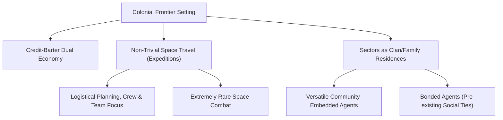

<!--
PROJECT: GDTLancer
MODULE: TRUTH_GAME-LOOP-VISION.md
STATUS: [Level 2 - Design]
TRUTH_LINK: TRUTH_PROJECT.md § Project Stack And Context; TRUTH_SIMULATION-GRAPH.md § 0. Implementation Reality
LOG_REF: 2026-06-15 01:20:00
-->

# GDTLancer - Game Loop & TTRPG Simulation Vision

**Version:** 1.0
**Date:** 2026-06-15
**Status:** Approved Architectural Vision

---

## 1. Core Philosophy: The Human-Scale Frontier

To build a meaningful TTRPG-style simulation, we must align the game rules with the setting's social and physical reality. Rather than a vast, generic space game, GDTLancer focuses on a low-population, sector-autonomous colonial frontier.

### 1.1 The Credit-Barter Dual Economy
Without centralized empires or instantaneous galactic banking, the economy functions on a local, dual-layer system:
* **Electronic Credits:** Localized ledger balances representing trust and reputation. Factions and communities issue credit to individuals they trust. Credits are used for routine transactions within a faction's sphere of influence.
* **Barter:** When trading across faction borders, with unaligned groups, or in spaces lacking infrastructural networks, transactions revert to direct commodity exchange (fuel, raw materials, tech components).

### 1.2 Space Travel & Flight: Logistical Weight, Arcade-Style Action
Space travel carries narrative and logistical weight, but the physical controls remain approachable:
* **Arcade Flight Mechanics:** Flight itself is arcadey and direct. We prioritize how it *feels* to fly the ship, focusing on narrative momentum and accessibility rather than imposing strict simulator physics or complex piloting challenges. 
* **Logistical Expeditions:** The "non-triviality" of travel lives in the preparation and logistics, not in the cockpit. Navigating the void requires coordinating with crew, managing fuel and supplies, and planning routes between stations.
* **Exceptional Combat:** Because resources, ships, and lives are irreplaceable in a low-population sector, space combat is an absolute last resort. Most interactions resolve through negotiation, evasion, or logistical outmaneuvering.

### 1.3 Clans, Families, and Versatile Communities
Sectors are not sterile outposts populated by single-role agents. They are the homes of persistent communities, families, clans, and localized coalitions:
* **Multi-Faceted Factions:** Factions are social groups and alliances with internal structures, histories, and cultural identities rather than corporate monoliths.
* **Versatile Agents:** Instead of hard-coded roles (like "Miner" or "Trader"), agents are residents with social obligations. While they may have primary duties (e.g., maintenance, navigation), they are versatile members of their community who adapt to survive.

---

## 2. Starting Conditions & Social Anchors

The player begins the game fully embedded in this social reality. Rather than starting as a blank slate or a colony manager, the player is an individual actor within a tight-knit community.

### 2.1 The Embedded Clan Member
The player is a first-class agent with the exact same magnitude of authority as NPC agents:
* **Not a Colony Manager:** The player does not build structures or manage the colony's layout (Dwarf Fortress style). Instead, they play as an individual agent acting in their own interest, yet deeply tied to a community.
* **A Peer Among Peers:** The relationship to the starting community feels like being part of a small clan of player friends in a multiplayer game. You share a home base, pool resources for big ventures, and look out for one another, but you control only your own ship and choices.
* **Bonded Agents:** The player starts with deep, pre-existing social links to specific characters in the sector (family members, close allies, or mentors). These bonded agents are not tutorial prompts; they are persistent characters the player can talk to, interact with, and rely on for physical or emotional support. They act as the player's primary anchor in the game world.

---

## 3. Win & Loss States: Narrative-Social Stakes

Victory and defeat are defined in TTRPG terms, focusing on social stability and community survival.

### 3.1 Victory Conditions (Social Harmony & Stability)
* **Community Cohesion:** Successfully securing your community's long-term survival by establishing reliable barter routes with neighboring clans.
* **Conflict Resolution:** Mediating or resolving a long-standing dispute between your family and a rival sector clan, securing a stable alliance.
* **Social Integration:** Building strong bonds with your crew and neighboring agents, forming a resilient network that can withstand sector crises.

### 3.2 Defeat Conditions (Ostracization & Collapse)
* **Social Ostracization:** Losing the trust of your community or your bonded agents through selfish behavior, leading to exile or abandonment.
* **Community Disintegration:** The collapse of your home community's station infrastructure due to failed logistical planning, forcing the surviving members to scatter.
* **Logistical Stranding:** Becoming stranded in the deep void with an unrepairable ship, an exhausted crew, and no credit or barter options left, leading to an eventual rescue that strips you of your assets and social standing.

---

## 4. Agent Simulation & Social Loop

In this framework, the cognitive layer of the simulation focuses on relationships and community needs rather than mindless economic CA steps.

### 4.1 Relationship-Driven Decisions
NPC goals are derived from their family affiliations, personality traits, and standings with other agents:
* **Community Protection:** Agents prioritize securing basic survival goods (water, fuel) for their home sectors.
* **Reciprocity and Grudges:** If the player or another agent assists a clan member, the entire clan shifts toward a positive standing, unlocking credit lines. Conversely, harming or disrupting an agent creates a persistent grudge that restricts access to local station services.
* **Bond Maintenance:** Bonded agents will actively try to support the player, checking in during long voyages, offering shelter during crises, or warning them of local sector hazards.
