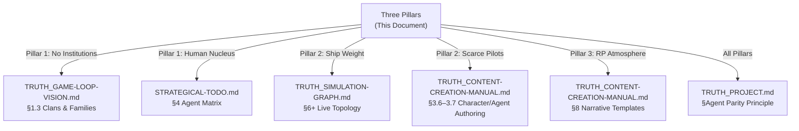

<!--
PROJECT: GDTLancer
MODULE: TRUTH_LORE-CONSTRAINTS.md
STATUS: [Level 2 - Design]
OWNER: architect
ACCESS: read-only-owner
USER INSTRUCTION: NONE
TRUTH_LINK: TRUTH_PROJECT.md § Project Stack And Context
LOG_REF: 2026-06-21 00:43:00
-->

# TRUTH LORE CONSTRAINTS

**Version:** 1.0  
**Date:** 2026-06-21  
**Status:** Approved Lore Rules  

---

## 1. The Social & Political Landscape of the Frontier

The setting represents a raw, early-stage frontier colonization effort defined by acute isolation and structural minimalism. To foster deep interpersonal stakes, the setting explicitly discards mainstream space-sim tropes of sprawling interstellar civilizations:

* **No Monolithic Institutions (LORE-1.1):** There are no sweeping galactic corporations, standing military forces, or centralized star-system governments governing the sector. Factions are small, fragile, localized coalitions.
* **Hyper-Localized Communities (LORE-1.2):** Society is fragmented into tightly-knit, highly insulated populations centered entirely around individual, isolated infrastructure nodes (dockables). A sector's community *is* its station.
* **The Human Nucleus (LORE-1.3):** The focus of the simulation is re-centered entirely around individual human actors, personal relations, and localized social friction. Space is not an empty playground for trade spreadsheets; it is a hostile backdrop that provides the rules, opportunities, and evolutionary challenges for a fragile human collective.

#### What This Prohibits

- ❌ Using terms like "corporation", "empire", "galactic authority", "navy", "military fleet", "interstellar government" in any player-facing text or template.
- ❌ Defining factions with implied galaxy-spanning reach or centralized bureaucratic structure.
- ❌ Treating stations as interchangeable service-point abstractions — each station is a *home* for a specific, named community.
- ❌ Narrative templates that frame the player as acting within a larger institutional framework (e.g., "The Trade Authority has posted a new contract…").

#### What This Requires

- ✅ Every faction definition must read as a small clan, family, cooperative, or local alliance, not a corporation.
- ✅ Narrative templates must reference specific people, local grudges, personal favors, and community survival — never abstract institutional mandates.
- ✅ Station descriptions must convey a sense of *home* — a place where specific people live, work, and depend on each other.
- ✅ The chronicle view must prioritize showing *who* is affected by events, not just *what* resources changed.

---

## 2. The Demystification and Weight of Starships

Spacecraft are completely decoupled from the concept of personal transport. They are re-contextualized as massive, complex, and culturally revered industrial installations deeply woven into the communities that harbor them.

* **Not Everyday "Cars" (LORE-2.1):** The assumption that the general population automatically owns a spacecraft is erased. Starships require coordinated group labor, specialized handling, and substantial material logistics to combat passive environmental degradation. **Vessels are community assets.** Most vessels are entirely community-owned, with captains appointed by community consensus for specific duties.
* **The Scarce Pilot Class (LORE-2.2):** Not every citizen or AI agent is a captain or pilot. Command and piloting are scarce, high-status, and deeply consequential roles within the community.
* **The Weight of Travel (LORE-2.3):** Space flight is treated as a non-trivial expedition. Launching a vessel demands real logistical sacrifice, group alignment, and physical peril. Space travel provides an unyielding layer of mechanical and physical friction against human ambition.
* **Crew are Generalists (LORE-2.4):** Small frontier communities require everyone to cross-train. There is no rigid specialization among crew members.
* **Vessel Rarity (LORE-2.5):** The number of vessels is exceedingly small. There is roughly one vessel per settled sector. They are rare, heavily monitored, and tremendously valuable.
* **Vessel Destruction is a Major Event (LORE-2.6):** The loss of a vessel shakes the community to its core. Crew survival is highly uncertain; those who do survive will only re-emerge after several World Clock ticks, often traumatized or forever changed.

#### What This Prohibits

- ❌ Narrative text that treats spaceflight as routine commuting (e.g., "You hop in your ship and fly to the next station").
- ❌ Agent templates where every NPC is a pilot or ship captain.
- ❌ Game mechanics that allow trivial, consequence-free travel between sectors.
- ❌ Treating ships as disposable or easily replaceable assets.

#### What This Requires

- ✅ Departure and arrival narrative templates must convey logistical weight — preparation, crew assembly, supply checks.
- ✅ Sub-agent population at stations must include non-pilot roles (maintenance crew, medics, administrators, families) vastly outnumbering pilots.
- ✅ The `SCARCE_PILOT` concept must be reflected in the agent/sub-agent ratio: most sub-agents are non-command crew or station residents.
- ✅ Ship damage, degradation, and repair must feel consequential in narrative prose — not just a stat decrement.

---

## 3. The Tabletop and Forum Roleplay Atmosphere

The overarching tonal and narrative identity of *GDTLancer* discards classic high-fidelity cinematic space tropes, drawing directly from text-driven, community-oriented design lineages:

* **The Stardew Valley / Pokemon Parallel (LORE-3.1):** Progression is completely stripped of linear gear-score grinding. Gameplay is focused on protecting community stability, navigating interpersonal dependencies, managing scarce resource caches, and securing personal standing across a finite population budget.
* **Forum Roleplay Authority (LORE-3.2):** Heavily inspired by the structural text-weight of classic server environments like the *Discovery Freelancer* RP server and forums.
* **Community-Centric Progression (LORE-3.3):** The player's success is measured by the health and stability of their community network, not by personal accumulation of wealth or firepower.

#### What This Prohibits

- ❌ Loot-drop or gear-score progression loops.
- ❌ Cinematic, high-drama prose in narrative templates (e.g., "The galaxy trembles as…").
- ❌ Player progression mechanics that scale independently of community standing.
- ❌ UI elements that emphasize individual power fantasy over community health.

#### What This Requires

- ✅ Narrative text must adopt a grounded, practical, logbook-like voice — as if written by a tired station clerk or a navigator's journal.
- ✅ Progression feedback in the chronicle view must show community-level impacts alongside personal stats.
- ✅ The jargon creole established in [TRUTH_CONTENT-CREATION-MANUAL.md](file:///home/roalyr/Software_archive/Games/GDTLancer/TRUTH_CONTENT-CREATION-MANUAL.md) must align with this atmosphere: low-tech, nautical, pragmatic.
- ✅ Victory conditions must reference social cohesion and community resilience, not individual combat prowess or wealth accumulation.

---

## 4. Integration Points

### Where the Three Pillars Touch Existing Truth Files

> [!NOTE]
> For the canonical **Lore Lexicon** containing banned and approved terms, refer to [TRUTH_CONTENT-CREATION-MANUAL.md](file:///home/roalyr/Software_archive/Games/GDTLancer/TRUTH_CONTENT-CREATION-MANUAL.md) Section 9.
