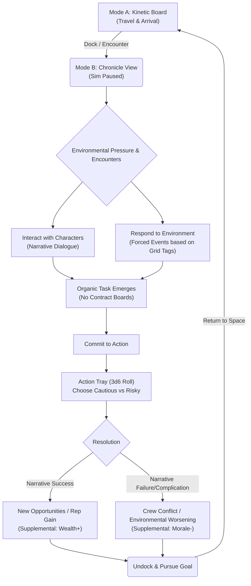

<!--
PROJECT: GDTLancer
MODULE: TRUTH_MVP_CORE.md
STATUS: [Level 1 - Core Truth]
OWNER: architect
ACCESS: read-only-owner
USER INSTRUCTION: NONE
TRUTH_LINK: TRUTH_PROJECT.md
LOG_REF: 2026-06-22 00:51:00
-->

# GDTLancer: Playable MVP Core Implementation Proposal

## 1. Objective and Design Philosophy
To deliver a 1-hour playable MVP that validates the **"Human-Scale Frontier"** philosophy by providing a true **Solo TTRPG Experience**. The focus is strictly on emergent narrative gameplay driven by the 4-layer simulation. We will hand-craft the environment, characters, and narrative templates, but the missions, outcomes, and stories must emerge naturally from player choices and environmental pressures. 

Under the **Rulebook-First Principle**, the MVP's mechanical and narrative systems are designed, documented, and validated first in the analogue solo ruleset, [TRUTH_RULEBOOK.md](file:///home/roalyr/Software_archive/Games/GDTLancer/TRUTH_RULEBOOK.md).

> [!NOTE]
> **The Goal:** Prove that GDTLancer can act as an automated rulebook partner.
> 1. **Tier 0 Validation:** Run full tabletop sessions of the MVP using [TRUTH_RULEBOOK.md](file:///home/roalyr/Software_archive/Games/GDTLancer/TRUTH_RULEBOOK.md) where an LLM agent companion acts as the GM / world simulator to validate the design with text/chat logging, saving digital implementation burden.
> 2. **Digital Validation:** Implement the mechanics (Wealth, Morale, Supplies) as a digital automation layer of the playtested rulebook, ensuring a coherent, zero-bloat player experience.

## 2. The Emergent TTRPG Game Loop
The gameplay loop must not feel like a reactive mechanical spreadsheet. It must feel like an evolving tabletop story where the player defines their own goals in the face of environmental pushback.

## 3. Synergistic Feature Implementations

To make the game core complete while strictly adhering to the TTRPG design pillar, we must implement the following:

### A. The Chronicle View (The "Tabletop Sheet" UI)
The `InteractionWindow` must evolve into a narrative-first interface, rather than a mechanical menu.
- **The Interaction Pane:** The player engages with the sector's persistent and mortal agents here. There is **no Contract Board**. Instead, tasks and "contracts" are a narrative journey—they emerge organically from conversing with a stressed station manager, or from a forced environmental event (e.g., a sudden hull breach requiring immediate action).
- **Diverse Narrative Tasks:** Contracts will not just be about trading. We will add stubs for varied narrative tasks: mediating disputes, rescuing stranded personnel, sabotage, or surveying an anomaly.
- **The Action Tray:** A tactile 2D area for resolving `CoreMechanicsAPI` rolls (3d6 + Modifiers). The choice between "Cautious" and "Risky" must feel weighty and consequential.

### B. Sub-Agent Simplicity & Narrative Morale
For the first iteration, sub-agents will be kept as simple as possible, serving primarily as narrative anchors.
- **Narrative Morale Consequences:** Morale must not turn into a perpetual, mechanical grind (e.g., a flat math penalty). Instead, low morale triggers narrative consequences. For example, a disaffected crew member might refuse to participate in a risky action, or demand to be left at the next port.
- **Mutiny as a Story Beat:** If morale collapses, it doesn't just mechanically lock the UI. It triggers a specific narrative event—a standoff on the ship that the player must resolve through dialogue or high-stakes action.

### C. Emergent Narrative Context (No Hand-Crafted Missions)
The player defines their own goals (e.g., "I need to secure enough resources to upgrade my drive and cross the frontier"). The game provides the friction.
- **Environmental Pressure:** The `GridLayer` dynamically mutates the local sector (e.g., shifting to `CONTESTED` security or `HARSH` environment). These tags dynamically alter the narrative templates presented when the player interacts with the station.
- **Emergent Outcomes:** The consequences of the player's 3d6 rolls ripple outward. A failed negotiation might cause a local faction to deny docking rights, forcing the player to fly to a dangerous neighboring sector with dwindling supplies.

## 4. Minimal Necessary UI Additions

To achieve this TTRPG atmosphere without over-engineering, we need only three major UI additions:

1. **Chronicle Log & Interaction Tabs:** A clean, text-forward interface where the player reads the jargon creole descriptions of their current situation, interacts with actors, and reviews their ship/crew state.
2. **The 3d6 Action Tray Popup:** A modal window that appears when a High-Stakes action is initiated, displaying the exact math `(3d6 + Wealth Mod + Morale Mod)` and the Cautious/Risky toggle.
3. **Event Notification Toast:** A non-intrusive text box for "Mundane" and "Narrative" tier action results, keeping the player informed of background simulation shifts while in flight.

## 5. Conclusion & Next Steps
This proposal binds the existing simulation layers (`GridLayer`, `AgentLayer`, `ContactManager`) to a true emergent TTRPG experience. By stripping away mechanical "quest boards" and focusing on narrative interactions and consequences, we achieve the Agent Parity Principle and fulfill the core design philosophy.

If approved, the immediate next step is to execute **Milestone 15: Chronicle View Layout Scaffold** to provide the UI canvas for these narrative interactions.
